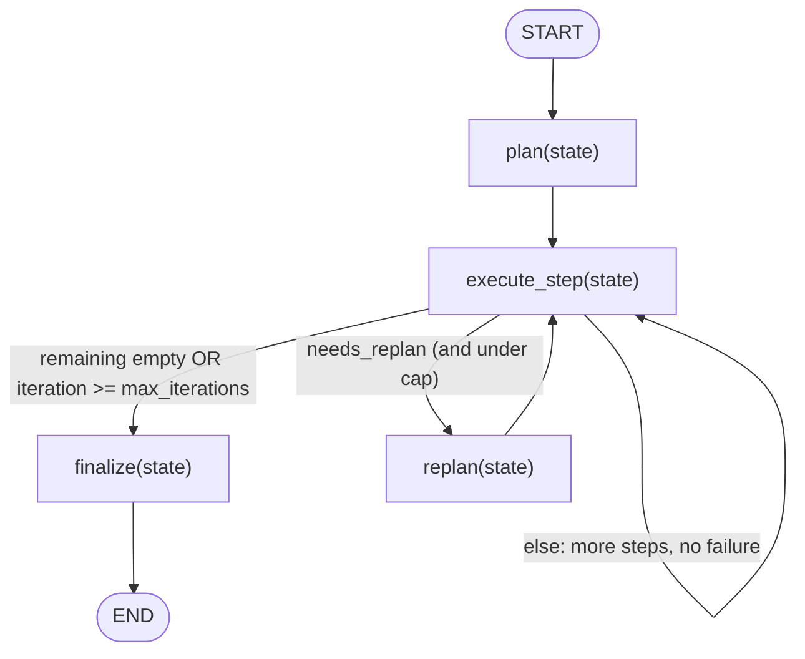
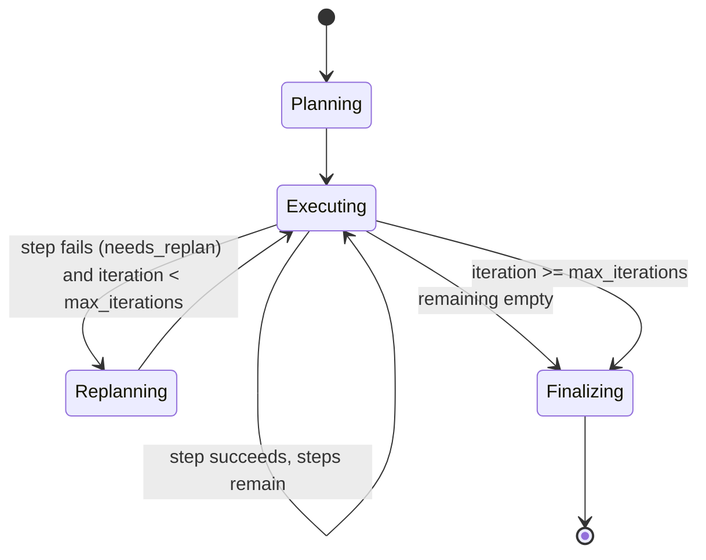
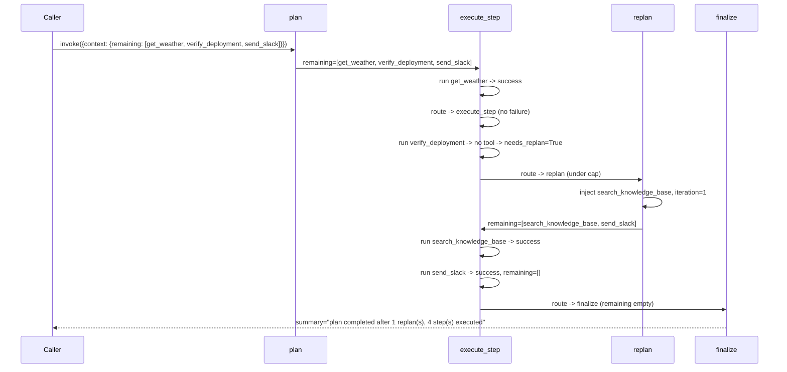

# 26 — Planning Loops

## Learning Objectives

After this module you can:

- Build a **plan -> execute -> replan** loop where the plan itself changes
  based on observed execution results, not just a fixed sequence.
- Bound a replanning loop with a `max_iterations` cap and explain what
  happens when the cap is hit before the plan is done.
- Distinguish this from module 23's fixed executor loop: here, a failure
  *changes what happens next*, instead of just being recorded and skipped.
- Trace through a scenario where the cap forces early termination with
  steps abandoned, and explain why that's the correct, safe outcome.

## Theory

Module 23's executor runs a **fixed** plan: every step executes (or is
skipped/fails) but the plan never changes shape. Real agents often need to
**revise** the plan mid-flight: if a step fails, maybe a diagnostic step
should run before continuing, or the remaining steps should change
entirely. That's what `replan` adds here: when `execute_step` reports
`needs_replan=True` (a step had no matching tool, or its tool raised),
control routes to `replan`, which injects a corrective step into the
remaining plan before execution resumes.

Without a bound, replan-on-failure could loop forever (a persistently
broken environment would just keep failing and keep replanning). The
`max_iterations` guard makes the loop **safe**: once `context["iteration"]`
reaches the cap, `route_after_execute` forces `finalize` regardless of how
many steps remain — the run reports exactly what was abandoned instead of
hanging.

## Mental Models

A road trip with a GPS that reroutes on a closed road: the original route
(`plan`) gets you most of the way, but hitting a closure (`needs_replan`)
makes the GPS insert a detour (`replan`) before continuing toward the same
destination. If the GPS keeps hitting closures past a fuel-range limit
(`max_iterations`), it stops rerouting and tells you plainly which stops on
your itinerary won't be reached — it doesn't keep recalculating forever
while you run out of gas.

## Architecture



*Legend: edge labels are `route_after_execute`'s three branches, evaluated
in this order; the loop back to `execute_step` is the normal one-step-per-turn
path, and `replan` is the corrective detour before that loop resumes.*

**Flow notes**

- `plan` seeds `context["remaining"]` with the scenario's steps, or a single
  `"respond_directly"` step if none were given.
- `execute_step` pops and runs the next step, recording
  `needs_replan=True` when the step has no matching tool or the tool raises.
- `route_after_execute` checks, in order: (1) no steps remain -> `finalize`;
  (2) `iteration >= max_iterations` -> `finalize` even if steps remain
  (they are abandoned); (3) `needs_replan` -> `replan`; (4) otherwise loop
  back to `execute_step` for the next step.
- `replan` increments `iteration` and inserts the diagnostic step
  `search_knowledge_base` at the front of `remaining` (only if not already
  queued), then always returns to `execute_step`.
- `finalize` reports either `"plan completed after N replan(s)"` or
  `"iteration cap reached ..., abandoned"`, depending on whether `remaining`
  is empty when it runs.



*Legend: this is the same loop as the flowchart above, viewed as a state
machine — `Replanning` is a transient state the loop always returns to
`Executing` from; `Finalizing` is the only terminal state.*



## Runnable Example

```bash
python src/26_planning_loops/planning_loops.py
```

Expected output (deterministic, offline):

```
remaining_initial=['get_weather', 'verify_deployment', 'send_slack'] summary=plan completed after 1 replan(s), 4 step(s) executed
remaining_initial=['nonexistent_a', 'nonexistent_b', 'nonexistent_c', 'nonexistent_d'] summary=iteration cap reached (2), 2 step(s) abandoned: ['nonexistent_c', 'nonexistent_d']
=== TRACK3 MODULE 26: PLANNING LOOPS COMPLETE ===
```

## Challenge

1. Raise `max_iterations` for the second scenario until all four steps
   complete instead of being capped — find the smallest value that works
   and explain why.
2. Add a second diagnostic step type (e.g. `send_slack` to alert a human)
   that `replan` injects after two consecutive failures instead of one.
3. Track *which* steps triggered a replan in `context["replanned_from"]`
   and print that list in `finalize`'s summary.

## Stretch Goals

- Make `replan` change the **order** of remaining steps based on the
  failure (e.g. move a dependent step to the end) instead of only
  inserting a new one.
- Combine with module 27: when the cap is about to be reached, `interrupt()`
  for a human decision (retry with a higher cap, or abandon) instead of
  abandoning silently.
- Add a `context["max_wall_time"]` guard alongside `max_iterations` and
  finalize early on either condition.

## Common Mistakes

- **Replanning without a cap.** A persistently failing step would loop
  forever without `max_iterations` — always pair "revise on failure" with a
  hard stop.
- **Growing the plan unboundedly.** `replan` checks
  `if _DIAGNOSTIC_STEP not in remaining` before inserting — without that
  guard, repeated failures before the diagnostic step runs would stack
  duplicate entries.
- **Confusing "cap reached" with "success."** `finalize` reports these
  differently (`"iteration cap reached"` vs. `"plan completed"`) — collapsing
  them would hide a real failure mode from whoever reads the summary.

## Best Practices

- Make the termination condition explicit and inspectable in the final
  state (`context["summary"]`) — don't just log it and discard the
  distinction.
- Keep `replan`'s corrective logic simple and specific to the observed
  failure — resist the urge to replan speculatively for failures that
  haven't happened.
- Log every replan decision (`get_logger`) with the iteration count, so a
  production trace shows exactly how many times — and why — the plan
  changed.

## References

- Module [`23_executor_agent`](../23_executor_agent/README.md) — the fixed
  step loop this module extends with replanning.
- Module [`14_error_handling`](../14_error_handling/README.md) — the
  retry/circuit-breaker pattern this module's `max_iterations` cap
  generalizes to plan-level replanning.
- LangGraph conditional edges:
  https://docs.langchain.com/oss/python/langgraph/graph-api#conditional-edges
- [`docs/tools.md`](../../docs/tools.md) — the tool registry each step
  ultimately calls.

## What Comes Next

[`27_human_in_the_loop`](../27_human_in_the_loop/README.md) adds a pause
point: instead of the agent deciding everything alone, a proposed action can
wait for explicit human approval before it runs.
