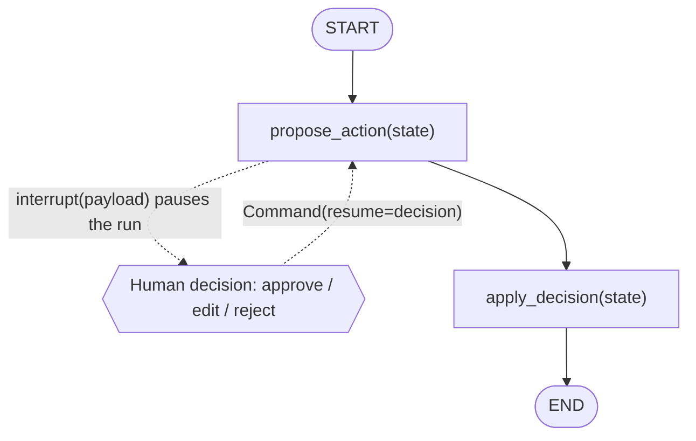
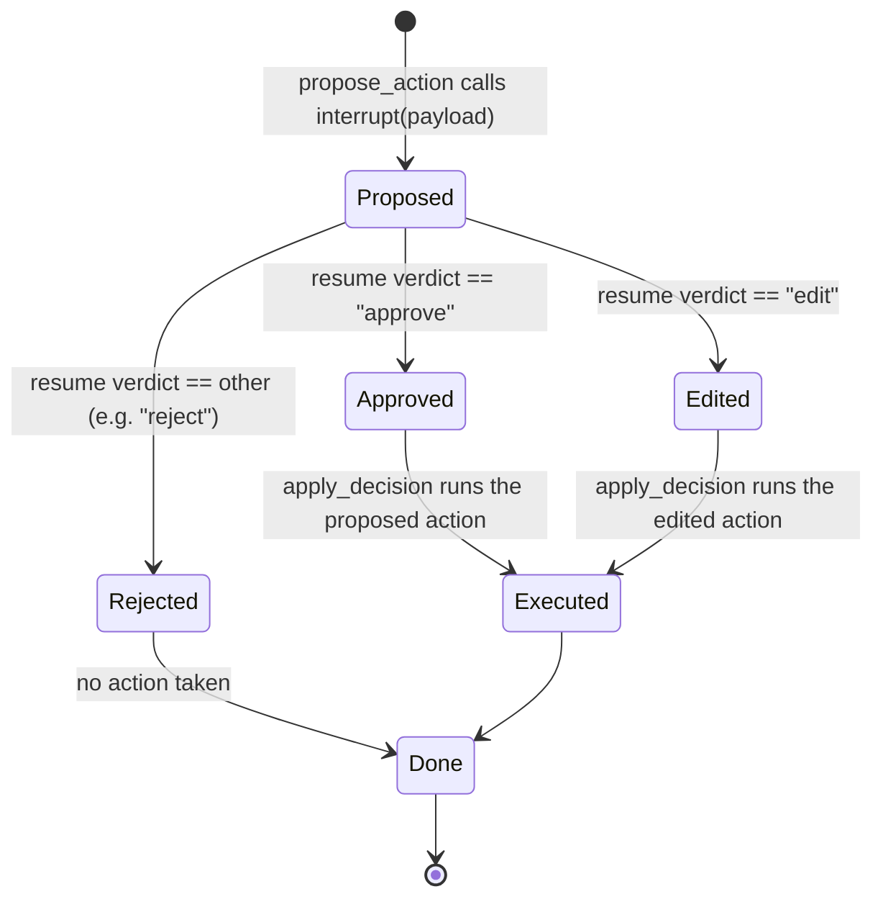
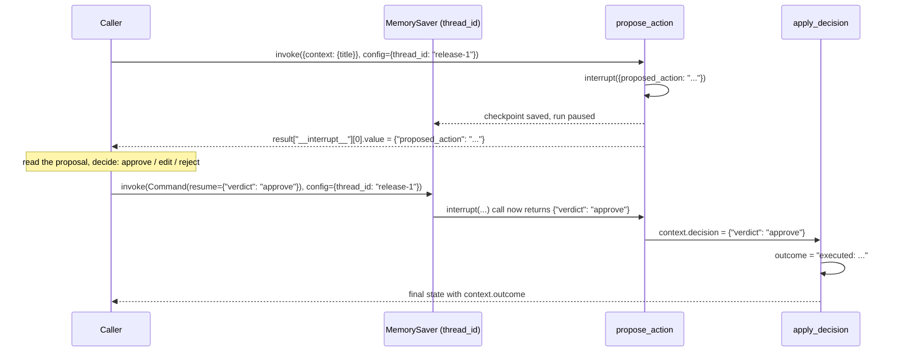

# 27 — Human-in-the-Loop

## Learning Objectives

After this module you can:

- Pause a running graph mid-execution with `interrupt(payload)` and resume
  it later with `Command(resume=value)`.
- Explain why a `checkpointer` (`MemorySaver`) is required for interrupt/
  resume to work, and what `thread_id` identifies.
- Implement **approve / edit / reject** as three distinct resume outcomes
  from the same pause point.
- Drive an interrupt -> resume cycle entirely in code — the pattern a test
  suite (or a scheduled job resuming from a queue) would use, with no human
  actually typing anything.

## Theory

Some actions are too sensitive to let an agent execute unsupervised — a
production deploy, a payment, a message to an external customer. LangGraph
supports pausing for exactly this: a node calls `interrupt(payload)`, which
raises a special control-flow signal that unwinds the current `invoke()`
call and returns a state dict containing `"__interrupt__"` — a list of
`Interrupt` objects carrying whatever `payload` was passed in.

Because the graph has genuinely stopped mid-run, resuming later — possibly
in a different process — requires persisting where it stopped. That's what
`checkpointer=MemorySaver()` does at compile time, keyed by
`config["configurable"]["thread_id"]`: each `thread_id` is an independent,
resumable run. Calling `app.invoke(Command(resume=value), config=config)`
with the *same* `thread_id` picks the paused node back up, with
`interrupt(...)`'s call site now returning `value` instead of raising — as
if the human had typed it in.

This module demonstrates three resume outcomes — approve (run the proposed
action as-is), edit (run a modified action), reject (do nothing) — driven
programmatically per scenario so the whole thing runs offline and
deterministically, without blocking on real stdin.

## Mental Models

An expense approval workflow: an employee submits a request
(`propose_action`) and it sits in a manager's queue — the workflow is
genuinely paused, not polling in a loop. The manager (played here by a
scripted decision, not a real person) can **approve** it as submitted,
**edit** the amount and approve that instead, or **reject** it outright.
Only after a decision comes back does the expense system
(`apply_decision`) actually book anything.

## Architecture



*Legend: dashed arrows are the `interrupt`/`Command(resume=...)` control-flow
(not compiled graph edges — LangGraph only ever runs the solid path
`propose_action -> apply_decision -> END`); solid arrows are the graph's
real, always-taken edges.*

**Flow notes**

- `propose_action` builds the proposed action string, then calls
  `interrupt(payload)`, which pauses the run and surfaces `payload` to the
  caller via `result["__interrupt__"]`.
- The human (or, in this module, a scripted decision) inspects the proposal
  and calls `app.invoke(Command(resume=decision), config=...)` with the
  *same* `thread_id`, resuming exactly at the paused `interrupt()` call site.
- `apply_decision` reads `context["decision"]["verdict"]`: `"approve"` runs
  the action as proposed, `"edit"` runs `decision["edited_action"]` instead,
  anything else (e.g. `"reject"`) takes no action.
- `MemorySaver` checkpoints the run so the pause survives across separate
  `invoke()` calls — even, in principle, a different process — as long as
  `thread_id` matches.



*Legend: this is the same pause point as the flowchart, viewed as the three
possible resume outcomes — exactly one of `Approved` / `Edited` / `Rejected`
is reached per run.*



## Runnable Example

```bash
python src/27_human_in_the_loop/main.py
```

Expected output (deterministic, offline):

```
thread=release-1 paused_on="send_slack: notify #team about 'v2.0 release'"
thread=release-1 outcome="executed: send_slack: notify #team about 'v2.0 release'"
thread=release-2 paused_on="send_slack: notify #team about 'v2.1 release'"
thread=release-2 outcome='executed (edited): send_slack: notify #leads only'
thread=release-3 paused_on="send_slack: notify #team about 'v2.2 release'"
thread=release-3 outcome='rejected: no action taken'
=== TRACK3 MODULE 27: HUMAN IN THE LOOP COMPLETE ===
```

## Challenge

1. Add a fourth scenario where the resume decision is malformed (missing
   `verdict`) and make `apply_decision` raise a clear error instead of
   silently defaulting to reject.
2. Chain two `interrupt()` calls in sequence (propose an action, then — if
   approved — confirm a follow-up detail) and drive both resumes in code.
3. Inspect `app.get_state(config)` before and after resuming to see the
   checkpointed values directly, instead of only reading `invoke`'s return
   value.

## Stretch Goals

- Swap `MemorySaver` for a durable checkpointer (e.g. SQLite-backed, if
  available) and prove the same `thread_id` resumes correctly across a
  fresh Python process.
- Add a timeout concept: if no resume arrives within N (simulated) turns,
  auto-reject via a scheduled follow-up call instead of waiting forever.
- Combine with module 26: pause for approval only when the plan's
  iteration cap is about to be hit, rather than on every proposed action.

## Common Mistakes

- **Forgetting the checkpointer.** `interrupt()` without
  `compile(checkpointer=...)` cannot resume — there's nowhere to persist the
  paused state.
- **Reusing a `thread_id` across unrelated runs.** Each independent
  approval flow needs its own `thread_id`; reusing one continues a stale,
  unrelated run instead of starting fresh.
- **Assuming `Command(resume=...)` re-invokes the whole graph from
  `START`.** It resumes from exactly the paused node — code before the
  `interrupt()` call in that node does **not** re-run.

## Best Practices

- Keep the `interrupt()` payload self-contained and human-readable (here:
  the exact proposed action as a string) — whoever approves shouldn't need
  to reconstruct context from elsewhere.
- Give every resumable flow a stable, meaningful `thread_id` (a release
  name, a ticket ID) so approvals can be looked up and audited later.
- Log both the pause (`get_logger`, what was proposed) and the resume (what
  was decided) — human-in-the-loop points are exactly where audit trails
  matter most.

## References

- LangGraph human-in-the-loop:
  https://docs.langchain.com/oss/python/langgraph/add-human-in-the-loop
- LangGraph persistence / checkpointers:
  https://docs.langchain.com/oss/python/langgraph/persistence
- [`docs/langgraph.md`](../../docs/langgraph.md) §6 — the checkpoints
  preview this module implements in full.
- Module [`26_planning_loops`](../26_planning_loops/README.md) — the
  bounded-loop pattern this module's approval gate could sit inside.

## What Comes Next

[`28_supervisor`](../28_supervisor/README.md) returns to full autonomy —
no pausing — but adds **orchestration**: one supervisor node dispatching
across a whole queue of tasks to specialized worker agents.
