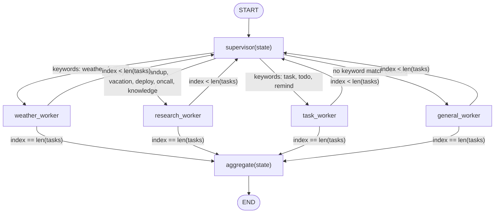
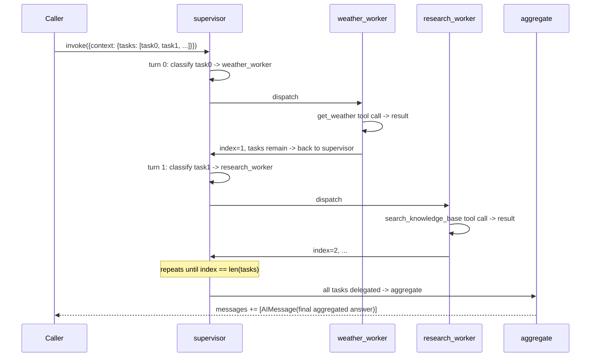

# 28 — Supervisor

## Learning Objectives

After this module you can:

- Build a **supervisor node** that repeatedly picks the next task and
  delegates it to one of several worker nodes.
- Explain how a supervisor loop differs from module 25's one-shot router:
  dispatch repeats across a queue of turns before producing a final answer.
- Aggregate results accumulated across many worker calls into a single
  final answer.
- Add a new worker without changing the supervisor's dispatch logic beyond
  one routing entry.

## Theory

A supervisor is an orchestration pattern: instead of one model doing
everything, a lightweight dispatcher inspects each pending task and routes
it to a specialized worker — a weather lookup, a knowledge-base search, a
task-tracker call — then collects that worker's result and moves to the
next task. This differs from module 25's router in shape: there, one
message maps to exactly one sub-graph and the run ends. Here, `supervisor`
and its workers form a loop that runs once **per task in a queue**,
returning to the supervisor after every worker call, until every task has
been delegated — only then does `aggregate` combine everything into one
final answer.

This is also a stepping stone toward true multi-agent systems: each
"worker" here is a small node calling one tool, but the same shape supports
workers that are themselves full sub-graphs (module 25) or even separate
LLM-backed agents with their own reasoning loops (module 21).

## Mental Models

A dispatcher at a delivery company: the dispatcher doesn't drive any truck
— they look at the next package (task), decide which driver (worker) covers
that zone, hand it off, and wait for confirmation before dispatching the
next package. Once every package has a delivery confirmation, the
dispatcher writes one end-of-day report (`aggregate`) summarizing every
delivery — not five separate reports.

## Architecture



*Legend: edge labels out of `supervisor` are `route_to_worker`'s keyword
match against the current task; edge labels out of each worker are
`route_after_worker`'s check of whether the task queue is exhausted.*

**Flow notes**

- `supervisor` reads `context["tasks"][index]` and keyword-matches it
  against `_WORKER_KEYWORDS`, defaulting to `general_worker` when nothing
  matches.
- `route_to_worker` performs no matching itself — it only reads
  `context["current_worker"]` back and returns it as the conditional-edge
  key.
- Each worker node runs exactly one tool call (or, for `general_worker`,
  just acknowledges), appends its output to `context["worker_results"]`,
  and increments `context["index"]`.
- `route_after_worker` sends control back to `supervisor` while
  `index < len(tasks)`; once every task has been dispatched, it routes to
  `aggregate` instead.
- `aggregate` joins every `worker_results` entry into one final
  `AIMessage`.



## Runnable Example

```bash
python src/28_supervisor/supervisor.py
```

Expected output (deterministic, offline):

```
[weather_worker] The weather in team offsite is 21C and sunny.
[research_worker] Request vacation in the HR portal at least two weeks ahead.
[task_worker] Created task 'TASK-378': Create a task to update the roadmap.
[general_worker] acknowledged: Say thanks to the team.
final_answer="Aggregated 4 worker result(s): ..."
=== TRACK3 MODULE 28: SUPERVISOR COMPLETE ===
```

## Challenge

1. Add a fifth task that matches no worker's keywords and confirm it falls
   through to `general_worker`.
2. Add a `context["worker_counts"]` dict tallying how many tasks each
   worker handled, and print it after `aggregate`.
3. Make `route_to_worker` raise a clear error if `current_worker` is ever
   missing from the mapping, instead of letting LangGraph fail with a
   generic routing error.

## Stretch Goals

- Replace one worker (e.g. `research_worker`) with a full ReAct sub-graph
  (module 21) so that worker can itself loop over multiple tools before
  returning its result to the supervisor.
- Let the supervisor dispatch to **two** workers per turn for tasks that
  match multiple keyword sets, using `Send` (module 12) for true fan-out,
  then reconcile both results with a reducer.
- Add a `human_in_the_loop` worker (module 27) for tasks classified as
  high-risk, pausing the whole run for approval before that worker acts.

## Common Mistakes

- **Conflating supervisor with router (module 25).** A router picks one
  path for one message and the run ends; a supervisor repeats dispatch
  across a whole task queue before producing one final answer.
- **Losing task order in aggregation.** `worker_results` accumulates in the
  order tasks were dispatched — don't reorder or dedupe it in `aggregate`
  unless that's an intentional design choice.
- **Giving workers direct access to the whole task queue.** Each worker
  node here only sees `context["current_task"]` — not the full list — so a
  worker can't accidentally process the wrong task.

## Best Practices

- Keep the supervisor's classification logic simple and centralized — one
  place decides "who handles this," so debugging a misrouted task means
  reading one function.
- Log every dispatch decision (`get_logger`) with the turn index and chosen
  worker — supervisor traces are exactly what you'd want in an incident
  review.
- Keep workers narrow and single-purpose; a worker that does "everything"
  defeats the point of having a supervisor route to specialists.

## References

- LangGraph multi-agent supervisor pattern:
  https://docs.langchain.com/oss/python/langgraph/multi-agent
- Module [`25_router_agent`](../25_router_agent/README.md) — one-shot
  dispatch to a sub-graph; this module generalizes it to a task queue.
- Module [`09_multi_agent_systems`](../09_multi_agent_systems/README.md) —
  the original planner/executor split this module builds on.
- [`docs/tools.md`](../../docs/tools.md) — the `DEMO_TOOLS` each worker
  wraps.

## What Comes Next

Track 3 is complete. From here, later tracks build persistent memory
(conversation, episodic, semantic) and retrieval on top of these agent
patterns — the supervisor and worker shapes here reappear wherever an agent
needs to delegate rather than do everything itself.
