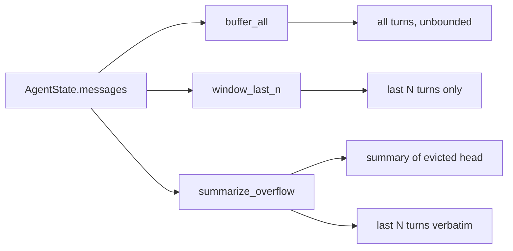

# 29 — Conversation Memory

## Learning Objectives

After this module you can:

- Explain the difference between **buffer**, **window**, and **summary**
  short-term memory strategies over a growing conversation.
- Implement a fixed-size window over `AgentState.messages`.
- Implement an overflow summary that keeps recent turns verbatim while
  compressing older ones.
- Articulate the token-cost vs. context-loss trade-off each strategy makes.

## Theory

Every agent conversation lives in `AgentState["messages"]` (see
`src/shared/state.py`), a list that only grows. Left unbounded, it eventually
blows the model's context window and inflates cost per call. Three classic
strategies bound it:

- **Buffer** — keep everything, no eviction. Simplest, but cost grows
  linearly with conversation length; eventually violates the context limit.
- **Window** — keep only the last `N` messages (or a token budget). Bounded
  cost, but old context is *lost*, not compressed — if turn 1 set an
  important constraint, turn 50 won't see it.
- **Summary** — keep the last `N` messages verbatim (for fluent, recent
  back-and-forth) plus a running summary of everything evicted (so the gist
  survives). This is what production agents use: bounded cost *and* retained
  gist.

This module is short-term, in-session memory — it does not persist across
runs. Long-term recall across sessions is what modules 30–32 (episodic,
semantic, procedural) are for.

## Mental Models

Think of a whiteboard during a long meeting: **buffer** is never erasing it
(eventually you run out of wall). **Window** is erasing everything except the
last five lines when the board fills up (fast, but you lose the agenda from
an hour ago). **Summary** is what a good scribe does: before erasing, they
write one condensed line capturing what mattered, then keep taking detailed
notes from that point on.

## Architecture



## Runnable Example

```bash
python src/29_conversation_memory/conversation_memory.py
```

Expected output (deterministic, log timestamp varies):

```
buffer: 6 message(s) retained (all)
window(n=3): 3 message(s) retained -> ['April is peak season, book early.', 'Any ryokan recommendations near Gion?', "I'd suggest looking at traditional inns in Higashiyama."]
summary(n=3): [summary of 3 earlier turn(s): Hi, I'm planning a t, Great! When are you , Sometime in April, f]
summary(n=3) kept verbatim -> ['April is peak season, book early.', 'Any ryokan recommendations near Gion?', "I'd suggest looking at traditional inns in Higashiyama."]
=== TRACK4 MODULE 29: CONVERSATION MEMORY COMPLETE ===
```

## Challenge

1. Change the window size to `n=2` and observe which turns are lost.
2. Make `summarize_overflow` token-budget-bounded instead of turn-count-bounded
   (estimate tokens as `len(text) // 4`).
3. Add a fourth strategy, "buffer with cap": keep the buffer strategy but
   raise an error once a hard message-count ceiling is exceeded.

## Stretch Goals

- Replace the deterministic digest in `summarize_overflow` with a real LLM
  call via `get_chat_model(responses=[...])` so the summary is generated, not
  concatenated.
- Track how many characters each strategy would send to the model per turn
  and plot (print) the growth curve across a 20-turn synthetic conversation.

## Common Mistakes

- **Windowing without knowing what you lose.** A hard cutoff silently drops
  facts established earlier in the conversation — always pair a window with
  either a summary or a long-term memory write (module 33).
- **Summarizing every turn.** Summarizing on every new message is wasteful;
  summarize once, when the buffer would otherwise overflow.
- **Confusing this with long-term memory.** Conversation memory is
  session-scoped. Facts worth keeping across sessions belong in semantic
  memory (module 31), not just the message window.

## Best Practices

- Choose window size based on the model's context limit and the cost budget,
  not an arbitrary constant.
- Keep the eviction boundary explicit and logged (`get_logger`) so debugging
  a "the agent forgot X" bug is tractable.
- Route anything worth remembering long-term through the write pipeline
  (module 33) *before* it gets evicted from the window.

## Suggested Improvements

- Make the window size adaptive: shrink it dynamically as the model's context
  budget is consumed by tool outputs.
- Add a `pinned` set of message ids that survive eviction regardless of
  position (e.g., the system prompt or an explicit user constraint).

## References

- LangGraph state and reducers: https://docs.langchain.com/oss/python/langgraph/graph-api#state
- Module [`06_memory_basics`](../06_memory_basics/README.md) — the original
  flat event log this track deepens.
- [`docs/memory.md`](../../docs/memory.md) — the Track 4 memory overview.

## What Comes Next

[`30_episodic_memory`](../30_episodic_memory/README.md) moves from
session-scoped conversation turns to a persistent, timestamped event log.
