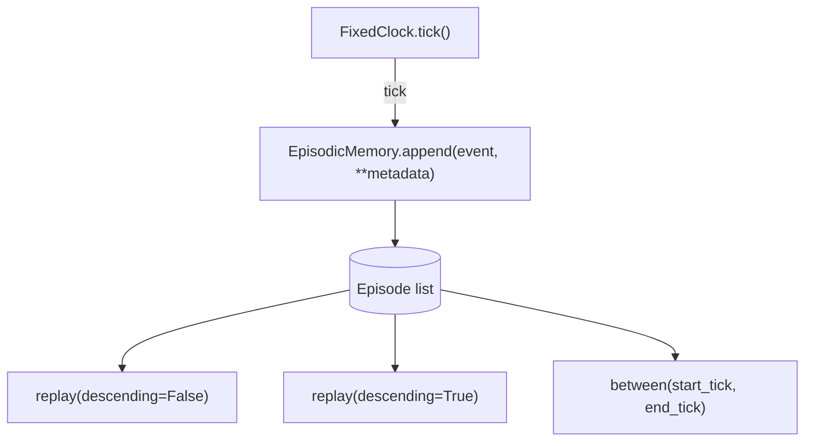
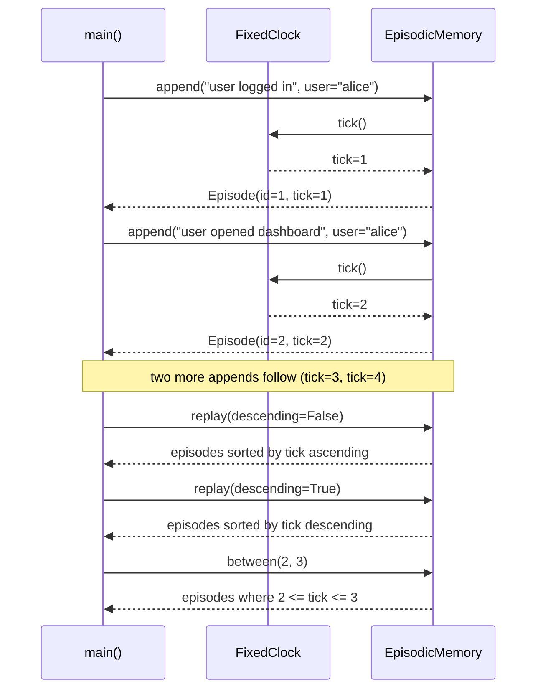

# 30 — Episodic Memory

## Learning Objectives

After this module you can:

- Define an `Episode` as a structured, timestamped event record (distinct
  from an unstructured event log).
- Use an injected `FixedClock` instead of wall-clock time so episodic
  timestamps stay deterministic and testable.
- Replay episodes in ascending or descending time order.
- Query episodes by a time (`tick`) range.

## Theory

Module 06 introduced the simplest possible memory: a list you append to and
read back. **Episodic memory** deepens that idea: each entry is a structured
`Episode` — an id, a `tick` (when it happened), the event description, and
free-form metadata — instead of an opaque dict. That structure is what makes
time-ordered **replay** and **range queries** possible.

The `tick` is produced by a `FixedClock`, not `time.time()` or
`datetime.now()`. Two reasons: (1) episodic order matters more than wall-clock
precision for most agent use cases, and (2) tests and demos must be
reproducible — a monotonic counter gives exact, repeatable timestamps.

Episodic memory answers "what happened, and when?" — as opposed to semantic
memory (module 31), which answers "what is true, generally?" with no time
component at all.

## Mental Models

Think of a ship's logbook: every entry has a sequential timestamp and a
description of what happened ("08:00 departed port", "14:00 storm sighted").
You can read it front-to-back (replay ascending), back-to-front (most recent
first), or ask "what happened between hour 2 and hour 3?" (a range query).
The logbook doesn't record *why* storms happen in general — that's a
different kind of knowledge (semantic memory).

## Architecture



*Legend: every `append` advances the shared `FixedClock` by exactly one
tick; `replay`/`between` never mutate the underlying list — they only
sort or filter a copy of it.*

**Flow notes**

- `append(event, **metadata)` calls `clock.tick()` to obtain the next
  monotonic tick, builds an `Episode` with an incrementing `episode_id`, and
  appends it to the in-memory list.
- `replay(descending=False)` (the default) returns every episode sorted by
  `tick` ascending — chronological order; `descending=True` reverses that
  order.
- `between(start_tick, end_tick)` filters episodes whose `tick` falls
  within `[start_tick, end_tick]` inclusive, preserving original append
  order.



*Legend: the `Mem->>Clk: tick()` round-trip happens once per `append` call
— `replay` and `between` never touch the clock, they only read episodes
already recorded.*

**Flow notes**

- Each `append` call round-trips through `FixedClock.tick()` before the
  `Episode` is built, so tick order always matches append order.
- `replay` returns a freshly sorted copy each call — ascending by default,
  descending on request — without altering stored order.
- `between(2, 3)` returns only the episodes recorded at tick 2 and tick 3,
  regardless of how many total episodes exist.

## Runnable Example

```bash
python src/30_episodic_memory/episodic_memory.py
```

Expected output (deterministic, log timestamp varies):

```
replay (ascending):
  tick=1 id=1 event='user logged in' meta={'user': 'alice'}
  tick=2 id=2 event='user opened dashboard' meta={'user': 'alice'}
  tick=3 id=3 event='user exported report' meta={'user': 'alice', 'report': 'Q1-sales'}
  tick=4 id=4 event='user logged out' meta={'user': 'alice'}
replay (descending):
  tick=4 id=4 event='user logged out'
  tick=3 id=3 event='user exported report'
  tick=2 id=2 event='user opened dashboard'
  tick=1 id=1 event='user logged in'
between(2,3): ['user opened dashboard', 'user exported report']
=== TRACK4 MODULE 30: EPISODIC MEMORY COMPLETE ===
```

## Challenge

1. Add a `most_recent(n)` method that returns the last `n` episodes without
   sorting the whole list.
2. Extend `Episode` with a `session_id` field and add a `for_session(id)`
   query.
3. Simulate two independent `FixedClock` instances (e.g., two agent sessions)
   and interleave their episodes into one merged, sorted timeline.

## Stretch Goals

- Persist the episode log to a JSON file and reload it, preserving tick
  order (still offline — no external database required).
- Add a `summarize_between(start, end)` that reuses the conversation-summary
  idea from module 29, applied to a time range of episodes instead of a
  message window.

## Common Mistakes

- **Using wall-clock time in tests.** `datetime.now()` makes output
  non-reproducible; always inject a clock (or a fixed value) for anything
  that gets asserted on.
- **Treating episodes as facts.** An episode is "what happened, once" — it
  is not general knowledge. Don't conflate it with semantic memory (module
  31); the write pipeline (module 33) is responsible for routing correctly.
- **Losing metadata.** Storing only a string event description discards
  context (who, what object, what outcome) that's often needed later —
  always carry structured `metadata`.

## Best Practices

- Keep `Episode` immutable-by-convention: append new episodes rather than
  mutating past ones, so replay is always a faithful history.
- Log every append (`get_logger`) — episodic memory often doubles as an audit
  trail.
- Prefer explicit tick/id fields over relying on list position, so queries
  survive re-ordering or filtering.

## Suggested Improvements

- Add an eviction/decay policy for episodes (see module 36) so old, unused
  episodes don't grow the log unbounded.
- Support async `append` for episodes arriving concurrently from multiple
  tool calls (see module 13's async pattern).

## References

- Module [`06_memory_basics`](../06_memory_basics/README.md) — the baseline
  flat event log this module deepens.
- Module [`31_semantic_memory`](../31_semantic_memory/README.md) — facts vs.
  events, contrasted directly.
- [`docs/memory.md`](../../docs/memory.md) — the Track 4 memory overview.

## What Comes Next

[`31_semantic_memory`](../31_semantic_memory/README.md) stores timeless facts
in a vector store and retrieves them by meaning instead of by time.
