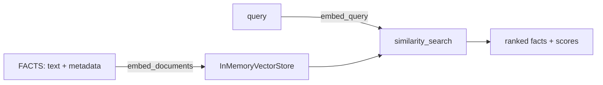

# 31 — Semantic Memory

## Learning Objectives

After this module you can:

- Explain the difference between semantic memory (timeless facts) and
  episodic memory (timestamped events, module 30).
- Write facts into `InMemoryVectorStore` via `get_embeddings`.
- Retrieve facts by semantic similarity to a natural-language query.
- Reason about why an offline hashing embedder still produces useful,
  reproducible rankings for a demo.

## Theory

Semantic memory holds knowledge that is true independent of when or how it
was learned: "Paris is the capital of France" doesn't need a timestamp to be
useful. This is fundamentally different from episodic memory (module 30),
which is *about* a specific moment ("at tick=12, the user asked about
Paris").

The write path is: `text -> get_embeddings().embed_documents() ->
InMemoryVectorStore.add_texts()`. The read path is: `query ->
embed_query() -> cosine similarity search -> ranked facts`. Offline, the
embeddings backend is `HashingEmbeddings` (bag-of-words hashing, no network,
no numpy) — it's deterministic and rewards genuine token overlap, so facts
that share vocabulary with the query score higher, exactly like a real
embedding model would for closely related text.

## Mental Models

Think of semantic memory as a well-indexed encyclopedia: you don't ask "when
was this page written?" — you ask "which pages are about this topic?" and
get back the most relevant entries ranked by how closely they match your
question, regardless of when each entry was added.

## Architecture



## Runnable Example

```bash
python src/31_semantic_memory/semantic_memory.py
```

Expected output (deterministic, log timestamp varies):

```
query='What is the capital of France?'
  score=0.875 fact='Paris is the capital of France.'
  score=0.6614 fact='The mitochondria is the powerhouse of the cell.'
query='How do cells produce energy?'
  score=0.1581 fact='Photosynthesis converts sunlight into chemical energy in plants.'
  score=0.0 fact='The Eiffel Tower is located in Paris, France.'
=== TRACK4 MODULE 31: SEMANTIC MEMORY COMPLETE ===
```

## Challenge

1. Add three more facts and a query that should retrieve them; verify the
   ranking makes sense.
2. Filter `recall()` results by `metadata["topic"]` before returning them.
3. Set `OPENAI_API_KEY` and re-run: confirm the same code path now uses real
   `OpenAIEmbeddings` (see `src/shared/embeddings.py`).

## Stretch Goals

- Add a `forget(fact_id)` method and show that a forgotten fact no longer
  appears in `recall()`.
- Combine semantic recall with episodic replay (module 30) to answer "what
  do we know, and when did we learn it?" in one combined query.

## Common Mistakes

- **Treating vector similarity scores as probabilities.** Cosine similarity
  is a relative ranking signal, not a calibrated confidence — don't threshold
  it as if it were.
- **Storing episodes as facts.** "User asked about Paris at 3pm" is an
  episode, not a fact — only store the durable, timeless knowledge here.
- **Ignoring low scores.** A `score=0.0` result (as seen above) means no
  token overlap at all — don't blindly return top-`k` without a relevance
  floor (see module 35 for a principled scoring approach).

## Best Practices

- Keep semantic facts short and single-topic — one fact per entry improves
  retrieval precision.
- Attach metadata (`topic`, `source`, `confidence`) at write time; it's much
  cheaper to filter on than to re-derive later.
- Log writes and reads (`get_logger`) so you can audit what the agent
  "knows" and when it was told.

## Suggested Improvements

- Add deduplication at write time (skip a fact whose nearest neighbor is
  already above a similarity threshold).
- Expose a `k` and a minimum-score floor together, so retrieval is both
  bounded and relevance-gated.

## References

- `src/shared/vectorstore.py` — `InMemoryVectorStore` implementation.
- `src/shared/embeddings.py` — `HashingEmbeddings` offline fallback.
- Module [`07_qdrant_integration`](../07_qdrant_integration/README.md) — the
  production vector-database counterpart.
- [`docs/memory.md`](../../docs/memory.md) — the Track 4 memory overview.

## What Comes Next

[`32_procedural_memory`](../32_procedural_memory/README.md) covers "knowing
how" — reusable step sequences retrieved by trigger, not by similarity.
