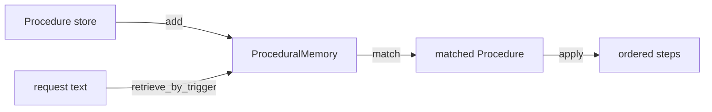

# 32 — Procedural Memory

## Learning Objectives

After this module you can:

- Distinguish "knowing that" (semantic memory, module 31) from "knowing how"
  (procedural memory, this module).
- Model a reusable skill as a named `Procedure`: a trigger condition plus an
  ordered list of steps.
- Retrieve the right procedure for a request by matching triggers, not by
  embedding similarity.
- Explain why procedural lookup is typically rule-based / trigger-based
  rather than similarity-based.

## Theory

Procedural memory stores *skills* — reusable, ordered step sequences an agent
can look up and apply, such as "how to reset a password" or "how to file a
bug report." Unlike semantic memory (facts) or episodic memory (events),
procedures are inherently **actionable**: retrieving one is the first half of
*doing* something, not just recalling information.

Retrieval here is deliberately trigger-based (keyword match against the
request) rather than vector similarity: procedures are typically few in
number, precise in scope, and need reliable, auditable dispatch — you want
"reset_password" to fire exactly when its known triggers appear, not
"probably close in meaning." Production systems often combine both: a
semantic pre-filter followed by exact trigger matching.

## Mental Models

Think of a cookbook with a table of contents indexed by dish name and
ingredients you have on hand ("if you have chicken and rice, see recipe #4").
You don't search the cookbook by vague vibes — you match your situation
(what you have, what you need) against a known trigger, then follow the
recipe's exact steps in order.

## Architecture



## Runnable Example

```bash
python src/32_procedural_memory/procedural_memory.py
```

Expected output (deterministic, log timestamp varies):

```
request="I forgot my password and can't log in"
  matched procedure='reset_password'
    step 1: Verify the user's identity
    step 2: Send a one-time reset link to the registered email
    step 3: Prompt the user to set a new password
    step 4: Invalidate all existing sessions
request='The app crashes on startup'
  matched procedure='file_bug_report'
    step 1: Collect reproduction steps
    step 2: Attach logs or a screenshot
    step 3: File the ticket in the tracker
    step 4: Tag the relevant engineering team
=== TRACK4 MODULE 32: PROCEDURAL MEMORY COMPLETE ===
```

## Challenge

1. Add a third procedure (e.g., `escalate_to_human`) with its own triggers
   and steps.
2. Make `retrieve_by_trigger` return *all* matching procedures instead of the
   first, and rank them by number of matched triggers.
3. Write a request that matches no procedure and handle the `None` case with
   a graceful fallback message.

## Stretch Goals

- Store procedures as data (JSON/YAML) instead of Python literals, so
  non-engineers can add new skills without touching code.
- Combine with module 31: pre-filter candidate procedures by semantic
  similarity of their `name`/description before trigger matching, for a
  larger procedure library.

## Common Mistakes

- **Overlapping triggers.** If two procedures share a trigger keyword, only
  the first-registered one will ever match with this simple linear scan —
  always test for trigger collisions as your procedure library grows.
- **Steps that aren't idempotent.** A procedure applied twice (e.g., by a
  retry) should be safe to re-run; design steps accordingly.
- **Conflating procedures with a single tool call.** A procedure is often a
  *sequence* of tool calls or decisions — don't collapse it into one action
  if the real-world skill has multiple steps.

## Best Practices

- Name procedures with clear, action-oriented identifiers (`reset_password`,
  not `proc_1`) — the name doubles as documentation.
- Log every match (`get_logger`) so you can audit which skill the agent
  invoked for a given request.
- Keep triggers specific enough to avoid false positives, but broad enough to
  cover paraphrases users actually type.

## Suggested Improvements

- Add versioning to procedures so a step sequence can evolve without
  breaking replay of past executions.
- Track success/failure outcomes per procedure application and feed that
  back into importance scoring (see module 35).

## References

- Module [`05_tools`](../05_tools/README.md) — tool-use patterns a procedure
  often orchestrates.
- Module [`31_semantic_memory`](../31_semantic_memory/README.md) — the
  "knowing that" counterpart this module contrasts with.
- [`docs/memory.md`](../../docs/memory.md) — the Track 4 memory overview.

## What Comes Next

[`33_memory_writer`](../33_memory_writer/README.md) builds the pipeline that
decides, for any raw interaction, *which* of these four memory types
(conversation, episodic, semantic, procedural) each piece belongs in.
