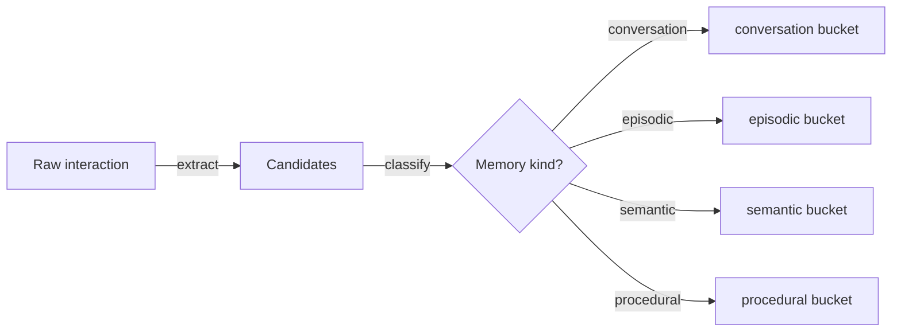

# 33 — Memory Writer

## Learning Objectives

After this module you can:

- Describe the write pipeline as three explicit stages: `extract -> classify
  -> store`.
- Split a raw interaction into independent candidate memory items.
- Classify each candidate into one of conversation / episodic / semantic /
  procedural using simple, explainable rules.
- Explain why routing should be a dedicated, auditable step rather than
  buried inside whichever module happens to run first.

## Theory

Modules 29–32 each own one memory type in isolation. In a real agent, a
single interaction ("the user asked to reset their password, we told them
we'd sent a link, and we now know resets invalidate sessions") contains
*pieces* of all four types at once. The **memory writer** is the pipeline
that takes a raw interaction and fans it out correctly:

1. **Extract** — split the raw interaction into independent, storable
   candidate strings (one idea per candidate).
2. **Classify** — decide which memory type each candidate belongs to. Here,
   simple, explainable keyword rules (mirroring module 11's `classify`
   pattern) keep the routing legible; production systems might use an LLM
   classifier or a structured-output call instead.
3. **Store** — write each candidate into its matching bucket (in modules
   29–32, actual `ConversationMemory` / `EpisodicMemory` / `SemanticMemory` /
   `ProceduralMemory` instances; here, simplified buckets to keep the lesson
   self-contained).

## Mental Models

Think of a hospital intake desk: a single patient visit generates a vitals
chart entry (episodic — what happened, when), an update to their known
allergies (semantic — a durable fact), a note in their care plan (procedural
— a skill/protocol to follow next time), and the raw conversation transcript
(conversation memory). One event, four destinations — the intake desk's job
is exactly the classify-and-route step this module demonstrates.

## Architecture



## Runnable Example

```bash
python src/33_memory_writer/memory_writer.py
```

Expected output (deterministic, log timestamp varies):

```
extracted 5 candidate(s)
conversation: 2 item(s) -> ['User asked: How do I reset my password?', "Agent replied: I've sent a reset link to your email."]
episodic: 1 item(s) -> ['At tick=12 the user triggered a password reset request.']
semantic: 1 item(s) -> ['Fact: password resets invalidate all existing sessions.']
procedural: 1 item(s) -> ['Procedure: reset_password -> verify identity, send link, set new password.']
=== TRACK4 MODULE 33: MEMORY WRITER COMPLETE ===
```

## Challenge

1. Add a sixth candidate line that should be classified as `episodic` and
   confirm it lands in the right bucket.
2. Replace the keyword-based `classify` with `get_chat_model()` using
   `with_structured_output` to output a `Literal["conversation", "episodic",
   "semantic", "procedural"]` field instead.
3. Make `store` actually instantiate the module 29–32 memory classes (import
   them via `importlib` since numbered folders aren't packages) instead of
   plain lists.

## Stretch Goals

- Add a confidence score to `classify` and route low-confidence candidates
  to a `needs_review` bucket instead of guessing.
- Make `extract` LLM-driven (splitting a paragraph of free text into atomic
  candidate statements) while keeping `classify`/`store` unchanged.

## Common Mistakes

- **Classifying the whole interaction as one type.** A single interaction is
  rarely one memory type — always extract first, then classify each piece.
- **Silent misrouting.** If classification has no fallback category, malformed
  candidates get silently dropped — always default to a safe bucket
  (`conversation` here) and log the decision.
- **Coupling extraction to storage.** Keep `extract`, `classify`, and `store`
  as separate functions (as here) so each can be tested and swapped
  independently.

## Best Practices

- Log every routing decision (`get_logger`) — memory writes are exactly the
  kind of "why did the agent think X" question you'll need to debug later.
- Keep classification rules (or the classifier prompt) in one place and
  version them, since misclassification silently corrupts long-term memory.
- Treat the writer as the *only* path into long-term memory — don't let
  individual modules write directly, or routing logic gets duplicated.

## Suggested Improvements

- Add a dry-run mode that reports the routing decision without persisting,
  useful for auditing classifier changes before they go live.
- Batch multiple raw interactions through the pipeline and report aggregate
  bucket distribution.

## References

- Module [`11_graph_branching`](../11_graph_branching/README.md) — the
  classify/route pattern this pipeline reuses.
- Modules [`29`](../29_conversation_memory/README.md)–[`32`](../32_procedural_memory/README.md)
  — the four destination memory types.
- [`docs/memory.md`](../../docs/memory.md) — the Track 4 memory overview.

## What Comes Next

[`34_memory_retrieval`](../34_memory_retrieval/README.md) is the mirror-image
pipeline: `query -> rank -> assemble`, pulling back out of all four stores
into one prompt-ready context block.
