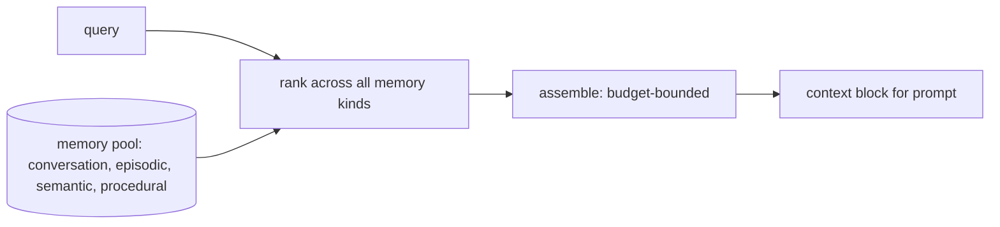

# 34 — Memory Retrieval

## Learning Objectives

After this module you can:

- Describe the retrieval pipeline as three explicit stages: `query -> rank ->
  assemble`.
- Rank candidates from multiple memory types with one shared relevance
  measure.
- Assemble a budget-bounded context block from ranked candidates.
- Explain why retrieval must be bounded by a character/token budget, not just
  a top-`k` count.

## Theory

Module 33 wrote candidates *into* conversation, episodic, semantic, and
procedural stores. This module reads them back out. Given a query, the
retrieval pipeline:

1. **Query** — a single natural-language request (what the agent currently
   needs to answer or act on).
2. **Rank** — score every candidate across *all* memory types by relevance to
   the query (here: token overlap; module 35 formalizes this into a full
   relevance/recency/importance score).
3. **Assemble** — greedily add the highest-ranked candidates into a single
   context block until a **character budget** is exhausted, not just picking
   a fixed top-`k` count.

The budget matters because different candidates have wildly different
lengths — a fixed `k` can either waste budget on short items or blow it on
one long one. Budget-bounded assembly keeps the final prompt size
predictable regardless of which memory types happen to answer a query.

## Mental Models

Think of a research assistant handed a question and a stack of index cards
from four different filing cabinets (recent chat, a diary, an encyclopedia,
a recipe box). They don't hand you every card — they skim all of them,
rank the most relevant ones, and hand you a single page's worth (the
budget), starting with whatever matters most, until the page is full.

## Architecture



## Runnable Example

```bash
python src/34_memory_retrieval/memory_retrieval.py
```

Expected output (deterministic, log timestamp varies):

```
query='How do I reset my password?'
  score=3 kind=conversation text='User asked how to reset their password.'
  score=2 kind=episodic text='At tick=12 the user triggered a password reset.'
  score=1 kind=semantic text='Fact: password resets invalidate all existing sessions.'
  score=1 kind=procedural text='Procedure reset_password: verify identity, send link, set new password.'
  score=0 kind=semantic text="Fact: the support team's SLA is 24 hours."
  score=0 kind=episodic text='At tick=3 the user logged in from a new device.'
assembled context (budget=160 chars):
[conversation] User asked how to reset their password.
[episodic] At tick=12 the user triggered a password reset.
=== TRACK4 MODULE 34: MEMORY RETRIEVAL COMPLETE ===
```

## Challenge

1. Increase `budget_chars` to 300 and observe how many more candidates get
   assembled.
2. Change `relevance` to also count partial token matches (e.g., "resets" vs.
   "reset") and see how the ranking shifts.
3. Add a rule that always includes at least one `procedural` item if one
   scored above zero, regardless of overall rank (a "type quota").

## Stretch Goals

- Replace the token-overlap `relevance` with real cosine similarity via
  `InMemoryVectorStore` (module 31) for the semantic-kind candidates only.
- Add a second budget dimension (max items per kind) so, e.g., episodic
  memories can't crowd out semantic facts even if they rank higher.

## Common Mistakes

- **Top-k without a budget.** A fixed `k` ignores wildly different candidate
  lengths — always bound by budget when the context window is the real
  constraint.
- **Ranking within a single memory type only.** Retrieval must compare
  *across* types on one shared scale, or a type with naturally higher scores
  (e.g., verbose episodic text) will always dominate.
- **Silently truncating mid-item.** `assemble` here skips an item entirely if
  it doesn't fit rather than truncating it mid-sentence — cutting text
  mid-thought produces confusing context.

## Best Practices

- Keep `rank` and `assemble` as separate, testable functions — ranking logic
  and budget logic change for different reasons.
- Log the final assembled context size (`get_logger`) so budget overruns are
  visible in production traces.
- Always have a graceful zero-result path — an empty context block should
  still let the agent respond, not crash.

## Suggested Improvements

- Make the relevance function pluggable (word overlap now; embeddings or an
  LLM re-ranker later — see module 41's reranking pattern) without changing
  `assemble`.
- Track which memory kind gets included most often in assembled context,
  useful for tuning weights in module 35's scoring.

## References

- Module [`33_memory_writer`](../33_memory_writer/README.md) — the write-side
  mirror of this pipeline.
- Module [`35_memory_scoring`](../35_memory_scoring/README.md) — the formal
  relevance/recency/importance scoring this module's `relevance` simplifies.
- [`docs/memory.md`](../../docs/memory.md) — the Track 4 memory overview.

## What Comes Next

[`35_memory_scoring`](../35_memory_scoring/README.md) replaces the simple
word-overlap relevance used here with a full, deterministic
relevance+recency+importance score.
