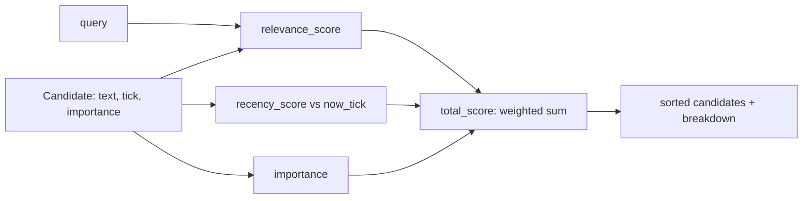

# 35 — Memory Scoring

## Learning Objectives

After this module you can:

- Combine relevance, recency, and importance into one deterministic weighted
  score.
- Implement linear recency decay against an injected fixed "now" tick
  (never wall-clock).
- Print a full score breakdown per candidate for explainability.
- Tune the three weights and predict how the ranking will shift.

## Theory

Module 34's retrieval pipeline used a single relevance signal (token
overlap) to rank candidates. Real memory systems combine (at least) three
signals:

- **Relevance** — how well the candidate matches the current query (here:
  fraction of query tokens present in the candidate text, 0–1).
- **Recency** — how recently the memory was written or last touched. This
  module uses **linear decay**: a score of `1.0` at the current tick, falling
  to `0.0` once the memory is `RECENCY_HALF_LIFE` ticks old. `now` is an
  injected constant (`NOW_TICK`), not `datetime.now()`, so scores are exactly
  reproducible.
- **Importance** — an explicit weight assigned when the memory was written
  (e.g., "the user's name" is more important than "the user said hello").

The final score is a **weighted sum**:
`total = w_r * relevance + w_c * recency + w_i * importance`. Weighted sums
are simple, auditable, and easy to tune — you can always explain *why* one
memory outranked another by pointing at the breakdown.

## Mental Models

Think of a search engine's ranking as three judges scoring the same
candidate: one judge only cares "does this match what was asked?"
(relevance), one only cares "how fresh is this?" (recency), and one only
cares "how important was this flagged as, independent of the question?"
(importance). The final ranking is their weighted vote, and printing the
breakdown is like showing each judge's individual scorecard.

## Architecture



## Runnable Example

```bash
python src/35_memory_scoring/memory_scoring.py
```

Expected output (deterministic, log timestamp varies):

```
query='How do I reset my password?' now_tick=10
text='Fact: password resets invalidate all existing sessions.' relevance=0.167 recency=0.6 importance=0.8 total=0.423
text='Procedure reset_password: verify identity, send link.' relevance=0.0 recency=0.8 importance=0.9 total=0.42
text='User asked how to reset their password.' relevance=0.5 recency=0.0 importance=0.4 total=0.33
text='User mentioned they like dark mode.' relevance=0.0 recency=0.0 importance=0.2 total=0.04
=== TRACK4 MODULE 35: MEMORY SCORING COMPLETE ===
```

## Challenge

1. Change `RELEVANCE_WEIGHT`/`RECENCY_WEIGHT`/`IMPORTANCE_WEIGHT` to
   `(0.2, 0.2, 0.6)` and observe how the ranking reorders.
2. Replace linear recency decay with exponential decay
   (`0.5 ** (age / half_life)`) and compare the two curves at `age = 0, 5,
   10, 20`.
3. Add a fourth candidate with `tick > NOW_TICK` (a "future" memory) and
   decide how `recency_score` should clamp it (currently `age` is clamped to
   `>= 0`).

## Stretch Goals

- Make the weights sum-to-one and validate that invariant with an assertion.
- Add a `min_total` floor and filter candidates below it before returning the
  ranked list — connect this to module 34's budget-bounded assembly.

## Common Mistakes

- **Using real timestamps in an assertable demo.** `datetime.now()` breaks
  reproducibility — always inject `now` as here.
- **Weights that don't sum to 1.** Nothing forces `RELEVANCE_WEIGHT +
  RECENCY_WEIGHT + IMPORTANCE_WEIGHT == 1.0`, but if they don't, `total`
  loses its 0–1 interpretability — keep them normalized.
- **Forgetting to clamp recency at zero.** Without `max(0.0, ...)`, memories
  older than the half-life would get a *negative* recency score and could
  swing the total unpredictably.

## Best Practices

- Always print (or log) the full breakdown, not just the total — scoring
  bugs are nearly impossible to diagnose from a single opaque number.
- Keep weights as named module-level constants (not magic numbers inline) so
  they're easy to find and tune.
- Round printed scores consistently (`round(x, 3)` here) so output stays
  stable across floating-point platforms.

## Suggested Improvements

- Make `half_life` per-memory-type (episodic memories might decay faster
  than semantic facts) instead of one global constant.
- Feed `total_score` directly into module 34's `rank` step, replacing the
  simple word-overlap relevance used there.

## References

- Module [`34_memory_retrieval`](../34_memory_retrieval/README.md) — the
  simpler relevance-only ranking this module formalizes.
- Module [`36_memory_consolidation_decay`](../36_memory_consolidation_decay/README.md)
  — reuses this scoring idea to decide what to forget.
- [`docs/memory.md`](../../docs/memory.md) — the Track 4 memory overview.

## What Comes Next

[`36_memory_consolidation_decay`](../36_memory_consolidation_decay/README.md)
applies a similar score to decide which memories to merge (consolidate) and
which to drop (decay).
