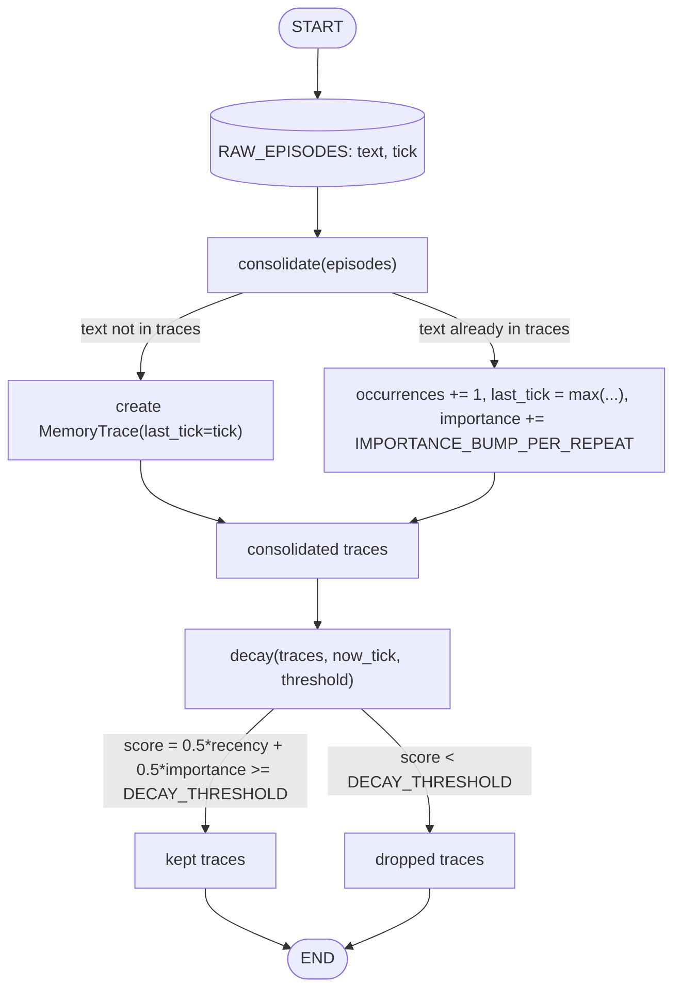
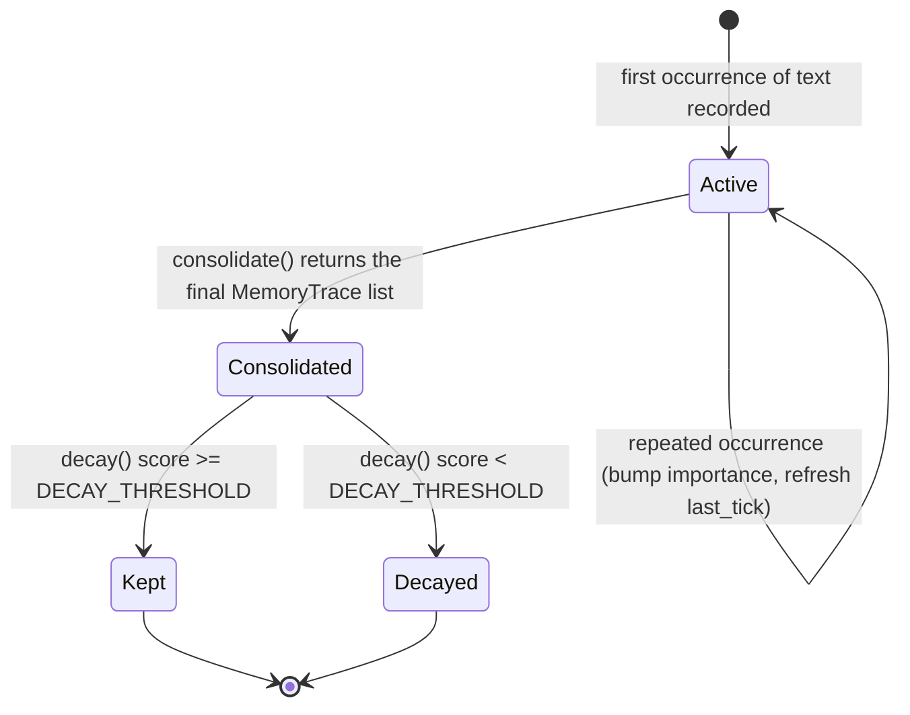
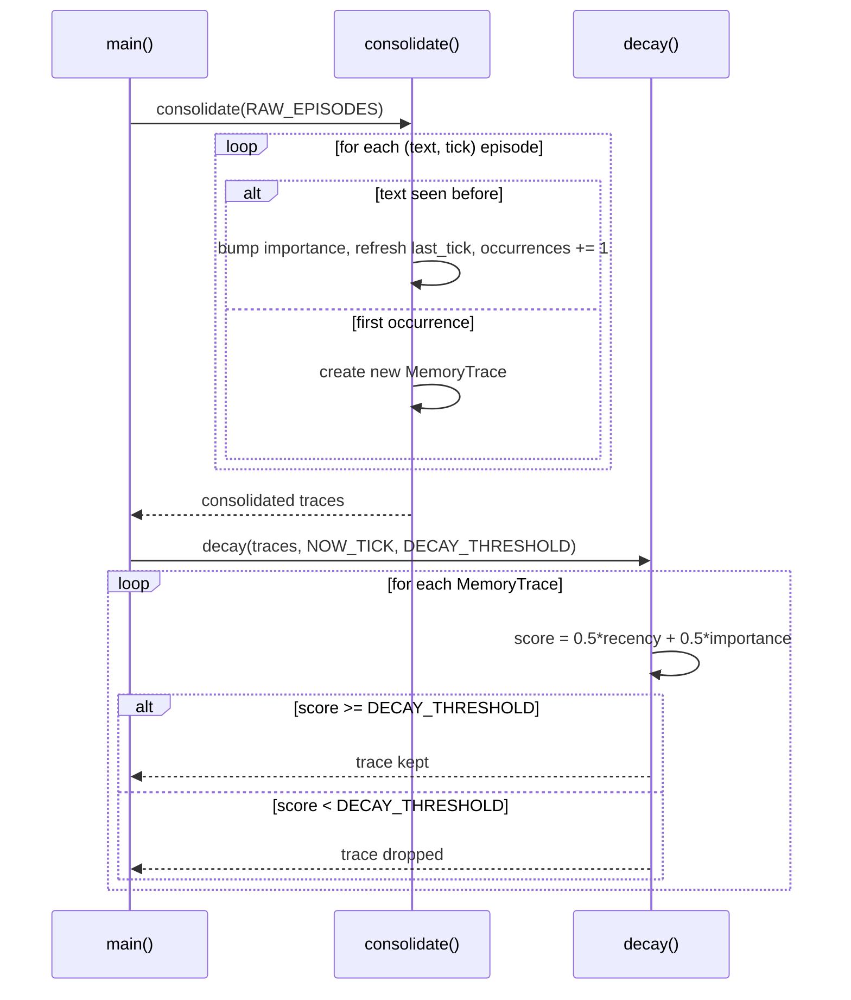

# 36 — Memory Consolidation & Decay

## Learning Objectives

After this module you can:

- Explain **consolidation** (merging repeated memories into one, stronger
  trace) as distinct from **decay** (forgetting stale, low-value memories).
- Implement a consolidation pass that bumps importance on repetition.
- Implement a decay pass using a recency+importance score against a fixed
  injected "now".
- Run both passes over a raw episode set and report what survives.

## Theory

Two maintenance operations keep a memory store useful instead of an
ever-growing, undifferentiated pile:

- **Consolidation** — repeated occurrences of essentially the same memory
  (here: identical text at different ticks) are merged into one
  `MemoryTrace`. Each repeat bumps that trace's `importance` — repetition is
  itself a signal that something matters — and refreshes its `last_tick` to
  the most recent occurrence.
- **Decay (forgetting)** — after consolidation, every trace is scored by a
  recency+importance formula (a simplified version of module 35's full
  scoring) against a fixed `NOW_TICK`. Traces scoring below a threshold are
  dropped. This models the fact that most useful memory systems must forget
  — unbounded retention isn't just expensive, it degrades retrieval quality
  by burying signal in noise.

Consolidation always runs before decay: merging duplicates first means a
memory that recurred often (and was therefore recently reinforced) survives
the decay pass even if any single occurrence was old.

## Mental Models

Think of how human memory works with repeated experience: the tenth time you
take the same route to work, it consolidates into one strong "how to get to
work" memory rather than ten separate trip memories — and each repetition
makes it more resistant to being forgotten. Meanwhile, a one-off detail you
noticed once and never revisited (what color umbrella a stranger carried)
fades — it decays because nothing reinforced it.

## Architecture

### Graph Structure



*Legend: the two edges out of `consolidate` distinguish a brand-new trace from a repeat that merges into an existing one; the two edges out of `decay` are the survive/forget outcome of the same scoring formula.*

Flow notes:
- `consolidate` merges episodes that share identical `text`: the first occurrence creates a `MemoryTrace`, and every repeat bumps `importance` by `IMPORTANCE_BUMP_PER_REPEAT` (capped at `1.0`) and refreshes `last_tick` to the more recent of the two.
- `decay` always runs **after** consolidation so a trace that recurred often is judged by its most recent occurrence and its boosted importance, not by any single stale timestamp.
- Each trace's decay score is `0.5 * recency + 0.5 * importance`; traces scoring `>= DECAY_THRESHOLD` are kept, the rest are dropped and logged.
- Dropped traces are discarded entirely — the pipeline has no archive step, so `occurrences` history is lost once a trace decays.

### State Machine — Trace Lifecycle



*Legend: `Active` covers every repeat-merge inside `consolidate`; the transition into `Consolidated` happens once, when the consolidation pass finishes; `Kept`/`Decayed` are `decay`'s only two terminal outcomes.*

Flow notes:
- A trace stays in `Active` across every repeat occurrence — the self-loop is the `occurrences += 1` bump each time the same text recurs.
- Once all episodes are processed, the trace set becomes `Consolidated` and is handed to `decay` as a whole.
- `Kept` and `Decayed` are mutually exclusive and final for this run — there is no revival path back to `Active`.

### Flow Over Time



## Runnable Example

```bash
python src/36_memory_consolidation_decay/memory_consolidation_decay.py
```

Expected output (deterministic, log timestamp varies):

```
raw episodes: 6
consolidated into 3 trace(s):
  text='user asked about password reset' occurrences=3 last_tick=7 importance=0.7
  text='user mentioned they like dark mode' occurrences=1 last_tick=3 importance=0.3
  text='user viewed the dashboard' occurrences=2 last_tick=8 importance=0.5
decay pass (now_tick=10, threshold=0.35):
  kept=['user asked about password reset', 'user viewed the dashboard']
  dropped=['user mentioned they like dark mode']
=== TRACK4 MODULE 36: MEMORY CONSOLIDATION & DECAY COMPLETE ===
```

## Challenge

1. Add a fourth repeated episode ("user mentioned they like dark mode" at
   `tick=9`) and confirm it now survives the decay pass.
2. Raise `DECAY_THRESHOLD` to `0.6` and observe which currently-kept trace
   now gets dropped.
3. Change `IMPORTANCE_BUMP_PER_REPEAT` to `0.05` and compare the outcome —
   does repetition still matter enough to save a trace?

## Stretch Goals

- Reuse module 35's full `relevance + recency + importance` formula here,
  adding a query so decay is context-sensitive (a trace stays "important"
  only relative to what the agent currently needs).
- Add a `promote_to_semantic()` step: once a trace's `occurrences` crosses a
  threshold, write it into a `SemanticMemory` (module 31) as a durable fact.

## Common Mistakes

- **Decaying before consolidating.** If decay runs first, a memory that
  recurred 3 times but whose *individual* occurrences are each old could get
  dropped before consolidation has a chance to recognize the pattern and
  boost its importance.
- **Losing occurrence count on decay.** Once a trace is dropped, its
  `occurrences` history is gone — if you need "this used to be common but
  faded," archive dropped traces instead of discarding them outright.
- **Wall-clock decay.** As with modules 30 and 35, use an injected
  `NOW_TICK`, not real time, so decay decisions are reproducible in tests.

## Best Practices

- Run consolidation on a schedule (not on every write) — it's a maintenance
  pass, not part of the hot write path.
- Log every kept/dropped decision (`get_logger`) — being able to answer "why
  did the agent forget X" is essential for trust and debugging.
- Keep the decay threshold as a named, tunable constant, and validate it
  against real usage data before deploying.

## Suggested Improvements

- Make `DECAY_HALF_LIFE` configurable per memory kind (episodic vs. semantic
  vs. procedural likely decay at different rates).
- Add a soft-delete: move dropped traces to an archive list instead of
  discarding, so consolidation can later "revive" a trace if it recurs.

## References

- Module [`35_memory_scoring`](../35_memory_scoring/README.md) — the fuller
  scoring formula this module's decay pass simplifies.
- Module [`30_episodic_memory`](../30_episodic_memory/README.md) — the raw
  episode records this module consolidates.
- [`docs/memory.md`](../../docs/memory.md) — the Track 4 memory overview.

## What Comes Next

This closes Track 4 (Memory). See [`docs/memory.md`](../../docs/memory.md)
for the full picture across modules 06 and 29–36, and the RAG track
(`37_embeddings` onward) for how semantic memory scales into a full retrieval
pipeline.
