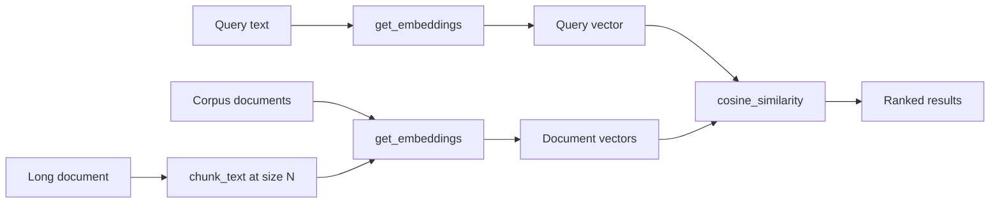

# 37 — Embeddings

## Learning Objectives

After this module you can:

- Explain what an embedding is and why cosine similarity is the standard way
  to compare two of them.
- Use `get_embeddings()` to turn text into vectors without any external
  service or API key.
- Explain why `HashingEmbeddings` is deterministic and offline, and what
  signal (and noise) a bag-of-words hashing embedder actually carries.
- Chunk a document at different granularities and observe how chunk size
  changes what a query retrieves.

## Theory

An **embedding** is a fixed-length vector representation of text such that
"similar meaning" texts end up as "close" vectors under some distance metric.
**Cosine similarity** — the cosine of the angle between two vectors — is the
standard metric because it ignores magnitude (document length) and only
measures direction (semantic content):

```
cosine(a, b) = (a . b) / (||a|| * ||b||)
```

`src/shared/embeddings.py` implements `get_embeddings()`: it returns a real
`OpenAIEmbeddings` when `OPENAI_API_KEY` is configured, and otherwise
`HashingEmbeddings` — a pure-Python **bag-of-words hashing embedder**. For
each token it hashes the token (`md5`, not the salted built-in `hash`, so the
result is stable across processes and runs) into one of `dim` buckets, adds
`+1` or `-1` to that bucket (the sign is also derived from the hash), and
sums across all tokens in the text. Two documents that share vocabulary end up
with vectors pointing in similar directions — real signal, not noise — while
staying 100% deterministic and dependency-free (no `numpy`, no network call).

The tradeoff: hashing embeddings only capture **exact token overlap** (plus
occasional hash-bucket collisions), not true semantics — "vacation" and "PTO"
look unrelated to it, where a real embedding model would place them close
together. That's the price of an offline-first fake; module `38` onward show
this is still enough to build a working RAG loop end to end.

**Chunking** is splitting a long document into smaller pieces before
embedding, because (a) embeddings and LLM context windows have finite size,
and (b) a chunk that mixes several topics dilutes the vector for any single
topic. Chunk size is a knob: too fine and you lose surrounding context; too
coarse and a relevant sentence gets buried inside irrelevant ones, lowering
its similarity score against a focused query.

## Mental Models

Think of a hashing embedder as a **word tally sheet with a fixed number of
rows**: every word gets assigned (by hashing) to one of `dim` rows, and you
add a tally mark (`+1`/`-1`) to that row every time the word appears. Two
documents that use the same words end up with similar tally sheets. Cosine
similarity then asks "how correlated are these two tally sheets?" — not "how
long is each document?"

Chunking is like **photographing a crowd**: photograph the whole crowd at
once (one giant chunk) and you can't tell who's standing where; photograph
each person alone (fine chunks) and you lose the context of who they're
standing next to. The right zoom level depends on the question you're trying
to answer.

## Architecture



## Runnable Example

```bash
python src/37_embeddings/embeddings.py
```

Expected output (deterministic, truncated):

```
query='Who approves a production deploy before it ships?'
doc=deploy score=0.3198
doc=vacation score=0.1961
doc=standup score=0.0981
doc=oncall score=0.0000

--- chunking the same long document at two granularities ---
chunk_size=11 num_chunks=5 best_chunk=chunk-0 score=0.3198 text='Production deploys run through CI after two approvals from senior engineers.'
chunk_size=45 num_chunks=1 best_chunk=chunk-0 score=0.2402 text='Production deploys run through CI after two approvals from senior engineers. ...'
takeaway: sentence-sized chunks (chunk_size=11) isolate the deploy sentence and score higher; one giant chunk (chunk_size=45) dilutes the same signal with unrelated topics and scores lower.
=== TRACK5 MODULE 37: EMBEDDINGS COMPLETE ===
```

## Challenge

1. Add a fifth document to `CORPUS` and confirm it slots into the ranking at
   the position its vocabulary overlap predicts.
2. Try `chunk_size` values between 11 and 45 and find the point where the
   best-matching chunk changes.
3. Write a second query whose top match is `vacation` instead of `deploy`,
   and verify the ranking with `rank_by_similarity`.

## Stretch Goals

- Increase `EMBEDDING_DIM` (env var, default 256) and observe whether hash
  collisions (module 39's "noise" theme) change any rankings.
- Implement overlapping chunks (a sliding window with stride < chunk_size)
  and compare retrieval quality against non-overlapping chunks.
- Swap in `OPENAI_API_KEY` (if you have one) and compare real embedding
  similarity scores against the hashed ones for the same corpus.

## Common Mistakes

- **Treating hashing-embedding scores as "semantic".** They reward shared
  vocabulary, not shared meaning — synonyms score low unless the words
  literally match.
- **Chunking by character count instead of tokens/words.** Character-based
  chunking can cut words in half at chunk boundaries, corrupting the tokens
  the embedder sees.
- **One chunk size for every document type.** Short FAQ answers and long
  policy documents need different chunk sizes — tune per corpus, not
  globally.

## Best Practices

- Keep chunks topically coherent (ideally one idea per chunk) rather than a
  fixed word count when the source structure allows it (headings, bullets).
- Always compute embeddings through one factory (`get_embeddings()`) so
  swapping the backend (fake -> real) doesn't touch call sites.
- Log corpus size and embedding dimensionality (`get_logger`) so retrieval
  regressions are traceable to a specific corpus version.

## Suggested Improvements

- Add a `recall@k` evaluation harness that checks whether the "correct" doc
  id is within the top-k for a labeled set of (query, expected_id) pairs.
- Support metadata-aware chunking (keep a `section` field per chunk) for
  citation quality in module `38`.

## References

- [`src/shared/embeddings.py`](../shared/embeddings.py) — `get_embeddings()`
  and `HashingEmbeddings`.
- [`docs/rag.md`](../../docs/rag.md) — the RAG loop this module feeds into.
- OpenAI embeddings guide: https://platform.openai.com/docs/guides/embeddings
- Cosine similarity: https://en.wikipedia.org/wiki/Cosine_similarity

## What Comes Next

[`38_rag_fundamentals`](../38_rag_fundamentals/README.md) plugs these vectors
into `InMemoryVectorStore` and closes the retrieve -> augment -> generate
loop with `get_chat_model`.
