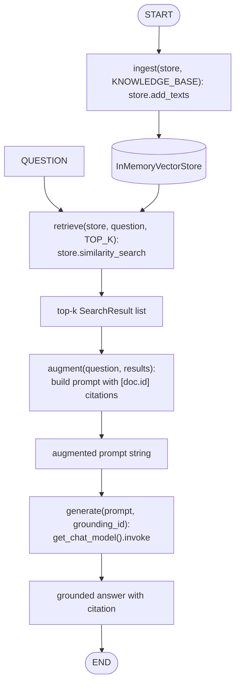
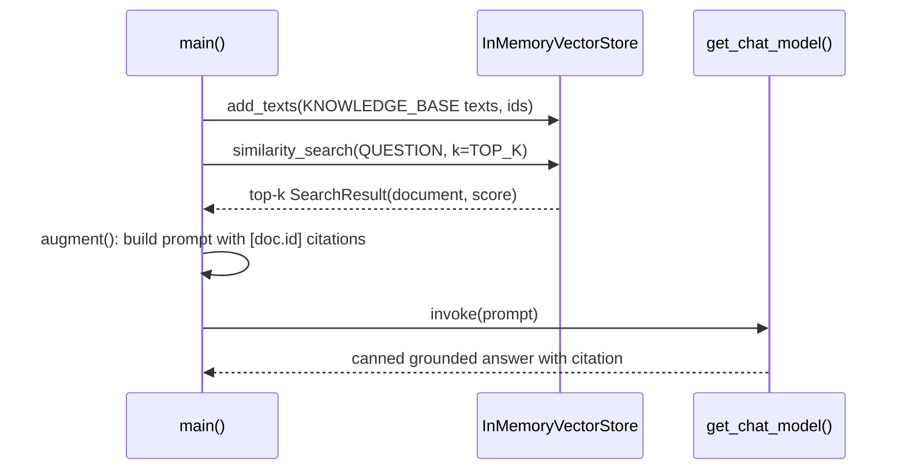

# 38 — RAG Fundamentals

## Learning Objectives

After this module you can:

- Implement the **retrieve -> augment -> generate** loop end to end with
  `InMemoryVectorStore` and `get_chat_model`.
- Explain why retrieved context must be **stuffed into the prompt**, not
  just "known" by the model.
- Reason about **context window** limits and why `k` (how many chunks you
  retrieve) is a real production tradeoff, not a free parameter.
- Add citations to a generated answer so it stays traceable to its sources.

## Theory

**Retrieval-Augmented Generation (RAG)** grounds an LLM's answer in specific
documents instead of relying purely on what the model memorized during
training. The loop has three steps:

1. **Retrieve** — given a question, fetch the top-`k` most relevant chunks
   from a vector store (module 37's embeddings power this).
2. **Augment** — build a prompt that includes those chunks as context,
   instructing the model to answer *from the context*, not from memory.
3. **Generate** — call the LLM with the augmented prompt; it composes an
   answer grounded in what it was just shown.

This is powerful because it lets an LLM answer questions about content it
never saw during training (your internal wiki, this week's tickets, a
customer's account history) without retraining anything — you just change
what you retrieve.

**Context windows** are the practical constraint: a model can only attend to
a finite number of tokens per call. Every retrieved chunk you stuff into the
prompt competes for that budget with the question, the system prompt, and
(in a multi-turn agent) the conversation history. This is exactly why
chunking (module 37) and retrieval quality (module 39's hybrid search,
module 41's reranking) matter — a bigger `k` isn't free, so retrieval needs
to be accurate with a small `k`.

**Citations** — printing `[doc-id]` next to the fact the model used — turn a
plausible-sounding answer into a checkable one. Grounded generation only
delivers trust if a human (or an eval) can trace every claim back to a
specific retrieved chunk.

## Mental Models

RAG is an **open-book exam**: retrieval is "which pages of the textbook are
relevant to this question" (you can't bring the whole textbook — page
budget is limited), augmentation is "photocopying those pages and stapling
them to the question," and generation is "writing the answer using only the
stapled pages, and citing which page each fact came from." A model with no
retrieval is taking the exam from memory alone — it might still get it
right, but you can't verify it did.

## Architecture

### Graph Structure



*Legend: this is a straight-line pipeline (no branches) — `ingest` runs once before the loop the reader cares about: `retrieve -> augment -> generate`, each step feeding the next unconditionally.*

Flow notes:
- `ingest` embeds and upserts every `KNOWLEDGE_BASE` document into the store once, before any question is asked.
- `retrieve` fetches the top-`TOP_K` documents by similarity to `QUESTION` — retrieval quality here directly bounds what `augment`/`generate` can ground their answer in.
- `augment` builds a single prompt string that stuffs the retrieved context (each line prefixed with its `[doc.id]`) ahead of the question, and instructs the model to answer **only** from that context.
- `generate` calls `get_chat_model().invoke(prompt)`; the offline fake returns a canned, citation-bearing answer, while a real `ChatOpenAI` would read the same augmented prompt and produce a grounded answer citing the same context.

### Flow Over Time



## Runnable Example

```bash
python src/38_rag_fundamentals/main.py
```

Expected output (deterministic):

```
question='Who has to approve a production deploy before it ships?'
retrieved id=kb-deploy score=0.2860
retrieved id=kb-standup score=0.2631
answer='Two senior engineers must approve a deploy via CI before it ships. [kb-deploy]'
=== TRACK5 MODULE 38: RAG FUNDAMENTALS COMPLETE ===
```

## Challenge

1. Lower `TOP_K` to 1 and confirm the answer's citation still points to the
   right document.
2. Add a document to `KNOWLEDGE_BASE` that directly contradicts `kb-deploy`
   and observe how retrieval scores (not the canned answer) change.
3. Rewrite `augment()` to truncate context to a fixed character budget and
   print a warning (via `get_logger`) when a chunk gets cut.

## Stretch Goals

- Replace the canned `generate()` response with a real `ChatOpenAI` call
  (set `OPENAI_API_KEY`) and confirm the same prompt produces a genuinely
  grounded, cited answer.
- Add a "no relevant context" branch: if the top retrieval score is below a
  threshold, refuse to answer instead of guessing.
- Track token counts of the augmented prompt and enforce a hard context
  budget instead of a fixed `k`.

## Common Mistakes

- **Skipping augmentation.** Retrieving good chunks but not putting them in
  the prompt (or putting them after the question, where instruction-tuned
  models pay less attention) defeats the entire point of RAG.
- **No citation discipline.** An ungrounded-looking answer that happens to be
  right is indistinguishable from a hallucination until you can trace it.
- **Ignoring the context budget.** Retrieving `k=20` chunks "to be safe" can
  silently truncate the most relevant chunk off the end of the prompt.

## Best Practices

- Always instruct the model to answer **only** from the provided context —
  it materially reduces hallucination even with real models.
- Log retrieval scores (`get_logger`) so a bad answer can be diagnosed as a
  retrieval problem vs. a generation problem.
- Keep `k` as small as your retrieval quality allows; invest in better
  retrieval (modules 39-41) before growing the context window.

## Suggested Improvements

- Add a `Document.metadata["source_url"]` field and render citations as
  clickable links instead of raw ids.
- Add an evaluation harness that scores whether the citation actually
  supports the generated claim (citation-faithfulness check).

## References

- [`src/shared/vectorstore.py`](../shared/vectorstore.py) —
  `InMemoryVectorStore`, `Document`, `SearchResult`.
- [`src/shared/llm.py`](../shared/llm.py) — `get_chat_model`,
  `FakeToolCallingModel`.
- [`docs/rag.md`](../../docs/rag.md) — the full RAG loop, chunking, hybrid
  search, rewriting, reranking, and evaluation.
- Retrieval-Augmented Generation paper (Lewis et al., 2020):
  https://arxiv.org/abs/2005.11401

## What Comes Next

[`39_hybrid_search`](../39_hybrid_search/README.md) improves the *retrieve*
step by fusing this dense signal with a keyword scorer, catching relevant
documents that pure embedding similarity misses.
