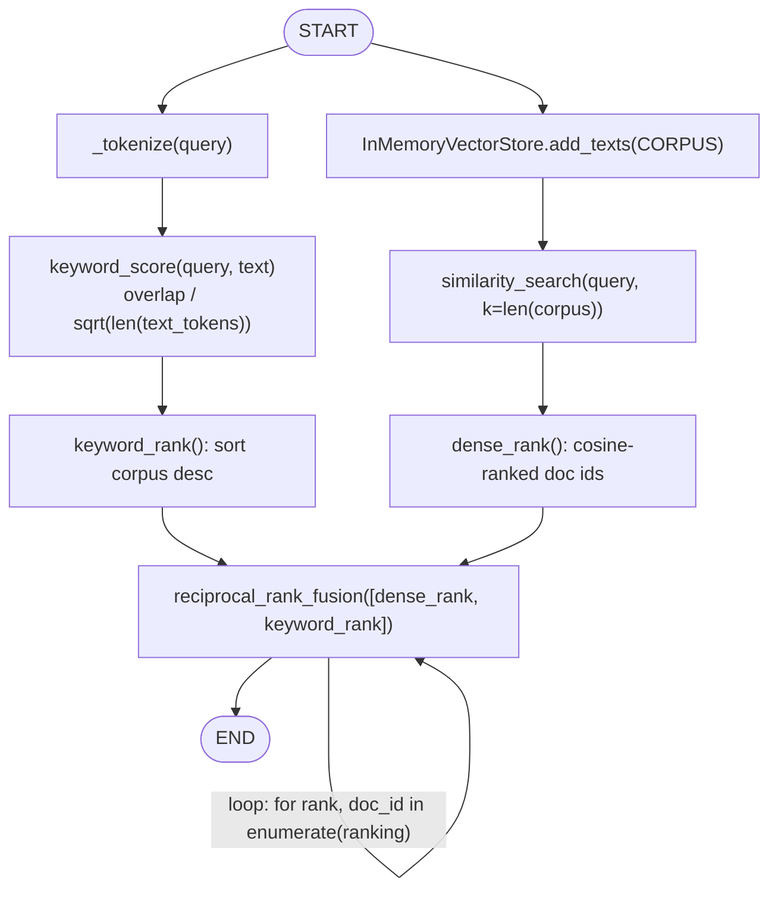
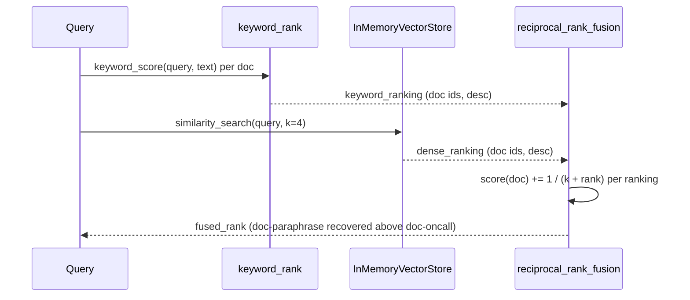

# 39 — Hybrid Search

## Learning Objectives

After this module you can:

- Combine a dense (embedding) retriever with a keyword/BM25-style retriever.
- Explain why the two signals fail differently and therefore compensate for
  each other.
- Fuse two rankings into one with **Reciprocal Rank Fusion (RRF)**.
- Point to a concrete query where hybrid search outranks either signal used
  alone.

## Theory

**Dense retrieval** (module 37/38) embeds query and documents into vectors
and ranks by cosine similarity. It's robust to vocabulary variation when the
embedder captures real semantics, but the offline `HashingEmbeddings` only
captures **exact shared tokens** (plus hash-bucket noise) — so it can
under-rank a genuinely relevant document that happens to share few words
with the query, especially if an unrelated document shares more common
words by coincidence.

**Keyword search** (BM25 and its relatives) ranks by term-frequency overlap,
normalized by document length. It nails exact terminology — error codes,
proper nouns, acronyms — but has zero notion of paraphrase: a document that
says the same thing in different words scores zero if it shares no tokens
with the query.

**Score fusion** combines both rankings so their failure modes don't
compound. This module uses **Reciprocal Rank Fusion (RRF)**:

```
score(doc) = sum over each ranking r of  1 / (k + rank_r(doc))
```

RRF only needs the *rank position* of a document in each list, not its raw
score — which sidesteps the problem of dense and keyword scores living on
incomparable scales (cosine similarity in `[-1, 1]` vs. an unbounded overlap
ratio). A document that ranks reasonably in *either* list accumulates score;
a document only one retriever likes still surfaces instead of being buried.

## Mental Models

Think of dense and keyword search as **two witnesses describing the same
suspect from different angles**: one recognizes an exact detail (a licence
plate — the error code), the other recognizes the general shape (a
paraphrase — "throttled" for "rate limited"). Neither witness alone gives
you the full picture reliably; a detective (RRF) who weighs both testimonies
by how confident/high-ranked each is reaches a better verdict than trusting
only one.

## Architecture



*Legend: the loop arrow on `reciprocal_rank_fusion` is the inner accumulation
over each ranking's positions, not a retry — every ranking is visited exactly
once per call.*



**Flow notes**

- Both `keyword_rank` and `dense_rank` run independently over the same
  `CORPUS` and never see each other's output — that independence is what
  lets fusion compensate for either one's mistakes.
- `reciprocal_rank_fusion`'s inner loop iterates each input ranking once,
  accumulating `1 / (k + rank)` per document — a document absent from a
  ranking simply contributes 0 from that source, it is never penalized.
- The final assertion (`fusion_recovers_it`) checks that `doc-paraphrase`
  outranks `doc-oncall` in `fused_rank` even though keyword search alone
  buries it — the concrete "hybrid beats either signal" case.

## Runnable Example

```bash
python src/39_hybrid_search/hybrid.py
```

Expected output (deterministic, truncated):

```
query='What does ERR_429 mean and what should I do about rate limiting?'
keyword_rank=['doc-code', 'doc-oncall', 'doc-paraphrase', 'doc-standup']
dense_rank=['doc-code', 'doc-paraphrase', 'doc-oncall', 'doc-standup']
fused_rank=['doc-code', 'doc-paraphrase', 'doc-oncall', 'doc-standup']
...
keyword_rank_of(doc-paraphrase)=3 vs keyword_rank_of(doc-oncall)=2 -> keyword_buries_relevant_doc=True
fused_rank_of(doc-paraphrase)=2 vs fused_rank_of(doc-oncall)=3 -> fusion_recovers_relevant_doc=True
=== TRACK5 MODULE 39: HYBRID SEARCH COMPLETE ===
```

Keyword search alone ranks the truly relevant paraphrase document *below* an
irrelevant one (a false positive from shared common words). Fusing in the
dense signal restores the correct order — a concrete case of hybrid beating
one signal alone.

## Challenge

1. Set `k=1` in `reciprocal_rank_fusion` (down from the default 60) and
   observe how much more aggressively fusion favors top-ranked documents.
2. Add a third ranking signal (e.g. a recency score) and fuse all three.
3. Construct a query where **dense** search buries the relevant document and
   keyword search recovers it (the mirror image of this module's example).

## Stretch Goals

- Replace the simple overlap-based `keyword_score` with a real BM25 formula
  (term frequency saturation + inverse document frequency) — still pure
  Python, no dependency.
- Add weighted fusion (`w_dense * 1/(k+rank)` vs `w_keyword * ...`) and tune
  the weights on a small labeled query set.
- Combine this module with `41_reranking`: use hybrid search as the
  first-stage retriever feeding into the cross-encoder-style reranker.

## Common Mistakes

- **Averaging raw scores directly.** Cosine similarity and a keyword overlap
  ratio are not on the same scale — averaging them without rank-based fusion
  or score normalization produces meaningless rankings.
- **Assuming hybrid always wins.** If one signal is much stronger for your
  domain (e.g. pure log search needs keyword-only), fusing in a weak second
  signal can dilute good rankings — measure before adopting hybrid.
- **Forgetting to dedupe.** If both retrievers query the same store,
  fusion must operate over the same document ids, or ranks won't line up.

## Best Practices

- Log both individual rankings and the fused ranking (`get_logger`) so a bad
  retrieval can be traced to one signal, not "hybrid search in general."
- Keep the keyword scorer dependency-free and fast — it should never become
  the retrieval bottleneck relative to the vector search.
- Evaluate hybrid search against dense-only and keyword-only baselines on a
  labeled query set before shipping it — the mixing isn't free of tradeoffs.

## Suggested Improvements

- Add per-field weighting (e.g. title matches count more than body matches)
  to the keyword scorer.
- Expose the RRF `k` constant as a tunable parameter and add a small sweep
  script that reports fused ranking stability across `k` values.

## References

- Reciprocal Rank Fusion (Cormack et al., 2009):
  https://plg.uwaterloo.ca/~gvcormac/cormacksigir09-rrf.pdf
- Okapi BM25: https://en.wikipedia.org/wiki/Okapi_BM25
- [`37_embeddings`](../37_embeddings/README.md) — the dense signal this
  module fuses.
- [`docs/rag.md`](../../docs/rag.md) — hybrid search in the full RAG
  pipeline.

## What Comes Next

[`40_query_rewriting`](../40_query_rewriting/README.md) improves *what you
retrieve for* — expanding or transforming the query itself — rather than
combining retrieval signals.
