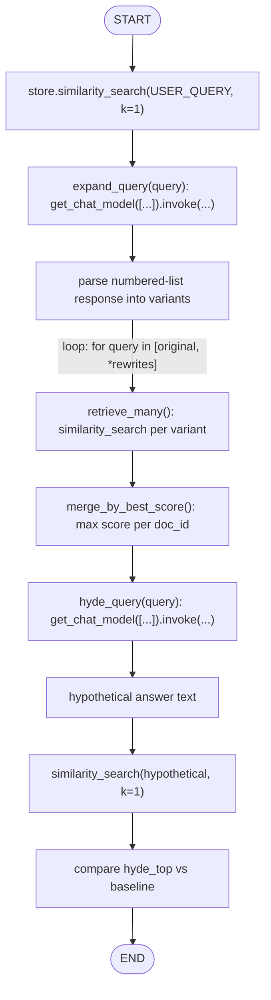
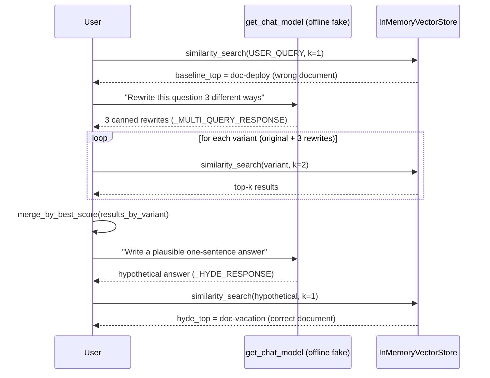

# 40 — Query Rewriting

## Learning Objectives

After this module you can:

- Implement **multi-query expansion**: turning one user question into
  several phrasings, retrieving for each, and merging the results.
- Implement **HyDE (Hypothetical Document Embeddings)**: embedding a
  hypothetical *answer* instead of the bare question.
- Explain why a terse question and a well-written answer can live in
  different regions of embedding space, and why that's the core rewriting
  problem.
- Explain when rewriting helps retrieval and when it can hurt it.

## Theory

Users ask short, ambiguous questions ("how far ahead do I need to plan a
trip?"); knowledge bases are written in longer, answer-shaped prose
("employees request vacation through the HR portal two weeks in advance").
Even with real embeddings, a **question** and its **answer** don't always
sit close together in vector space — they're different genres of text. Query
rewriting closes this gap *before* retrieval runs.

**Multi-query expansion** asks an LLM to produce several alternate phrasings
of the same question (synonyms, different framings, keyword-style
variants), retrieves top-k for *each* variant, and merges the results (this
module keeps each document's best score across variants). More
phrasings means more chances that at least one variant's vocabulary
overlaps with the target document.

**HyDE** takes the opposite approach: instead of rewriting the question, ask
the model to **sketch a plausible answer** to it (even a wrong one is
useful — it doesn't need to be factually correct), then embed *that* and use
it as the retrieval query. An answer-shaped hypothetical document tends to
land near real answer-shaped documents in embedding space, even when the
original terse question does not.

**When rewriting helps:** vocabulary mismatch between question and answer
phrasing (the case demonstrated below), ambiguous or underspecified
questions, and domains with heavy jargon where the user doesn't know the
right term.

**When rewriting hurts:** the original question already retrieves well
(rewriting adds latency and cost for no gain), rewrites drift off-topic
(especially HyDE — a wrong hypothetical answer can pull retrieval toward the
wrong part of the corpus), or the corpus is small enough that spurious
matches from broader phrasing dilute precision.

## Mental Models

**Multi-query** is like **asking the same question to a room in five
different accents** — if any one phrasing "clicks" with how the answer is
written, you find it, even if your first phrasing didn't.

**HyDE** is like **guessing what the textbook page looks like before you
open the book** — you sketch what an answer would plausibly say, and go
find the real page that reads similarly, rather than searching with the raw
question a student would ask out loud.

## Architecture



*Legend: the loop on `retrieve_many` is "one retrieval per rewritten
variant"; there is no conditional branching in this module — both
strategies run unconditionally so their outputs can be compared side by
side.*



**Flow notes**

- `expand_query` calls the model once, then parses its numbered-list
  response into rewrites; the original query is always kept as the first
  variant so rewriting can only add coverage, never remove the baseline.
- `retrieve_many` loops over every variant (original + rewrites) and issues
  one `similarity_search` per variant — no branch, just repetition.
- `merge_by_best_score` keeps each document's **best** score seen across all
  variants (a `max`, never an average), so one bad rewrite can only fail to
  help, not actively hurt a document's merged score.
- `hyde_query` takes a different path entirely: one model call produces a
  hypothetical *answer*, which is embedded and searched directly — no
  merging step, just a single retrieval compared against the baseline.

## Runnable Example

```bash
python src/40_query_rewriting/query_rewriting.py
```

Expected output (deterministic, truncated):

```
user_query='How far ahead do I need to plan a trip away from work?'
baseline_top id=kb-deploy score=0.1672

--- multi-query expansion ---
variant='How far ahead do I need to plan a trip away from work?'
variant='How much notice is required before taking time off?'
variant='What is the process for requesting vacation?'
variant='vacation HR portal advance notice policy'
merged_rank=[('kb-vacation', 0.527...), ...]

--- HyDE (hypothetical document embeddings) ---
hypothetical_answer='You should submit your vacation request through the HR portal at least two weeks before your planned time off.'
hyde_top id=kb-vacation score=0.6198 vs baseline_top id=kb-deploy score=0.1672 improvement=+0.4525
=== TRACK5 MODULE 40: QUERY REWRITING COMPLETE ===
```

The bare user question retrieves the *wrong* document (`kb-deploy`); both
multi-query expansion and HyDE correctly surface `kb-vacation`.

## Challenge

1. Change `USER_QUERY` to a phrasing that already retrieves `kb-vacation`
   directly, and observe that rewriting no longer changes the top result —
   the "rewriting doesn't always help" case.
2. Add a fourth multi-query variant designed to be a bad rewrite (off-topic)
   and see how `merge_by_best_score` limits its damage (it can only ever
   help a document's score, never hurt one via the `max` merge).
3. Implement a merge strategy based on `reciprocal_rank_fusion` (module 39)
   instead of best-score-per-document, and compare the two merged rankings.

## Stretch Goals

- Replace the canned multi-query response with a real `ChatOpenAI` call
  (`OPENAI_API_KEY`) and inspect genuinely model-generated rewrites.
- Build a HyDE variant that generates *multiple* hypothetical answers and
  averages their embeddings before retrieval.
- Add a guard: if HyDE's hypothetical answer retrieves worse than the
  baseline query, fall back to the baseline (protects against the "hurts"
  case).

## Common Mistakes

- **Trusting a bad rewrite blindly.** Multi-query and HyDE both add a model
  call in the loop; if that call produces an off-topic rewrite, retrieval
  quality can degrade instead of improve — always compare against the
  baseline in eval, don't assume rewriting is strictly additive.
- **Re-running expensive rewriting on every query.** Cache or skip rewriting
  when the baseline retrieval score is already high.
- **Confusing HyDE's hypothetical answer with a real answer.** It must never
  be shown to the user — it exists purely to steer retrieval.

## Best Practices

- Always keep the original query as one of the multi-query variants (this
  module does) so a rewrite can only add coverage, not replace a
  already-good baseline.
- Log which variant(s) contributed to the final top document
  (`get_logger`) so rewriting quality can be measured over time.
- A/B or offline-eval rewriting strategies against the no-rewrite baseline
  before deploying — this module's own example shows rewriting can be a
  clear win, but that's a property of the corpus, not a universal law.

## Suggested Improvements

- Add a confidence-gated rewriting step: only rewrite when baseline
  retrieval score is below a threshold, saving latency on easy queries.
- Track rewrite provenance in the merged results so citations can note
  "found via variant 3" for debugging.

## References

- HyDE paper (Gao et al., 2022), "Precise Zero-Shot Dense Retrieval without
  Relevance Labels": https://arxiv.org/abs/2212.10496
- [`39_hybrid_search`](../39_hybrid_search/README.md) — `reciprocal_rank_fusion`,
  reusable as an alternate merge strategy here.
- [`docs/rag.md`](../../docs/rag.md) — query rewriting in the full RAG
  pipeline.

## What Comes Next

[`41_reranking`](../41_reranking/README.md) improves the step *after*
retrieval: re-scoring the candidates rewriting and fusion produced with a
more accurate, joint query/candidate scorer.
