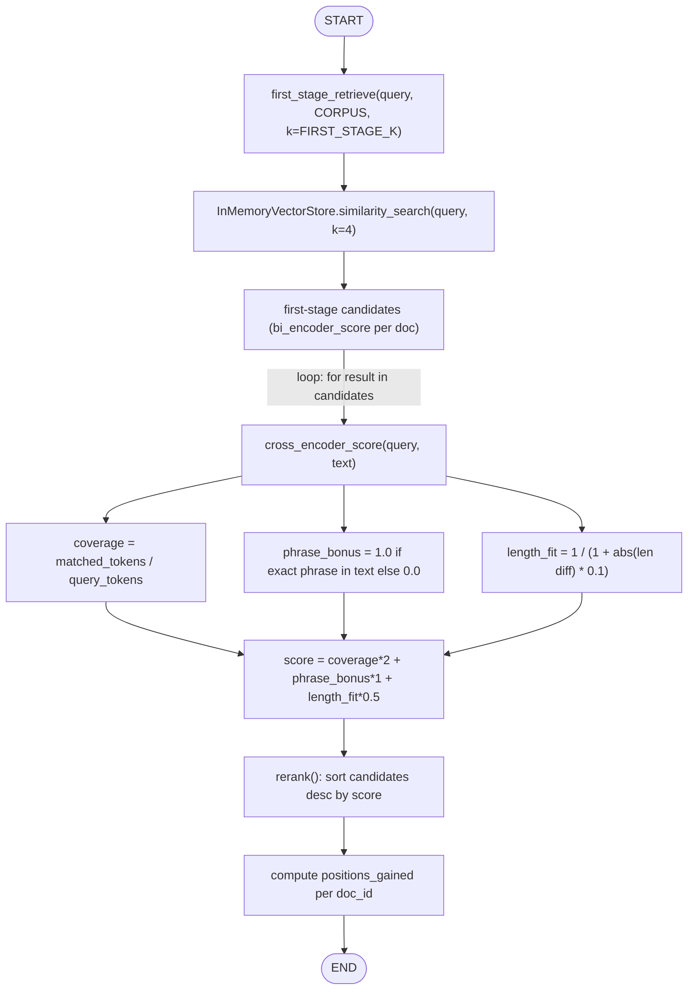
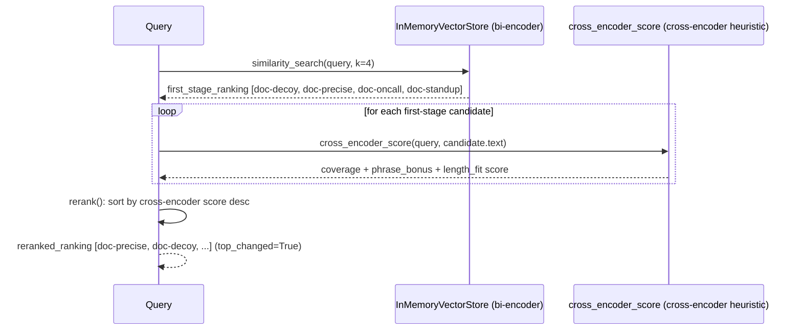

# 41 — Reranking

## Learning Objectives

After this module you can:

- Explain the **two-stage retrieve-then-rerank** pattern and why production
  RAG systems use it instead of running an expensive scorer over the whole
  corpus.
- Contrast a **bi-encoder** (query and candidate embedded independently,
  compared by cosine similarity) with a **cross-encoder** (query and
  candidate scored jointly, as a pair).
- Implement a deterministic, offline cross-encoder-style heuristic and use
  it to re-order a first-stage candidate list.
- Read a ranking delta and explain what it means for retrieval quality.

## Theory

**First-stage retrieval** (modules 37-39) is cheap because it's a
**bi-encoder**: query and every candidate are embedded *independently*, once,
and compared by cosine similarity. This scales to millions of documents
because candidate embeddings can be precomputed and indexed. Its weakness:
because query and candidate never "see" each other during embedding, the
similarity score can't capture interactions that only make sense pairwise —
exact phrase order, whether every distinct query concept is actually covered,
document length relative to the query, etc.

A **cross-encoder** feeds `[query, candidate]` through a single model so
every query token can attend to every candidate token — much more accurate,
but it must run once *per candidate per query* and can't be precomputed.
That's too slow for an entire corpus, which is why production systems run it
only over the small set (10-100) the cheap bi-encoder already narrowed down.
This is **two-stage retrieve-then-rerank**: retrieval optimizes for *recall*
(don't miss anything plausible), reranking optimizes for *precision*
(put the truly best one first).

A real cross-encoder is a trained model (and isn't installed here). This
module's `cross_encoder_score` is a deterministic, offline **heuristic**
standing in for one: it combines query-token **coverage** (what fraction of
query terms appear in the candidate), an exact-**phrase** containment bonus,
and a **length-fit** term — three pair-level signals a bi-encoder's cosine
score cannot see, because it only ever looks at one vector at a time.

## Mental Models

Bi-encoder retrieval is a **résumé keyword scanner**: fast, scales to
thousands of applicants, but it can rank a résumé stuffed with buzzwords
above a genuinely well-matched one. A cross-encoder is a **hiring manager
reading the top 10 résumés side by side against the actual job description**
— slower, but catches keyword-stuffing and rewards the candidate that
actually answers what the role needs. You use the scanner to get to 10, and
the manager to pick 1 — never the other way around.

## Architecture



*Legend: the loop over "for result in candidates" is stage 2 re-scoring
each stage-1 candidate independently — no candidate can be promoted unless
it survived stage 1 first.*



**Flow notes**

- Stage 1 (`first_stage_retrieve`) is the cheap bi-encoder pass: query and
  every candidate are embedded independently and compared by cosine
  similarity — it decides *recall* (what makes the candidate set at all).
- Stage 2 (`rerank` → `cross_encoder_score`) only ever sees the candidates
  stage 1 already returned; there is no branch back to stage 1, so a
  document stage 1 dropped can never be rescued by reranking.
- `cross_encoder_score` combines three pair-level signals a bi-encoder
  cannot see: token **coverage**, exact-**phrase** containment, and
  **length-fit** — this is what lets `doc-precise` overtake the
  keyword-stuffed `doc-decoy` in the final ranking.

## Runnable Example

```bash
python src/41_reranking/reranking.py
```

Expected output (deterministic, truncated):

```
query='request vacation through the HR portal'
--- stage 1: bi-encoder first pass ---
id=doc-decoy bi_encoder_score=0.8115
id=doc-precise bi_encoder_score=0.7144
...
--- stage 2: cross-encoder-style rerank ---
id=doc-precise cross_encoder_score=2.2778
id=doc-decoy cross_encoder_score=2.1667
...
first_stage_rank=['doc-decoy', 'doc-precise', 'doc-oncall', 'doc-standup']
reranked_rank=['doc-precise', 'doc-decoy', 'doc-oncall', 'doc-standup']
delta id=doc-precise positions_gained=1
delta id=doc-decoy positions_gained=-1
top_changed_after_rerank=True
=== TRACK5 MODULE 41: RERANKING COMPLETE ===
```

`doc-decoy` keyword-stuffs the query's exact terms into unrelated sub-topics
and wins the bi-encoder pass; the cross-encoder-style scorer sees through
the stuffing (lower coverage of distinct concepts, worse length fit) and
correctly promotes `doc-precise` — the document that actually answers the
question.

## Challenge

1. Change `FIRST_STAGE_K` to 2 and observe that `doc-precise` must survive
   stage 1 to ever be reranked to the top — reranking cannot recover a
   document stage 1 didn't retrieve at all.
2. Tune the weights in `cross_encoder_score` (coverage vs. phrase bonus vs.
   length fit) and see how sensitive the reranked order is to each term.
3. Add a document that wins on cross-encoder score but was *not* in the
   first-stage top-k, and prove reranking can't rescue it (motivating a
   larger `FIRST_STAGE_K` when compute allows).

## Stretch Goals

- Swap in `sentence-transformers`' `CrossEncoder` (if you add the
  dependency) behind the same `cross_encoder_score` signature, gated like
  module 42 gates `qdrant-client`.
- Combine with `39_hybrid_search`: feed hybrid-fused candidates into
  `rerank()` instead of pure bi-encoder candidates.
- Add a `top_k` parameter to `rerank()` so only the reranked top-n are kept,
  measuring end-to-end latency versus stage-1-only.

## Common Mistakes

- **Reranking the whole corpus.** Defeats the purpose — the point of
  two-stage retrieval is that the expensive scorer only ever sees a small
  candidate set.
- **Trusting bi-encoder scores as final.** Cosine similarity from an
  independently-embedded pair is a *candidate generator*, not a final
  ranking — treat it as recall-oriented, not precision-oriented.
- **A reranker with no relationship to the domain.** A heuristic (or a
  cross-encoder) tuned on the wrong kind of text can rerank confidently and
  wrongly — validate reranking against labeled examples before trusting it.

## Best Practices

- Always log both the first-stage and reranked orderings (`get_logger`) so
  a bad final answer can be traced to the retrieval stage or the reranking
  stage.
- Keep `FIRST_STAGE_K` generous enough that reranking has real candidates to
  work with — reranking cannot invent recall it wasn't given.
- Measure ranking deltas (this module's `positions_gained`) on a held-out
  query set before shipping a reranker — it should measurably improve
  precision at k, not just reorder arbitrarily.

## Suggested Improvements

- Add an NDCG or MRR evaluation harness comparing first-stage-only vs.
  reranked orderings against labeled relevance judgments.
- Cache cross-encoder scores per (query, doc) pair within a session to avoid
  recomputing them if the same candidates reappear.

## References

- Two-stage retrieval overview:
  https://www.sbert.net/examples/applications/retrieve_rerank/README.html
- [`39_hybrid_search`](../39_hybrid_search/README.md) — an alternate
  first-stage retriever that can feed this module's `rerank()`.
- [`docs/rag.md`](../../docs/rag.md) — reranking in the full RAG pipeline.

## What Comes Next

[`42_qdrant_production`](../42_qdrant_production/README.md) moves from an
in-memory prototype to a production vector-store path — the same retrieval
mechanics, backed by a real vector database when one is configured.
