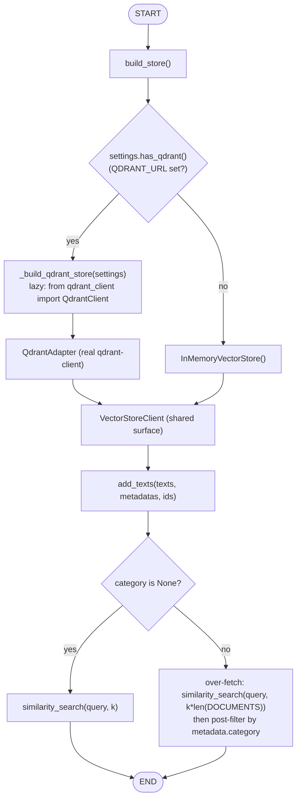
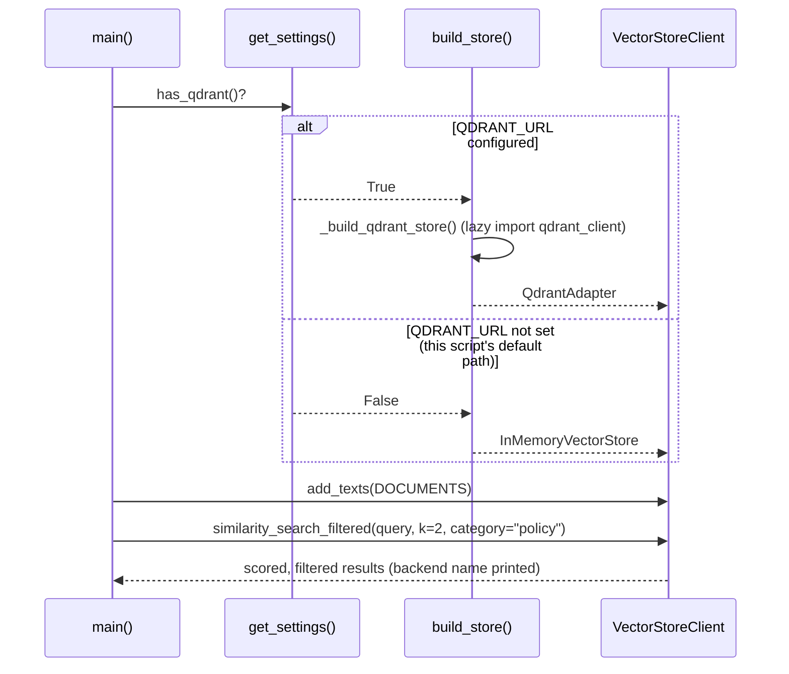

# 42 — Qdrant Production Path

## Learning Objectives

After this module you can:

- Explain the difference between a prototype vector store
  (`InMemoryVectorStore`) and a production one (Qdrant): persistence,
  scale, and server-side filtering.
- Gate a real client dependency behind an environment variable so a module
  runs offline by default and against a real service when configured.
- Explain **collections**, **payloads**, and **filtered search** — the three
  concepts that carry over between the in-memory fallback and a real Qdrant
  deployment.
- Read code where the real-dependency import is deliberately kept out of the
  module's top level, and explain why that matters for offline-first repos.

## Theory

`InMemoryVectorStore` (used throughout modules 37-41) is a teaching tool: no
persistence, no server, cosine similarity over a Python dict. **Qdrant** is a
real vector database: it persists vectors to disk, indexes them for
sub-linear approximate nearest-neighbor search at scale, and runs as a
separate service your application talks to over HTTP/gRPC.

Three concepts map directly from the toy store to the real one:

- **Collection** — a named set of vectors with a fixed dimensionality and
  distance metric (here, cosine). `InMemoryVectorStore` has one implicit
  collection; Qdrant lets you manage many, each independently configured
  (`COLLECTION_NAME` in this module's code).
- **Payload** — arbitrary metadata attached to each vector (`category`,
  `source`, `tenant_id`, ...). `InMemoryVectorStore`'s `Document.metadata`
  and a Qdrant point's `payload` serve the same purpose: filtering and
  citation data that travels with the vector.
- **Filtered search** — restricting similarity search to vectors whose
  payload matches a condition (e.g. `category == "policy"`). Qdrant pushes
  this filter **server-side** (efficient: it prunes the search space before
  scoring). The in-memory fallback has no server to push it to, so this
  module over-fetches and **post-filters** in Python — correct results, but
  it scans more candidates to get there. That cost difference is the whole
  point of using a real vector database in production.

**Why gate the import:** `qdrant-client` is not installed in this
environment. If `from qdrant_client import QdrantClient` sat at module top
level, importing this file at all — including for the offline smoke test —
would fail. Instead, the import lives strictly inside `_build_qdrant_store`,
called only when `get_settings().has_qdrant()` is true (i.e. `QDRANT_URL` is
set). Offline, that function is never called and never imported; the
`InMemoryVectorStore` fallback runs instead. This is the same pattern
`get_chat_model`/`get_embeddings` already use for `langchain_openai`.

## Mental Models

Think of `InMemoryVectorStore` as a **whiteboard with sticky notes** — great
for a demo, gone when you erase it, and fine for a handful of notes. Qdrant
is a **filing cabinet in a records office**: notes persist, there's an index
so a clerk (the query planner) can jump straight to the right drawer
(collection) and folder (payload filter) instead of reading every sticky
note in the building.

## Architecture



*Legend: the `has_qdrant()` diamond is the only real/offline branch in this
module; the `category is None?` diamond is a second, independent branch
inside `similarity_search_filtered` that decides between a plain search and
an over-fetch-then-post-filter search.*



**Flow notes**

- `build_store()` checks `settings.has_qdrant()` exactly once; on `False`
  (the default, offline path this script and its smoke test always
  exercise) it returns `InMemoryVectorStore()` without ever importing
  `qdrant_client`.
- On `True`, `_build_qdrant_store` is the only place `qdrant_client` is
  imported — lazily, inside the function — so the module stays importable
  even when the package isn't installed.
- `similarity_search_filtered`'s `category is None` branch chooses between
  a plain `similarity_search` and an over-fetch-then-post-filter path; the
  in-memory backend has no server-side filter to push the condition to, so
  it fetches `k * len(DOCUMENTS)` candidates and filters in Python — a real
  Qdrant collection would push the same filter server-side instead.

## Runnable Example

```bash
python src/42_qdrant_production/main.py
```

Expected output offline (`QDRANT_URL` unset — the path this script and its
smoke test always exercise):

```
collection=agent_lab_docs backend=InMemoryVectorStore docs=4
id=doc-vacation category=policy score=0.1118
id=doc-deploy category=policy score=0.0000
=== TRACK5 MODULE 42: QDRANT PRODUCTION COMPLETE ===
```

With a real Qdrant instance running and `QDRANT_URL` set (not exercised by
the smoke test, since `qdrant-client` is not installed here):

```bash
QDRANT_URL=http://localhost:6333 python src/42_qdrant_production/main.py
# collection=agent_lab_docs backend=QdrantAdapter docs=4
```

## Challenge

1. Add a third `category` value to `DOCUMENTS` and confirm
   `similarity_search_filtered` correctly restricts results to it.
2. Change `similarity_search_filtered`'s over-fetch multiplier
   (`k * len(DOCUMENTS)`) to something smaller and observe when it starts
   missing matches for a rare category — this is exactly the cost profile
   Qdrant's server-side filter avoids.
3. Print how many candidates were scanned vs. returned for a filtered search
   to make the over-fetch cost visible.

## Stretch Goals

- Install `qdrant-client` in a separate environment, run a local Qdrant
  Docker container, set `QDRANT_URL`, and confirm `_build_qdrant_store`
  round-trips real upserts and searches.
- Add a `delete_collection` / `recreate_collection` lifecycle helper shared
  by both backends' test setup.
- Extend `VectorStoreClient` with a `batch_similarity_search` method and
  implement it for both backends.

## Common Mistakes

- **Importing `qdrant_client` at module top level.** Breaks offline
  execution entirely — always import lazily, inside the function gated by
  `has_qdrant()`.
- **Forgetting payloads carry the searchable text.** Qdrant vectors alone
  aren't human-readable; store the source text (and any filter fields) in
  the payload, or search results become an opaque list of ids.
- **Post-filtering with a fixed over-fetch multiplier in production.** Fine
  for a demo; in a real deployment, push the filter server-side (Qdrant's
  `Filter`/`FieldCondition`) instead of guessing how much to over-fetch.

## Best Practices

- Keep one shared interface (`VectorStoreClient` here) so calling code never
  branches on which backend is active — `build_store()` is the only place
  that knows.
- Log which backend was selected (`get_logger`) on startup — a silent
  fallback to in-memory in a production environment is a debugging trap.
- Version your collection name or embedding dimensionality checks so a
  redeployed embedder can't silently write incompatible vectors into an
  existing collection.

## Suggested Improvements

- Add a `QdrantAdapter.delete` method mirroring `InMemoryVectorStore`'s
  surface for symmetric lifecycle management.
- Add a health-check helper that verifies the configured `QDRANT_URL` is
  reachable before committing to the real backend, falling back gracefully
  if not.

## References

- Qdrant collections: https://qdrant.tech/documentation/concepts/collections/
- Qdrant payloads and filtering:
  https://qdrant.tech/documentation/concepts/payload/
- [`07_qdrant_integration`](../07_qdrant_integration/README.md) — the
  on-ramp introduction in module `07`; this module deepens production patterns.
- [`docs/qdrant.md`](../../docs/qdrant.md) — the production vector-store
  path in depth.

## What Comes Next

This is the last module of Track 5. From here, [`docs/rag.md`](../../docs/rag.md)
ties modules 37-42 together into one coherent retrieval story, and later
tracks (memory, multi-agent) build on `InMemoryVectorStore`/Qdrant as the
long-term memory backend for agents.
