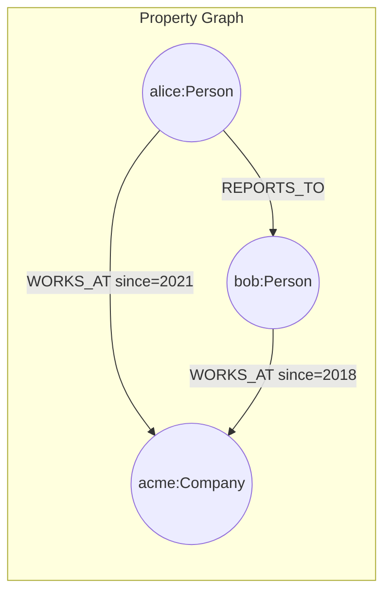
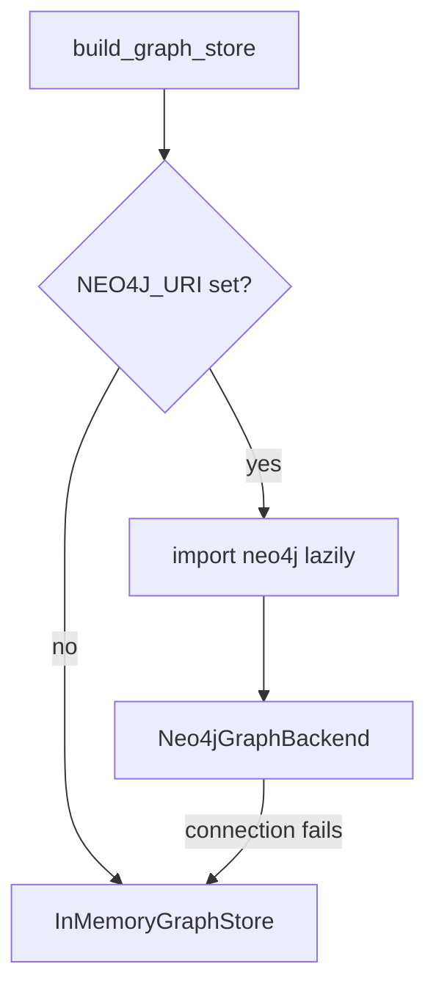

# 43 — Neo4j Basics

## Learning Objectives

After this module you can:

- Explain the property-graph model: labelled nodes, typed directed
  relationships, and arbitrary key/value properties on both.
- Read and write a property graph through a small, backend-agnostic API
  (`upsert_node`, `add_relationship`, `neighbors`, `find`).
- Gate a real, optional dependency (`neo4j`) behind a settings check so an
  exercise runs offline by default and against a real database only when
  configured.
- Explain why the `neo4j` import must live *inside* the configured branch,
  not at module top level, when the package may not be installed.

## Theory

A **property graph** is the data model Neo4j (and this module's offline
stand-in) exposes:

- **Nodes** carry one or more **labels** (a type tag, e.g. `Person`,
  `Company`) and a bag of **properties** (`name`, `title`, ...).
- **Relationships** are **typed** (`WORKS_AT`, `REPORTS_TO`) and **directed**
  (`alice -[WORKS_AT]-> acme`, not the reverse), and may also carry
  properties (`since=2021`).

Cypher, Neo4j's query language, reads like the graph looks:
`MATCH (a:Person)-[:WORKS_AT]->(b:Company) RETURN a, b`. Module 44 builds a
Python analogue of that pattern-matching idiom; this module focuses on the
node/relationship primitives underneath it.

`src/shared/graphstore.py`'s `InMemoryGraphStore` implements that same
surface (`upsert_node`, `add_relationship`, `neighbors`, `find`, `stats`) in
pure Python — no server, no driver. The **backend-selection pattern** shown
here — check `get_settings().has_neo4j()`, import the real driver lazily
only on that path, otherwise use the in-memory store — is the pattern every
later module in this track (`44`–`47`) builds on, and the one module `08`
was a placeholder for.

## Mental Models

Think of `InMemoryGraphStore` as a **flight simulator** for Neo4j: the
controls (the method names) are the same ones you'd use against a real
database, so everything you practice here — modeling entities as nodes,
relationships as typed directed edges — transfers directly once `NEO4J_URI`
points at a real cluster. The simulator just never requires you to actually
take off.

## Architecture



Backend selection at startup:



## Runnable Example

```bash
python src/43_neo4j_basics/neo4j_basics.py
```

Expected output (offline fallback, deterministic):

```
stats={'nodes': 3, 'relationships': 3}
node id=acme label=Company properties={'name': 'Acme Corp'}
node id=alice label=Person properties={'name': 'Alice', 'title': 'Engineer'}
node id=bob label=Person properties={'name': 'Bob', 'title': 'Manager'}
rel alice -[REPORTS_TO]-> bob properties={}
rel alice -[WORKS_AT]-> acme properties={'since': 2021}
rel bob -[WORKS_AT]-> acme properties={'since': 2018}
alice neighbors=['acme', 'bob']
=== MODULE 43: NEO4J BASICS COMPLETE (offline fallback) ===
```

Set `NEO4J_URI` (plus `NEO4J_PASSWORD`) and install the `neo4j` package to
exercise the real-backend branch instead; it prints
`(real neo4j backend)` and is not covered by the offline smoke test.

## Challenge

1. Add a third relationship type, `FOUNDED`, from a new `Person` node to
   `acme`, and print it alongside the existing relationships.
2. Extend `describe` to also print each node's `label` grouped together
   (all `Person` nodes, then all `Company` nodes).
3. Write a tiny `to_cypher(node)` helper that renders a `Node` as a Cypher
   `CREATE` statement string, e.g. `CREATE (:Person {id: 'alice', ...})`.

## Stretch Goals

- Install `neo4j` locally, run a Neo4j instance (e.g. via Docker), set
  `NEO4J_URI`/`NEO4J_PASSWORD`, and confirm `build_graph_store` returns a
  `Neo4jGraphBackend` and the same seed data lands in the real database.
- Add a `Neo4jGraphBackend.find` method backed by a Cypher `MATCH` query, so
  the real backend fully implements the same interface as
  `InMemoryGraphStore`.

## Common Mistakes

- **Importing `neo4j` at module top level.** This breaks the module for
  every learner who hasn't installed the driver — always import inside the
  `has_neo4j()` branch.
- **Assuming relationships are bidirectional.** `alice -[WORKS_AT]-> acme`
  does not imply `acme -[WORKS_AT]-> alice`; query direction matters (see
  `store.neighbors` vs. the reverse lookups in modules 46–47).
- **Mutating a node's label after creation.** `upsert_node` merges
  properties but keeps the original label — model the label correctly the
  first time.

## Best Practices

- Keep an offline fake with the exact method surface of the real backend so
  exercises (and CI) never need real infrastructure.
- Feature-detect (`has_neo4j()`) rather than try/except-ing an import at
  the top of the file — it keeps the failure mode explicit and logged.
- Log which backend was selected (`get_logger`) so a misconfigured
  `NEO4J_URI` is visible instead of silently falling back.

## Suggested Improvements

- Add connection pooling / retry logic to `Neo4jGraphBackend` for production
  use.
- Extract the backend-selection function into `src/shared` once a second
  module needs it verbatim (currently duplicated conceptually by design, to
  keep this module self-contained as a teaching artifact).

## References

- Neo4j property graph model: https://neo4j.com/docs/getting-started/appendix/graphdb-concepts/
- [`src/shared/graphstore.py`](../shared/README.md) — the `InMemoryGraphStore` implementation this module wraps.
- [`src/08_graph_memory_neo4j`](../08_graph_memory_neo4j/README.md) — the original graph-memory placeholder this module deepens.
- [`docs/neo4j.md`](../../docs/neo4j.md) — property-graph model, backend gating, and graph algorithms across modules 43–47.

## What Comes Next

[`44_graph_modeling_cypher`](../44_graph_modeling_cypher/README.md) builds a
Cypher-style pattern-matching helper on top of the same `InMemoryGraphStore`
primitives introduced here.
