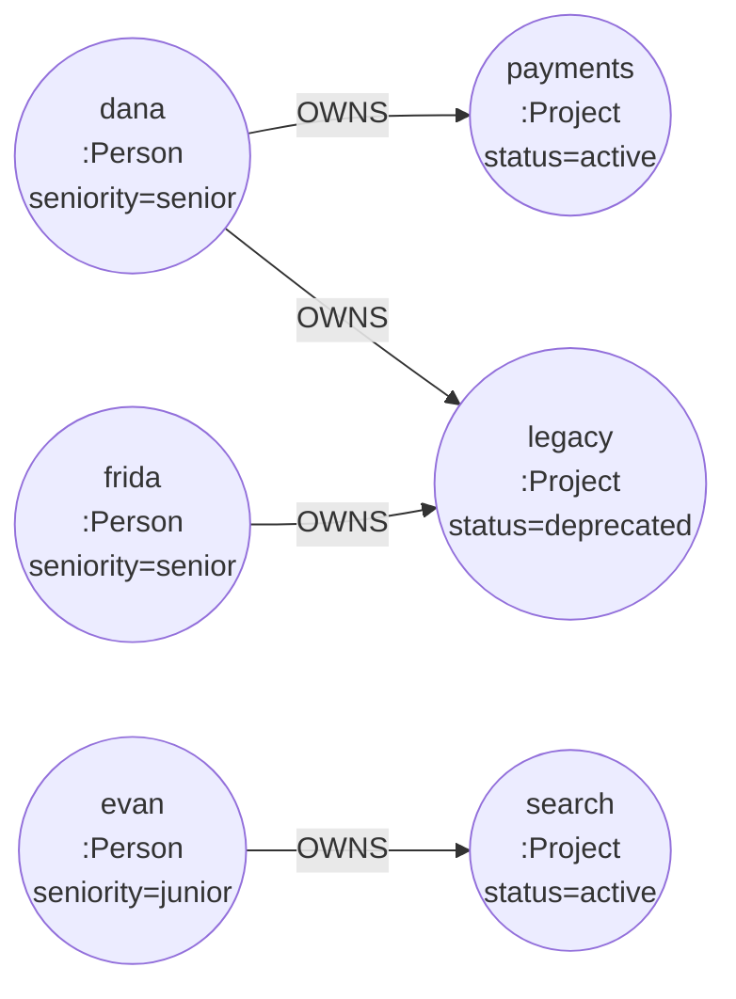
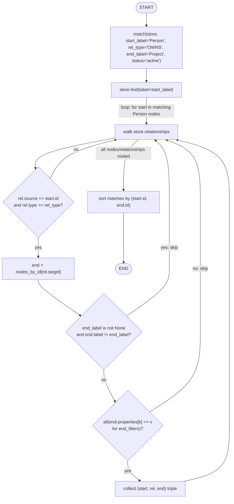

# 44 — Graph Modeling & Cypher-Style Queries

## Learning Objectives

After this module you can:

- Model entities and relationships as a property graph instead of relational
  tables: choose labels, relationship types, and directions deliberately.
- Contrast relational modeling (rows, foreign keys, joins) with graph
  modeling (nodes, typed directed edges, no joins).
- Write a Cypher-style `MATCH (a)-[:REL]->(b) WHERE ... RETURN a, r, b`
  pattern as a plain Python function over `InMemoryGraphStore`.
- Explain why relationship *direction* and *naming* are modeling decisions,
  not implementation details.

## Theory

**Relational modeling** normalizes data into tables and expresses
relationships via foreign keys: a `person` table, a `project` table, and an
`owns` join table, joined at query time with `JOIN ... ON`. The relationship
is implicit — reconstructed by the query planner from matching keys.

**Graph modeling** makes the relationship a first-class citizen: `alice
-[:OWNS]-> payments` *is* the join, stored once, walked directly with no
join computation. This tends to be more natural for two shapes of question
relational databases struggle with:

- **Variable-depth traversal** — "everyone `alice` reports to, transitively"
  requires a recursive CTE in SQL; in a graph it's just "follow `REPORTS_TO`
  edges until there are none left" (see modules 45–47).
- **Schema-light, evolving relationships** — adding a new relationship type
  (`MENTORS`) needs no new table or migration, just new edges.

**Cypher** is Neo4j's query language, built around ASCII-art pattern
matching: `(a:Person)-[:OWNS]->(b:Project {status: 'active'})` reads left to
right exactly like the graph diagram. This module's `match()` function is a
Python function that implements that same pattern — start label, relationship
type, end label, end-node property filters — over the offline
`InMemoryGraphStore`, so the *reasoning* ("what pattern am I matching, what
am I filtering, what do I return") transfers directly to real Cypher.

Two **modeling decisions** matter as much as the query itself:

- **Direction** — `alice -[:OWNS]-> payments` vs. `payments -[:OWNED_BY]->
  alice` are different graphs requiring different traversal directions to
  answer the same question. Pick one direction per relationship type and be
  consistent.
- **Naming** — relationship types are conventionally `SCREAMING_SNAKE_CASE`
  verbs (`OWNS`, `DEPENDS_ON`, `REPORTS_TO`); node labels are
  `PascalCase` nouns (`Person`, `Project`). Consistent naming makes traversal
  code and diagrams self-documenting.

## Mental Models

A relational join is like looking up a phone number in a separate address
book every time you need it — correct, but you re-derive the connection on
every query. A graph relationship is like a **sticky note already attached**
between two entries — walking to the connected entry costs nothing extra,
no matter how many sticky notes you follow in a row.

## Architecture

The example property graph seeded by `seed_project_graph`:



*Legend: node shapes are `:Label` graph nodes with their properties; every
arrow is an `OWNS` relationship — the same edge the SQL join table would
otherwise need.*

`match()`'s pattern-matching algorithm — the Python analogue of
`MATCH (a:Label)-[:REL]->(b:Label {filters}) RETURN a, r, b`:



*Legend: each diamond is one `WHERE`-style filter from the Cypher pattern
(`WHERE b:end_label`, `WHERE b.prop = value`); a "no" on any filter skips
back to the relationship-walk loop instead of collecting a result.*

**Flow notes**

- `checksrc` implements the pattern's edge shape — only relationships
  starting at a matched `start_label` node and typed `rel_type` are
  considered; everything else is skipped without collecting.
- `checklabel` implements `end_label` filtering (Cypher's `(b:Project)`);
  when `end_label` is `None` (as in the unfiltered `MATCH
  (p:Person)-[:OWNS]->(pr)` query), this check always passes.
- `checkfilters` implements property filters on the end node (Cypher's
  `{status: 'active'}` / `WHERE b.status = 'active'`) via `**end_filters`;
  omitting them (as the second query in `main()` does) matches every
  `OWNS` edge regardless of project status.
- The final `sort` step exists purely so output order is deterministic —
  it plays no role in *which* triples match, only in what order they print.

## Runnable Example

```bash
python src/44_graph_modeling_cypher/graph_modeling_cypher.py
```

Expected output (deterministic):

```
MATCH (p:Person)-[:OWNS]->(pr:Project {status: 'active'})
  dana -[OWNS]-> payments (Payments API)
  evan -[OWNS]-> search (Search Service)
MATCH (p:Person)-[:OWNS]->(pr) RETURN p, pr
  dana -[OWNS]-> legacy
  dana -[OWNS]-> payments
  evan -[OWNS]-> search
  frida -[OWNS]-> legacy
total_people=3 total_projects=3
=== MODULE 44: GRAPH MODELING & CYPHER COMPLETE ===
```

## Challenge

1. Add a `**start_filters` parameter to `match()` so the pattern can also
   filter on the start node's properties (e.g. `seniority='senior'`).
2. Model a `COLLABORATES_WITH` relationship between two `Person` nodes and
   write a query for "who collaborates with a senior engineer".
3. Write the equivalent SQL for `MATCH
   (p:Person)-[:OWNS]->(pr:Project {status: 'active'})` against a
   `person`/`project`/`owns` schema, and compare readability.

## Stretch Goals

- Extend `match()` to support a two-hop pattern:
  `(a)-[:R1]->(b)-[:R2]->(c)` (this is exactly what module 47's
  `which_teams_touch` does manually — try generalizing it here).
- Support an `OR` of relationship types (`rel_type: str | tuple[str, ...]`).
- Add a tiny string-based Cypher parser that compiles a subset of
  `MATCH ... WHERE ... RETURN` into a call to `match()`.

## Common Mistakes

- **Modeling a relationship as a node.** `OWNS` should be an edge, not a
  `Ownership` node, unless the relationship itself needs its own identity
  or further relationships (a legitimate but rarer pattern).
- **Inconsistent direction.** Mixing `OWNS` (person -> project) with
  `OWNED_BY` (project -> person) in the same graph doubles the traversal
  code every query needs to handle.
- **Forgetting the join table entirely.** In graph terms, "no join table"
  does not mean "no relationship type" — every edge still needs an explicit,
  named type.

## Best Practices

- Choose relationship direction to match the most common query ("who owns
  X" is more common than "what does X own", but model whichever your access
  patterns need — and stay consistent).
- Keep pattern-matching helpers composable and label/type-driven, not
  hard-coded to a single query — see how `match()` is reused for both
  filtered and unfiltered queries in `main()`.
- Sort query results before printing (as `match()` does) so that graph
  traversal order (a Python `dict`/`list` implementation detail) never
  leaks into observable, testable output.

## Suggested Improvements

- Add an index (`dict[label, list[Node]]`) to `InMemoryGraphStore.find` for
  large graphs — today's linear scan is fine for teaching-sized graphs only.
- Support relationship-property filters (`**rel_filters`) alongside the
  existing end-node filters.

## References

- Cypher pattern syntax: https://neo4j.com/docs/cypher-manual/current/patterns/
- [`43_neo4j_basics`](../43_neo4j_basics/README.md) — the property-graph
  primitives this module builds a query layer on top of.
- [`docs/neo4j.md`](../../docs/neo4j.md) — Cypher-style querying section,
  with more worked examples.

## What Comes Next

[`45_dependency_analysis`](../45_dependency_analysis/README.md) uses the same
`InMemoryGraphStore` to model DAGs and run graph algorithms (topological
sort, cycle detection) rather than single-pattern queries.
