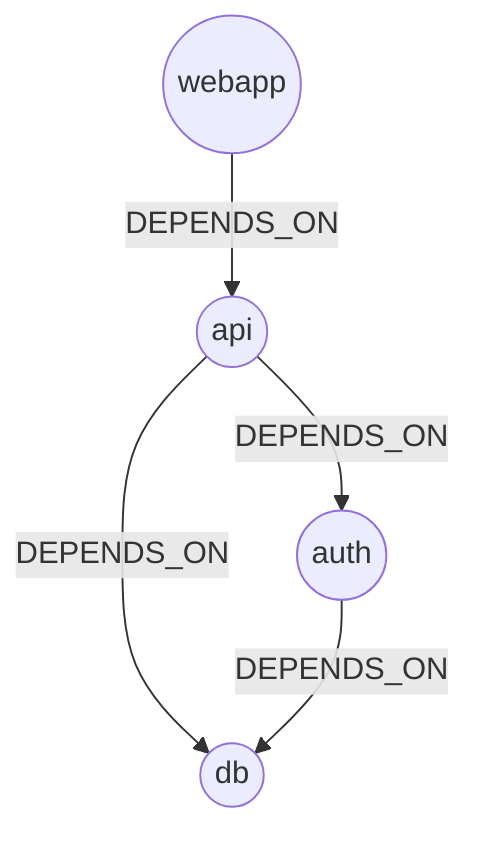
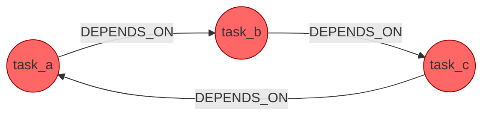

# 45 — Dependency Analysis

## Learning Objectives

After this module you can:

- Define a DAG (directed acyclic graph) and explain why dependency graphs
  need to be acyclic to be buildable/runnable at all.
- Implement Kahn's algorithm for topological sort over
  `InMemoryGraphStore` relationships.
- Implement DFS-based cycle detection using the classic white/gray/black
  node coloring scheme.
- Read a topological-sort failure as a signal to run cycle detection and
  report the exact offending path.

## Theory

A **dependency graph** models "requires" relationships: `a DEPENDS_ON b`
means `a` cannot run/build/deploy until `b` has. A **DAG** (directed acyclic
graph) is a dependency graph with no cycles — if it had one (`a` depends on
`b` depends on `a`), there would be no valid order to satisfy every
dependency, and the build/deploy/task system would deadlock.

**Topological sort** produces a linear ordering of nodes such that every
edge points from an earlier node to a later one. **Kahn's algorithm**
computes it by repeatedly removing nodes with no remaining unsatisfied
dependencies (in-degree zero in the *dependents* direction used here):

1. Compute each node's in-degree (count of "things that depend on it" is
   irrelevant here — what matters is the count of *its own* unresolved
   dependencies).
2. Start a queue with every node that has zero dependencies left.
3. Repeatedly pop a node, append it to the order, and decrement the
   in-degree of everything that depended on it; if that in-degree hits
   zero, enqueue it.
4. If the final order doesn't include every node, a cycle exists — some
   nodes never reached in-degree zero because they're stuck depending on
   each other.

**Cycle detection** via DFS uses three colors per node: **white**
(unvisited), **gray** (on the current recursion path), **black** (fully
explored, no cycle through it). Revisiting a **gray** node during DFS means
the current path has looped back on itself — that loop *is* the cycle,
reconstructed from the DFS path.

## Mental Models

Topological sort is a **dinner-party seating chart for prerequisites**: you
can only seat a guest once everyone they're waiting on is already seated.
Kahn's algorithm is exactly that process — seat everyone with no one left
to wait for, then repeat. If, after seating everyone available, some guests
are still waiting on each other in a loop, nobody can ever be seated — that
loop is the cycle this module's `find_cycle` reports.

## Architecture





## Runnable Example

```bash
python src/45_dependency_analysis/dependency_analysis.py
```

Expected output (deterministic):

```
package_dag topological_order=['db', 'auth', 'api', 'webapp']
task_graph topological_order failed: cycle detected: only 0/3 nodes could be ordered
task_graph detected_cycle=['task_a', 'task_b', 'task_c', 'task_a']
=== MODULE 45: DEPENDENCY ANALYSIS COMPLETE ===
```

## Challenge

1. Add a fifth package, `metrics`, that `DEPENDS_ON` both `api` and `db`,
   and confirm it appears after both in the topological order.
2. Break the cycle in `build_cyclic_task_graph` (remove one edge) and
   confirm `topological_order` now succeeds and `find_cycle` returns `None`.
3. Modify `find_cycle` to return *all* distinct cycles in a graph, not just
   the first one found.

## Stretch Goals

- Compute the **critical path** (longest dependency chain) through the
  acyclic package graph — useful for estimating minimum build time when
  independent branches can run in parallel.
- Add a `parallel_batches(store)` function that groups the topological order
  into batches of nodes that could all run concurrently (everything with the
  same "depth" in the DAG).
- Detect **self-loops** (`a DEPENDS_ON a`) as a special, cheaper case before
  running full DFS cycle detection.

## Common Mistakes

- **Confusing edge direction with build order.** `a DEPENDS_ON b` means `b`
  runs *first*; it's easy to build the in-degree count backwards and get a
  reversed (or wrong) order. This module's `dependents` map inverts the
  edge on purpose — read the comment in `topological_order` before editing.
- **Assuming Kahn's algorithm alone reports *which* nodes are cyclic.** It
  only tells you *that* a cycle exists (`len(order) != len(in_degree)`);
  `find_cycle`'s DFS is what pinpoints the actual loop.
- **Forgetting to reset DFS state between disconnected components.** The
  `for node_id in sorted(adjacency)` loop in `find_cycle` must visit every
  unvisited (white) node, not just start from one root — otherwise cycles
  in a disconnected part of the graph go undetected.

## Best Practices

- Always validate a dependency graph for cycles *before* attempting to use
  a topological order in production (a CI/CD pipeline, a task scheduler).
- Make cycle errors actionable: `GraphCycleError`'s count-based message here
  is a starting point — `find_cycle`'s explicit path is what an operator
  actually needs to fix the graph.
- Sort ties deterministically (`sorted(...)` throughout this module) so
  output — and tests — don't depend on dict/set iteration order.

## Suggested Improvements

- Cache `blast_radius`-style downstream counts (module 46) alongside
  topological depth for a combined "how central is this dependency" report.
- Visualize the DAG and any detected cycle as a rendered Mermaid diagram
  generated from the live graph, not hand-written.

## References

- Kahn's algorithm: https://en.wikipedia.org/wiki/Topological_sorting#Kahn's_algorithm
- DFS cycle detection (graph coloring): https://en.wikipedia.org/wiki/Depth-first_search
- [`44_graph_modeling_cypher`](../44_graph_modeling_cypher/README.md) — the
  pattern-matching helpers this module's graph traversal builds on.
- [`docs/neo4j.md`](../../docs/neo4j.md) — graph algorithms section
  (traversal, cycles, RCA).

## What Comes Next

[`46_root_cause_analysis`](../46_root_cause_analysis/README.md) reuses the
same `DEPENDS_ON` graph shape to walk *upstream* from a failing node and rank
likely root causes, instead of ordering the whole graph.
