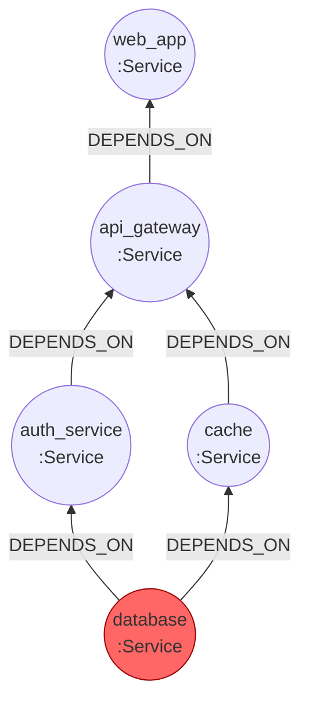
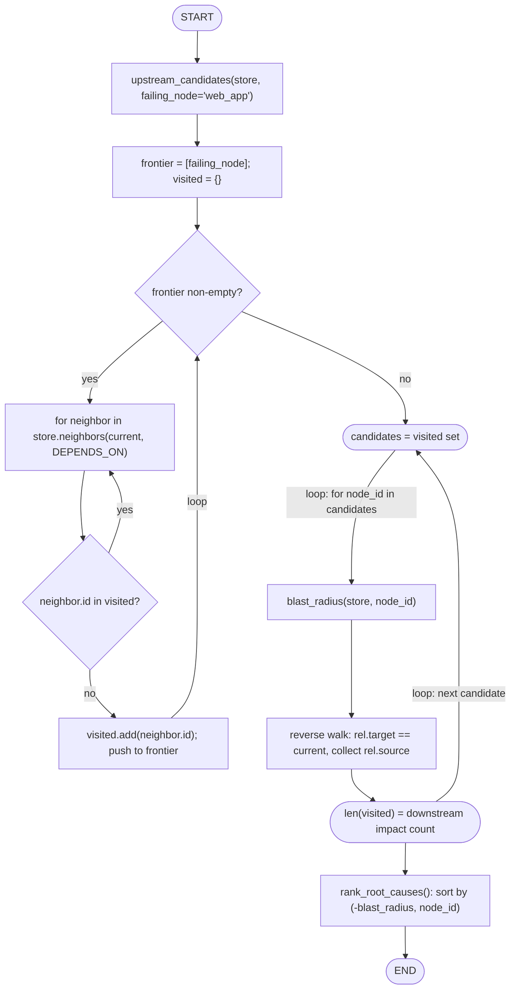

# 46 — Root Cause Analysis

## Learning Objectives

After this module you can:

- Distinguish **upstream** traversal (what could have caused this failure)
  from **downstream** traversal / **blast radius** (what this failure could
  affect).
- Walk a `DEPENDS_ON` graph from a failing node to collect root-cause
  candidates.
- Rank root-cause candidates by blast radius and explain why a larger blast
  radius makes a candidate a more likely true root cause.
- Recognize this pattern as the graph-theoretic core of incident response
  and observability tooling.

## Theory

When `web_app` fails, the naive question is "why?" — but in a service graph
with several layers of dependencies, "why" has many candidate answers: any
node `web_app` depends on, directly or transitively, could be the actual
root cause. This module formalizes two traversal directions over the same
`DEPENDS_ON` graph from module 45:

- **Upstream traversal** (`upstream_candidates`) — starting at the failing
  node, follow `DEPENDS_ON` edges *forward* (`store.neighbors` already does
  this) to collect every node that could be responsible. This answers "what
  could have caused this?"
- **Downstream traversal / blast radius** (`blast_radius`) — starting at a
  candidate node, follow `DEPENDS_ON` edges *backward* (who points *at* this
  node) to count how many other nodes depend on it, transitively. This
  answers "if this node fails, how much breaks?"

**Ranking by blast radius** turns a list of plausible candidates into a
prioritized one: a candidate near the "bottom" of the dependency graph
(like a shared `database`) that many other services transitively depend on
is statistically the more likely true root cause when multiple, seemingly
unrelated services are failing simultaneously — it explains the most
symptoms with the fewest assumptions (a form of Occam's razor for incident
response).

## Mental Models

Think of the dependency graph as **plumbing**: if the kitchen sink, the
bathroom sink, and the washing machine all stop draining at once, you don't
suspect three unrelated clogs — you suspect the shared main pipe they all
feed into. `blast_radius` is exactly that shared-pipe test, computed
mechanically: the node with the most things downstream of it is the pipe
most worth checking first.

## Architecture

The service topology from `build_service_graph` (every arrow is a
`DEPENDS_ON` edge, drawn bottom-to-top so `database` — the true root
cause — sits at the base):



*Legend: `database` (red) is the most-likely root cause — it has the
largest blast radius. Arrows point "depends on", so `web_app` (top) failing
means upstream traversal walks *down* toward `database`; blast radius is
measured walking *back up* from any candidate toward `web_app`.*

The two traversal algorithms this module runs over that graph:



*Legend: `upstream_candidates` walks **forward** along `DEPENDS_ON` using
`store.neighbors` directly (what the failing node needs); `blast_radius`
walks **backward** by scanning `store.relationships` for edges that target
the candidate (what needs the candidate) — swapping these two directions
silently produces a wrong ranking.*

**Flow notes**

- `seen` (the `visited` check) is what keeps `upstream_candidates`
  terminating even on a graph with a cycle — a node already visited is
  never re-pushed onto the frontier.
- `walk` uses `store.neighbors(current, DEPENDS_ON)`, which only exposes
  **outgoing** edges — exactly the forward, "what do I need" direction; no
  reversal is needed for upstream traversal.
- `reverse` is the mirror image: since `InMemoryGraphStore` has no built-in
  reverse-neighbor lookup, `blast_radius` scans every relationship and
  keeps the ones whose `target` matches the current node, collecting
  `source` instead — the manual reversal `upstream_candidates` doesn't need.
- `rank_root_causes` sorts candidates by `(-blast_radius, node_id)` — most
  downstream impact first, ties broken deterministically by id — which is
  why `database` (impacts 4 services) outranks `auth_service`/`cache`
  (impact 2 each) in the runnable example below.

## Runnable Example

```bash
python src/46_root_cause_analysis/root_cause_analysis.py
```

Expected output (deterministic):

```
failing_node=web_app
root_cause_candidates (ranked by blast_radius, most likely first):
  database: blast_radius=4
  auth_service: blast_radius=2
  cache: blast_radius=2
  api_gateway: blast_radius=1
most_likely_root=database (impacts 4 downstream service(s))
=== MODULE 46: ROOT CAUSE ANALYSIS COMPLETE ===
```

## Challenge

1. Add a `message_queue` service that both `auth_service` and a new
   `notifications` service depend on, and confirm it now outranks
   `auth_service` alone in blast radius once `notifications` is added.
2. Add a secondary ranking key — distance from the failing node (fewer hops
   = more directly implicated) — for candidates that tie on blast radius.
3. Simulate an actual outage: mark `database` as `healthy=False` in its
   properties and write a function that only reports candidates whose
   `healthy` property is `False`, combining graph structure with live state.

## Stretch Goals

- Combine `find_cycle` (module 45) with this module: a cyclic
  `DEPENDS_ON` graph makes upstream traversal loop forever without a
  `visited` set — confirm the `visited` guard in `upstream_candidates`
  already handles this safely, then remove it and observe the infinite loop
  it would otherwise cause.
- Add a `CAUSES` relationship type distinct from `DEPENDS_ON` (a `CAUSES` a
  `b` is a stronger, event-level claim than "b" depends on "a" structurally)
  and extend ranking to weigh direct `CAUSES` edges above structural
  `DEPENDS_ON` ones.
- Build a small CLI: `python root_cause_analysis.py --failing web_app` that
  reads the failing node from `sys.argv` instead of a hard-coded constant.

## Common Mistakes

- **Confusing upstream and downstream.** `upstream_candidates` walks
  *forward* along `DEPENDS_ON` (what the failing node needs); `blast_radius`
  walks *backward* (what needs the candidate). Swapping them silently
  produces a plausible-looking but wrong ranking.
- **Forgetting the `visited` set.** Without it, a cyclic graph (see module
  45) causes both traversal functions to loop forever instead of failing
  fast or reporting the cycle.
- **Ranking by blast radius alone in production.** Blast radius is a strong
  prior, not proof — always corroborate with real signals (error rates,
  logs, deploy timestamps) before acting on a ranked candidate list.

## Best Practices

- Always traverse with an explicit `visited` set — dependency graphs are
  not guaranteed acyclic in practice, even when modeled as `DEPENDS_ON`.
- Log the ranked candidate list (`get_logger`) during real incident
  response so the reasoning is auditable after the fact.
- Keep "candidate generation" (upstream traversal) and "candidate scoring"
  (blast radius) as separate functions — it makes each independently
  testable and lets you swap in a different scoring heuristic later.

## Suggested Improvements

- Weight blast radius by node criticality (e.g. `Service.properties["tier"]
  == "critical"`) instead of treating every downstream node equally.
- Add time-decay: recent deploys to a candidate should boost its rank
  ("what changed recently" is a classic RCA heuristic this module doesn't
  yet model).

## References

- Root cause analysis (overview): https://en.wikipedia.org/wiki/Root_cause_analysis
- [`45_dependency_analysis`](../45_dependency_analysis/README.md) — the
  `DEPENDS_ON` graph and DAG traversal primitives this module builds on.
- [`docs/neo4j.md`](../../docs/neo4j.md) — graph algorithms section
  (traversal, cycles, RCA) with more worked examples.

## What Comes Next

[`47_organizational_graph`](../47_organizational_graph/README.md) applies
the same "graph edges answer questions no join table can as cheaply"
approach to a people/teams/projects domain instead of infrastructure
dependencies.
