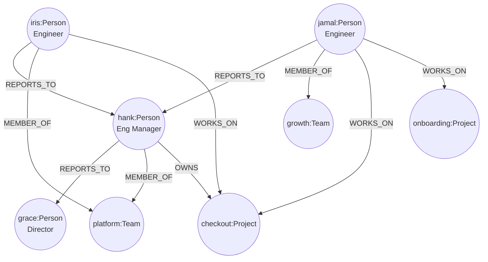

# 47 — Organizational Graph

## Learning Objectives

After this module you can:

- Model an org chart — people, teams, and projects — as a property graph
  with multiple relationship types.
- Answer "who owns X" and "who reports to Y" as one-hop reverse-neighbor
  lookups.
- Answer "which team touches Z" as a two-hop traversal
  (`WORKS_ON` then `MEMBER_OF`) with no join tables.
- Recognize multi-hop relationship queries as the general pattern behind
  "who should I ask about this" tooling.

## Theory

Organizational questions are naturally multi-hop: "which team owns the
service that's failing" requires knowing *who* works on it, then *which
team* they belong to — two relationship hops away from the project node,
not a direct edge. This module models three relationship types over
`Person`, `Team`, and `Project` nodes:

- `REPORTS_TO` (`Person -> Person`) — the management chain.
- `MEMBER_OF` (`Person -> Team`) — team membership.
- `OWNS` (`Person -> Project`) — direct accountability for a project.
- `WORKS_ON` (`Person -> Project`) — contributes to a project without
  necessarily owning it.

Each query in this module is a **reverse-neighbor lookup** (module 46's
`incoming` pattern, reused here) or a **composition of two of them**:

- `who_owns(project)` — one hop: find every `Person` with an `OWNS` edge
  pointing at `project`.
- `who_reports_to(manager)` — one hop: find every `Person` with a
  `REPORTS_TO` edge pointing at `manager`.
- `which_teams_touch(project)` — two hops: find every `Person` with a
  `WORKS_ON` edge pointing at `project` (hop 1), then every `Team` each of
  those people belong to via `MEMBER_OF` (hop 2), de-duplicated.

This composability is graph modeling's core payoff: each hop is a small,
reusable, independently testable function, and multi-hop questions are just
function composition — no schema change, no new join table, no new query
plan to hand-tune.

## Mental Models

Think of the org graph as a **rolodex where every card lists both
directions**: Hank's card says "reports to Grace" and "member of Platform
Team"; Grace's card (found by flipping through everyone else's cards, which
is what `incoming` does) lists Hank as one of her reports. Answering "who
touches the Checkout project" is just: find every card that says "works on
Checkout" (hop 1), then read each of *those* cards' team line (hop 2).

## Architecture



## Runnable Example

```bash
python src/47_organizational_graph/organizational_graph.py
```

Expected output (deterministic):

```
who_owns(checkout)=['hank']
who_reports_to(hank)=['iris', 'jamal']
which_teams_touch(checkout)=['growth', 'platform']
which_teams_touch(onboarding)=['growth']
=== MODULE 47: ORGANIZATIONAL GRAPH COMPLETE ===
```

## Challenge

1. Add a `who_manages_chain(person)` function that walks `REPORTS_TO` edges
   transitively to return the full management chain up to the top.
2. Add a `MENTORS` relationship (`Person -> Person`, distinct from
   `REPORTS_TO`) and a query "who mentors anyone on the Growth team"
   (three hops: `MEMBER_OF` reversed, then `MENTORS` reversed).
3. Extend `which_teams_touch` to also count *ownership* (`OWNS`), not just
   `WORKS_ON`, and compare the two result sets for `checkout`.

## Stretch Goals

- Compute **team overlap**: for two projects, which teams touch both (set
  intersection over `which_teams_touch` results)?
- Add a `Skill` node label and a `HAS_SKILL` relationship, then answer
  "who on the Platform team has skill X" (three-hop: `MEMBER_OF` reversed,
  filter by team, then `HAS_SKILL`).
- Detect **bus factor**: projects where `who_owns` and `which_teams_touch`
  together return exactly one person — a single point of organizational
  failure, the people-graph analogue of module 46's blast radius.

## Common Mistakes

- **Conflating `OWNS` and `WORKS_ON`.** Ownership is accountability; working
  on something doesn't imply owning it (see `jamal` in the example, who
  works on `checkout` without owning it). Keep the relationship types
  distinct or queries like `who_owns` become inaccurate.
- **Assuming one team per person.** `which_teams_touch` correctly
  de-duplicates via a `dict` keyed by team id, but a naive `list` of teams
  without de-duplication would double-count a team touched by two people.
- **Forgetting reverse-neighbor lookups need a full relationship scan.**
  `incoming()` scans `store.relationships` — for very large graphs, an
  index from `target_id` to incoming relationships would be needed (see
  Suggested Improvements).

## Best Practices

- Keep relationship types narrow and specific (`OWNS` vs. `WORKS_ON`) rather
  than one generic `RELATED_TO` — specificity is what makes each query a
  single, unambiguous traversal.
- Compose multi-hop queries out of small, named one-hop functions
  (`incoming`, `store.neighbors`) rather than writing one large nested loop
  per query — it keeps each hop independently testable.
- Sort and de-duplicate query results (as `which_teams_touch` does via a
  `dict`) so multi-hop fan-in doesn't produce non-deterministic or
  duplicate output.

## Suggested Improvements

- Build a reverse-adjacency index (`target_id -> list[Relationship]`) once
  per store snapshot instead of rescanning `store.relationships` on every
  `incoming()` call — meaningful once graphs grow past teaching scale.
- Add a generic `n_hop(store, start_id, path: list[tuple[str, str]])` helper
  that takes a list of `(rel_type, direction)` steps and executes an
  arbitrary-length multi-hop query, generalizing `which_teams_touch`.

## References

- Property graph multi-hop queries: https://neo4j.com/docs/getting-started/cypher-intro/patterns/
- [`46_root_cause_analysis`](../46_root_cause_analysis/README.md) — the
  reverse-neighbor (`incoming`) pattern this module reuses for org queries.
- [`docs/neo4j.md`](../../docs/neo4j.md) — full Track 6 index, including
  Cypher-style querying and graph algorithms.

## What Comes Next

This is the last module in Track 6 (Graph Intelligence). The graph-native
reasoning here — pattern matching, traversal, ranking, multi-hop
composition — feeds directly into later multi-agent and full-system
modules (Track 9/10) that need to reason over tool graphs, agent
hand-off graphs, and memory graphs the same way.
