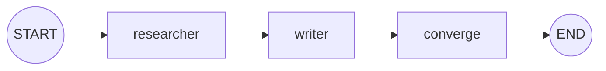
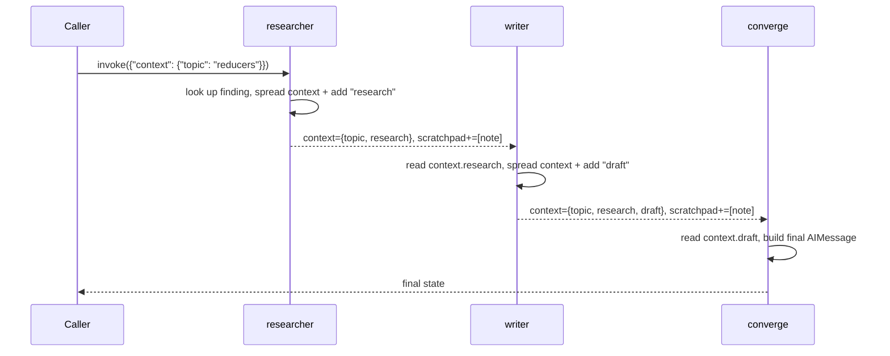

# 48 — Agent Collaboration

## Learning Objectives

After this module you can:

- Compose two or more specialist agents that cooperate over one shared
  `AgentState` instead of one monolithic node doing everything.
- Distinguish reducer-backed channels (safe for concurrent appends) from
  plain dict channels (last-write-wins, unsafe unless you merge by hand).
- Namespace each agent's contribution inside a shared `context` dict so
  writes stay disjoint.
- Explain, concretely, how a "naive" writer that forgets to spread the
  previous context silently destroys another agent's work.

## Theory

Module 09 (`planner`/`executor`) already showed two functions handing off a
plain Python dict in sequence. This module deepens that idea onto LangGraph's
`AgentState` and makes the sharing rules explicit:

- **`scratchpad: Annotated[list[str], operator.add]`** — every agent may
  append its own log line; LangGraph concatenates the lists instead of
  picking a winner. Safe for any number of agents, in any order.
- **`context: dict[str, Any]`** — no reducer. A node's returned `context`
  value **replaces** the entire field. If `writer` returns
  `{"context": {"draft": ...}}`, it wipes out whatever `researcher` wrote
  (`research`, `topic`, ...) even though `writer` never touched those keys.

The fix used throughout this module is a convention, not a language feature:
every agent spreads the previous context first —
`{**state.get("context", {}), "my_key": my_value}` — so it only *adds* a key
instead of *replacing* the dict. This is exactly why real multi-agent systems
either enforce that convention everywhere, or promote a channel to a proper
reducer (`operator.add`, a custom merge function, or `add_messages`) as soon
as more than one node writes it.

## Mental Models

Think of `context` as a shared whiteboard with **no eraser discipline**: if
one person wipes the whole board to write their note, everyone else's note is
gone. The convention here is "always copy what's already on the board before
adding your line." `scratchpad`, by contrast, is a shared notebook where
everyone's entries are appended to a running log — no copying required
because the reducer does the merging for you.

## Architecture



Cooperation loop for one topic:



## Runnable Example

```bash
python src/48_agent_collaboration/collaboration.py
```

Expected output (truncated, deterministic):

```
anti-pattern demo: naive writer would drop keys ['research', 'topic']
[researcher] found: Reducers merge concurrent partial state updates deterministically.
[writer] drafted: Brief: Reducers merge concurrent partial state updates deterministically.
topic='reducers' result="Final brief for 'reducers': Brief: Reducers merge concurrent partial state updates deterministically."
...
=== TRACK7 MODULE 48: AGENT COLLABORATION COMPLETE ===
```

## Challenge

1. Add a third agent, `reviewer`, that reads `context["draft"]` and appends a
   `context["approval"]` key (remembering to spread!). Have `converge` include
   the approval in its final message.
2. Break the convention on purpose: make `writer` return
   `{"context": {"draft": draft}}` without spreading, run the script, and
   observe the `KeyError` in `converge` when it looks for `context["topic"]`.
3. Add a fourth topic to `_FINDINGS` and `TOPICS` and confirm the pipeline
   handles it without any other code change.

## Stretch Goals

- Convert `researcher` and `writer` into real LLM-backed nodes using
  `get_chat_model(responses=[...])` from `src.shared`, keeping the output
  deterministic via canned `responses`.
- Run `researcher` and a second, independent `fact_checker` agent in parallel
  via `Send` (see module 12), both writing to `scratchpad` only — then try
  making both also write to `context` in the same super-step and observe why
  that's unsafe without a reducer.
- Add a `MemorySaver` checkpointer so the collaboration can pause after
  `researcher` for a human review step before `writer` runs.

## Common Mistakes

- **Forgetting to spread `context`.** The single most common bug in
  multi-agent LangGraph code — a node "just returns its own field" and
  silently deletes every other agent's contribution.
- **Confusing "namespaced key" with "reducer".** Namespacing (`context["my_key"]`)
  prevents two agents from writing the *same* key; it does nothing to prevent
  one agent's write from replacing the *whole dict* if it forgets to spread.
- **Putting side effects in a router.** As in module 11, keep any conditional
  routing logic pure; this module doesn't need one, but if you add branching
  agents, don't let the router itself post to context.

## Best Practices

- Prefer a reducer (`operator.add`, `add_messages`, or a custom merge
  function) over "spread-by-convention" whenever more than one agent can
  write the same field in the same super-step — conventions are easy to
  forget, reducers are enforced by the framework.
- Give each agent's contribution an explicit, predictable key
  (`context["research"]`, `context["draft"]`) rather than a generic shared
  key multiple agents might collide on.
- Log every agent's write (`get_logger`) so a full run's cooperation trail is
  auditable after the fact.

## Suggested Improvements

- Add a `context["history"]` list (with `operator.add`) that records every
  key written and by whom, turning the anti-pattern demo into an automatic
  assertion instead of a printed observation.
- Generalize `researcher`/`writer` into a small `Agent` protocol (`name`,
  `read_keys`, `write_key`, `run`) reusable across modules 48-52.

## References

- LangGraph reducers: https://docs.langchain.com/oss/python/langgraph/graph-api#reducers
- Module [`09_multi_agent_systems`](../09_multi_agent_systems/README.md) — the
  original planner/executor hand-off this module deepens.
- Module [`12_parallel_execution`](../12_parallel_execution/README.md) — the
  reducer mechanics (`operator.add`) reused here.
- [`docs/multi-agent.md`](../../docs/multi-agent.md) — coordination patterns
  overview across modules 48-52.

## What Comes Next

[`49_negotiation`](../49_negotiation/README.md) turns cooperation into
back-and-forth: instead of two agents each contributing once, a proposer and
a critic iterate over several rounds until they converge or hit a cap.
