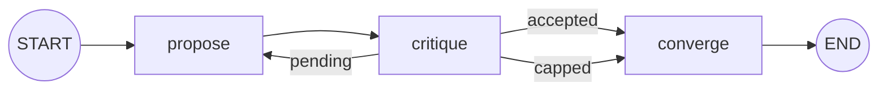
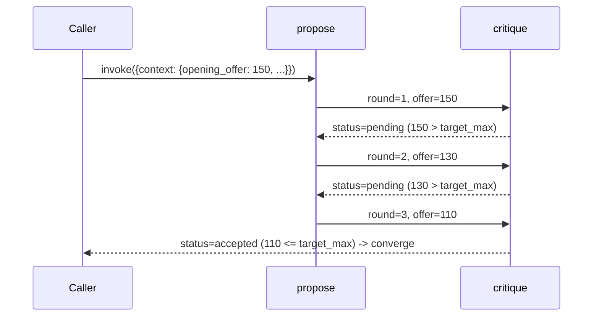

# 49 — Negotiation

## Learning Objectives

After this module you can:

- Model a proposer/critic negotiation as a LangGraph loop with a conditional
  edge that either repeats a round or terminates.
- Encode an acceptance range and a round budget as plain state, and use them
  to decide "keep negotiating" vs. "converge."
- Distinguish the two ways a negotiation loop terminates: **agreement**
  (offer lands in range) and **cap** (round budget exhausted — a circuit
  breaker for negotiations).
- Reuse the retry-loop shape from module 14 for a fundamentally different
  purpose: not fault tolerance, but multi-agent convergence.

## Theory

A negotiation is an iterated **propose -> critique -> (repeat or stop)**
loop:

1. `propose` emits an offer — the opening offer on round 1, a concession
   (`offer - step`) on every subsequent round.
2. `critique` scores the offer against `[target_min, target_max]`:
   - inside the range -> `status = "accepted"`.
   - outside the range but `round >= max_rounds` -> `status = "capped"`
     (give up, no deal).
   - otherwise -> `status = "pending"` (loop back for another concession).
3. A conditional edge reads `status` and either routes back to `propose`
   (another round) or forward to `converge` (done, one way or the other).

This is structurally identical to module 14's retry/backoff/circuit-breaker
graph — a node that can "fail" (be rejected), a conditional edge that retries
up to a budget, and a fallback path once the budget is exhausted. The domain
is different (multi-agent convergence vs. fault tolerance) but the shape —
bounded retry with a determinate exit — recurs constantly in agent systems.

## Mental Models

Think of a used-car negotiation: the seller (`propose`) starts high and
concedes a fixed amount each round; the buyer (`critique`) simply says
"still too high" or "deal" — never making a counter-offer of their own, only
judging the seller's latest number. The negotiation ends the moment the
seller's offer lands inside the buyer's acceptable range, or when both sides
have gone back and forth long enough that continuing is pointless (the round
cap) — a realistic model of most single-issue haggling.

## Architecture



Sequence for a settling negotiation (3 rounds):



## Runnable Example

```bash
python src/49_negotiation/negotiation.py
```

Expected output (truncated, deterministic):

```
[proposer] round 1: offer=150
[critic] round 1: rejected offer=150, counter lower
[proposer] round 2: offer=130
[critic] round 2: rejected offer=130, counter lower
[proposer] round 3: offer=110
[critic] round 3: accepted offer=110
scenario=settles_within_budget Negotiation outcome=deal after 3 round(s): final offer=110
...
scenario=hits_round_cap Negotiation outcome=no_deal after 5 round(s): final offer=70
=== TRACK7 MODULE 49: NEGOTIATION COMPLETE ===
```

## Challenge

1. Add a `buyer_step` so the buyer's implicit acceptance range narrows each
   round (simulating impatience), and observe how that changes which
   scenarios settle vs. cap.
2. Make `propose` concede by a *percentage* of the gap to the target instead
   of a fixed `step`, and verify the negotiation still terminates in a bounded
   number of rounds.
3. Add a third scenario where the opening offer is already inside the target
   range (an immediate `accepted` on round 1) and confirm the loop body still
   runs exactly once.

## Stretch Goals

- Give the critic its own counter-offer (a real two-sided negotiation) instead
  of only accepting/rejecting the proposer's number, using a second `context`
  field (`counter_offer`) that `propose` reads on the next round.
- Model three parties (buyer, seller, mediator) using a mediator node that
  decides whether to keep looping, mirroring a real arbitration process.
- Persist each round via a `MemorySaver` checkpointer so a negotiation can be
  paused for human sign-off before the final round.

## Common Mistakes

- **No round cap.** Without `max_rounds`, a negotiation that never lands in
  range loops forever. Always bound iterative agent loops (retry, negotiate,
  reflect) with an explicit exit condition unrelated to "success."
- **Router with side effects.** `route_after_critique` only reads
  `context["status"]` and returns a key — it does not mutate state. Keep it
  that way; state changes belong in `propose`/`critique`.
- **Conflating "capped" with an error.** A capped negotiation is a normal,
  expected outcome (no deal), not a failure to raise an exception for — model
  it as data (`status`), exactly like module 14's `fallback` path.

## Best Practices

- Make the acceptance condition and the termination condition **independent**
  fields (`status` derived from both) so `converge` can report exactly which
  one triggered the exit.
- Log every round (`get_logger`) — negotiation transcripts are exactly the
  kind of thing you want to audit after the fact.
- Keep the round counter and the offer in the same state dict so a single
  reducer-free `context` update captures a full round atomically.

## Suggested Improvements

- Add a `context["history"]` list (via `operator.add`) recording every
  offer/critique pair, so `converge` can print a full transcript instead of
  just the final outcome.
- Parameterize `SCENARIOS` from a config file so non-engineers can define new
  negotiation setups without touching the graph code.

## References

- LangGraph conditional edges: https://docs.langchain.com/oss/python/langgraph/graph-api#conditional-edges
- Module [`14_error_handling`](../14_error_handling/README.md) — the
  retry/backoff/circuit-breaker shape this module repurposes for negotiation.
- Module [`48_agent_collaboration`](../48_agent_collaboration/README.md) —
  the simpler, non-iterative cooperation this module extends into a loop.
- [`docs/multi-agent.md`](../../docs/multi-agent.md) — coordination patterns
  overview across modules 48-52.

## What Comes Next

[`50_task_decomposition`](../50_task_decomposition/README.md) moves from two
agents iterating over one shared value to one coordinator fanning a goal out
across many independent workers, then reducing their results.
