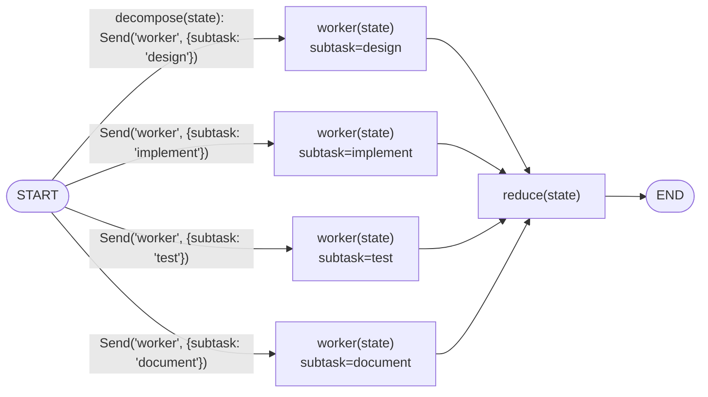
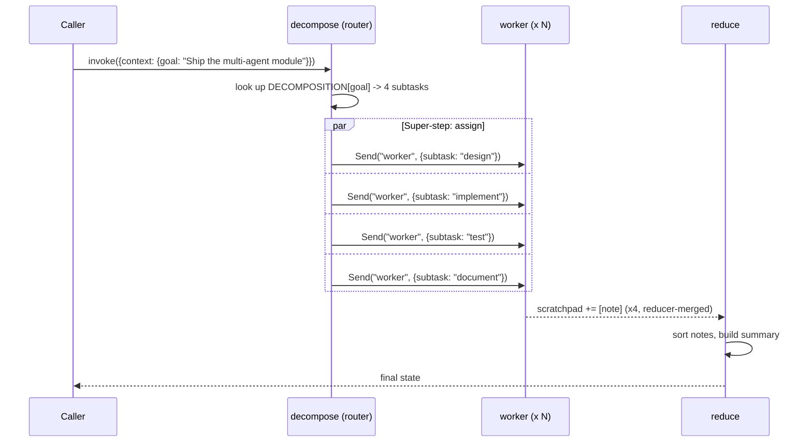

# 50 — Task Decomposition

## Learning Objectives

After this module you can:

- Split a goal into independent subtasks and fan them out with `Send`,
  reusing the fan-out/fan-in mechanics from module 12 for a coordinator
  pattern instead of a fixed document batch.
- Explain the **map / assign / reduce** shape: a coordinator maps a goal to
  subtasks, assigns each to a worker, and a reduce step folds partial results
  into one answer.
- Reason about which super-step each part of the graph runs in, and why
  workers never see each other's subtask.
- Make fan-in output deterministic even when parallel completion order isn't
  guaranteed.

## Theory

Task decomposition is the coordinator pattern behind most "planner" style
multi-agent systems (module 09's `planner`/`executor`, generalized):

1. **Map** — `decompose` (a conditional-edge router, not a node) reads the
   goal and looks up its subtasks.
2. **Assign** — each subtask becomes one `Send("worker", {...})`. `Send`'s
   second argument is the **entire** input for that worker invocation — the
   worker sees only its own subtask, never the full list. All `Send`s emitted
   by one router call are scheduled within the same super-step (see
   `docs/langgraph.md` §1 on super-steps), which is what makes this fan-out
   rather than a sequential loop.
3. **Reduce** — every worker's return value merges into the shared
   `scratchpad` via its `operator.add` reducer (module 12's key mechanism).
   Once all workers finish, `reduce` reads the fully merged `scratchpad` and
   builds one final answer.

Because reducer-merged order can depend on completion order (real parallel
execution, or even just dict/list internals), `reduce` sorts the notes before
using them — a small but important habit: **anything downstream of a fan-in
that must be deterministic should sort or otherwise normalize**, rather than
assume workers finish in submission order.

## Mental Models

Think of `decompose` as a project manager splitting a ticket into subtasks
and handing each to a different specialist — each specialist only knows
about their own assignment, not the others'. The manager doesn't wait for one
specialist to finish before briefing the next (that's the fan-out); the
manager only reconvenes everyone (`reduce`) once every subtask reports back.

## Architecture



*Legend: `decompose` is a conditional edge attached to `START` (not a node)
that returns a list of `Send` objects instead of a plain string — one arrow
per `Send`, each carrying only that worker's own subtask as its entire input.*

Map/assign/reduce sequence for one goal:



**Flow notes:**
- `decompose` maps a `goal` to its subtasks via the static `DECOMPOSITION`
  dict and emits one `Send("worker", {...})` per subtask — all scheduled in
  the same super-step (fan-out), not a sequential loop.
- Each `Send`'s second argument is the **entire** input for that worker
  invocation, so a worker only ever sees its own `subtask` — never the
  other workers' assignments.
- `worker` writes only to `scratchpad` (reducer-backed via `operator.add`),
  which is what lets every parallel worker's contribution merge safely
  instead of colliding.
- `reduce` is the fan-in: it runs once, after every `worker` invocation from
  the same `decompose` call has completed, and sorts `scratchpad` before
  building the summary so output is deterministic regardless of completion
  order.

## Runnable Example

```bash
python src/50_task_decomposition/main.py
```

Expected output (truncated, deterministic):

```
worker result: [design] completed for goal 'Ship the multi-agent module'
worker result: [document] completed for goal 'Ship the multi-agent module'
worker result: [implement] completed for goal 'Ship the multi-agent module'
worker result: [test] completed for goal 'Ship the multi-agent module'
subtask_count=4
summary: Goal 'Ship the multi-agent module' complete via 4 subtask(s): ...
...
=== TRACK7 MODULE 50: TASK DECOMPOSITION COMPLETE ===
```

## Challenge

1. Add a third goal to `DECOMPOSITION` and confirm it fans out and reduces
   correctly with zero other code changes.
2. Make one subtask "fail" (raise inside `worker`, caught locally per module
   14's pattern) and have `reduce` report it as a partial result instead of
   crashing the whole run.
3. Change `worker` to also return a `context` update and observe the
   last-write-wins collision across parallel workers — then explain in a
   comment why `scratchpad` (not `context`) is the only safe channel for
   fan-in here.

## Stretch Goals

- Nest decomposition: have one subtask itself fan out into sub-subtasks
  (`Send` from within a worker), producing a two-level map/reduce tree.
- Replace the static `DECOMPOSITION` dict with an LLM-driven planner using
  `get_chat_model(...).with_structured_output(...)` from `src.shared`,
  keeping output deterministic via canned responses.
- Add a per-subtask timeout/retry (module 14's pattern) so a slow or failing
  worker doesn't block the whole reduce step indefinitely.

## Common Mistakes

- **Workers writing to `context`.** `context` has no reducer; two parallel
  workers writing to it in the same super-step is a genuine, undefined
  conflict (unlike `scratchpad`, which is reducer-safe by design). Keep
  worker outputs on reducer-backed channels only.
- **Assuming fan-in order matches fan-out order.** Don't rely on it; sort or
  key by subtask name if the final answer must be deterministic.
- **Putting the subtask list inside a node instead of the router.** `Send`
  must come from a conditional edge (or a node returning `Send`s) — a plain
  node cannot fan out on its own.

## Best Practices

- Keep the map step (`decompose`) pure — it only reads state and returns
  `Send`s, never mutates anything.
- Give each worker the minimum context it needs (`goal`, `subtask`) rather
  than the full accumulated state, so workers stay independent and testable
  in isolation.
- Normalize (sort/dedupe) any fan-in output your tests or downstream logic
  depend on being stable.

## Suggested Improvements

- Track subtask ownership (`context["assignments"]`) so `reduce` can report
  not just completion but which worker/agent handled which subtask.
- Add a `context["failed_subtasks"]` list (via `operator.add`) so partial
  failures are visible in the final summary instead of silently absent.

## References

- LangGraph `Send` API: https://docs.langchain.com/oss/python/langgraph/graph-api#send
- Module [`12_parallel_execution`](../12_parallel_execution/README.md) — the
  fan-out/fan-in + reducer mechanics this module reuses for a coordinator.
- Module [`09_multi_agent_systems`](../09_multi_agent_systems/README.md) — the
  original single-worker planner/executor this module generalizes to N.
- [`docs/multi-agent.md`](../../docs/multi-agent.md) — coordination patterns
  overview across modules 48-52.

## What Comes Next

[`51_shared_memory`](../51_shared_memory/README.md) moves from a coordinator
explicitly assigning work to agents that instead read and post to a shared
blackboard, discovering each other's contributions rather than being handed
them directly.
