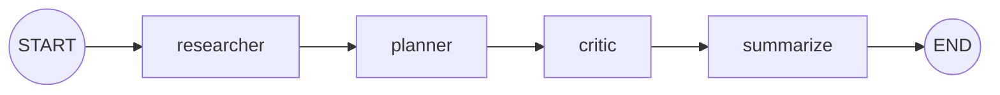
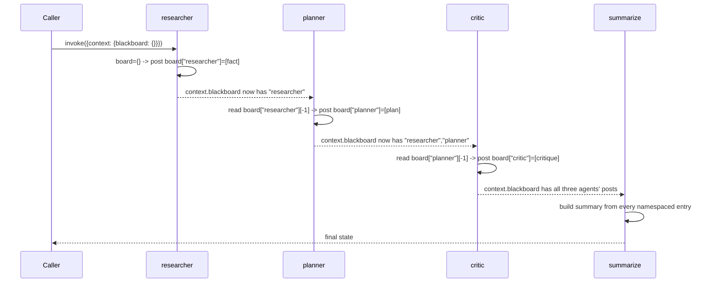

# 51 — Shared Memory (Blackboard)

## Learning Objectives

After this module you can:

- Implement a **blackboard**: a shared, in-memory store agents post facts to
  and read from, using nothing beyond `src.shared`'s `AgentState`.
- Namespace each agent's contributions so multiple agents can post to the
  same board without overwriting each other.
- Explain why a linear (sequential) chain of agent nodes gives you
  read-after-write ordering for free, and what would break that guarantee.
- Distinguish a blackboard (shared, persistent-within-a-run memory) from
  message passing (module 52) and direct hand-off (module 48).

## Theory

A blackboard architecture is one of the oldest multi-agent patterns: instead
of agents calling each other directly, they all read and write a shared
store. Any agent can observe any earlier post; no agent needs to know who
will read its contribution, or in what order agents were added.

This module implements the board as `AgentState.context["blackboard"]`, a
plain dict keyed by agent name:

```python
board = {
    "researcher": ["fact 1"],
    "planner": ["fact derived from fact 1"],
    "critic": ["critique of the plan"],
}
```

**Namespacing** (`board[name]`) prevents two agents' posts from colliding —
each agent only ever appends to its *own* list. **Read-after-write ordering**
is guaranteed here by construction: the graph runs `researcher -> planner ->
critic -> summarize` as a strictly linear chain. Each node's return value is
fully merged into state before the next node starts (LangGraph's super-step
model — see `docs/langgraph.md` §1), so `planner` is guaranteed to see
`researcher`'s post, and `critic` is guaranteed to see both. If two agents
ran in parallel (via `Send`, as in modules 12/50) instead, neither could
safely assume the other's post already landed on the board — that ordering
guarantee only holds for a sequential chain.

Note this is genuinely "reuse `src.shared`, no new infrastructure": the board
is just a nested dict inside the same `context` field every other module 48-52
module uses — no new store, no new persistence layer.

## Mental Models

Think of an old-fashioned incident-response whiteboard in an operations room:
each responder writes their observation under their own name, and reads what
everyone before them already wrote before adding their own line. Nobody
messages anyone directly — they just walk up to the board.

## Architecture



Read-after-write sequence:



## Runnable Example

```bash
python src/51_shared_memory/blackboard.py
```

Expected output (truncated, deterministic):

```
[researcher] posted: LangGraph state updates are merged into shared state via reducers.
[planner] posted: Plan: apply '...' when designing the next module.
[critic] posted: Critique: '...' is sound but should mention namespacing too.
board[critic]=[...]
board[planner]=[...]
board[researcher]=[...]
summary: Blackboard summary -- critic: ...; planner: ...; researcher: ...
=== TRACK7 MODULE 51: SHARED MEMORY COMPLETE ===
```

## Challenge

1. Add a fourth agent, `historian`, that posts a fact referencing *all three*
   prior agents' latest posts (not just one), proving the board accumulates
   correctly across more than two hops.
2. Let an agent post more than one fact per run (append twice inside one
   node) and confirm `board[name]` accumulates both without losing the first.
3. Deliberately reorder the graph so `critic` runs before `planner` and watch
   the `KeyError` when `critic` looks for `board["planner"]` — a concrete
   demonstration of why sequential ordering is what provides the
   read-after-write guarantee, not the dict itself.

## Stretch Goals

- Add a `context["blackboard_log"]` (via `operator.add`) recording
  `(agent, timestamp_or_order, fact)` tuples for a full audit trail
  independent of the namespaced board.
- Run two agents in parallel (via `Send`) that both read the board *before*
  either posts, and reason about what "read-after-write" even means once
  writes are concurrent — this is the natural segue to module 52's
  decoupled, order-independent message passing.
- Swap the in-memory dict for `InMemoryVectorStore` from `src.shared` so
  agents can query the board semantically ("find posts about reducers")
  instead of by exact agent name.

## Common Mistakes

- **Assuming any execution order gives read-after-write.** It's the linear
  chain (sequential edges) that provides the guarantee here, not the
  blackboard data structure itself. Parallel writers need an explicit
  ordering mechanism (or must tolerate reading a partial board).
- **Sharing one list across agents instead of namespacing.** Without
  `board[name]`, two agents appending to the same list can't tell which
  entry came from whom, defeating the point of per-agent memory.
- **Forgetting to spread `board` before adding a key** — same class of bug as
  module 48's context-spread lesson, just one level deeper (spread the board,
  not just the context).

## Best Practices

- Keep each agent's read narrow (`board["researcher"][-1]`, not the whole
  board) so it's obvious exactly which prior contribution it depends on.
- Log every post (`get_logger`) — a blackboard's value is largely in being
  auditable after the fact.
- Prefer explicit sequential edges over "hope for the right order" whenever
  read-after-write matters; make ordering a graph-level guarantee, not an
  assumption.

## Suggested Improvements

- Add TTL/expiry semantics to board entries for long-running blackboards
  that shouldn't accumulate forever.
- Support "subscriptions" — an agent that should be re-invoked whenever a
  specific other agent's namespace changes — bridging toward module 52's
  pub/sub bus.

## References

- Blackboard architectural pattern (background):
  https://en.wikipedia.org/wiki/Blackboard_(design_pattern)
- Module [`06_memory_basics`](../06_memory_basics/README.md) — the original
  in-memory event storage this module generalizes to multiple agents.
- Module [`48_agent_collaboration`](../48_agent_collaboration/README.md) —
  the context-spread convention this module reuses one level deeper.
- [`docs/multi-agent.md`](../../docs/multi-agent.md) — coordination patterns
  overview across modules 48-52.

## What Comes Next

[`52_event_bus`](../52_event_bus/README.md) replaces "read the shared board"
with "subscribe to a topic": agents no longer need to know each other's
namespace at all — the bus decouples publishers from subscribers entirely.
