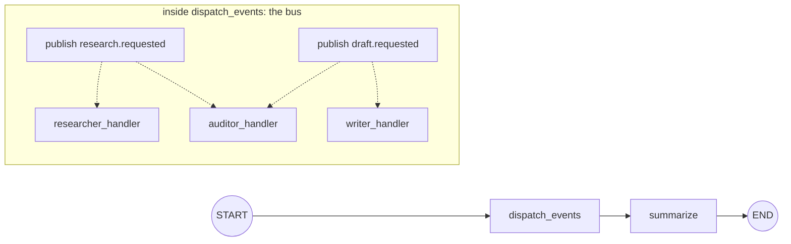
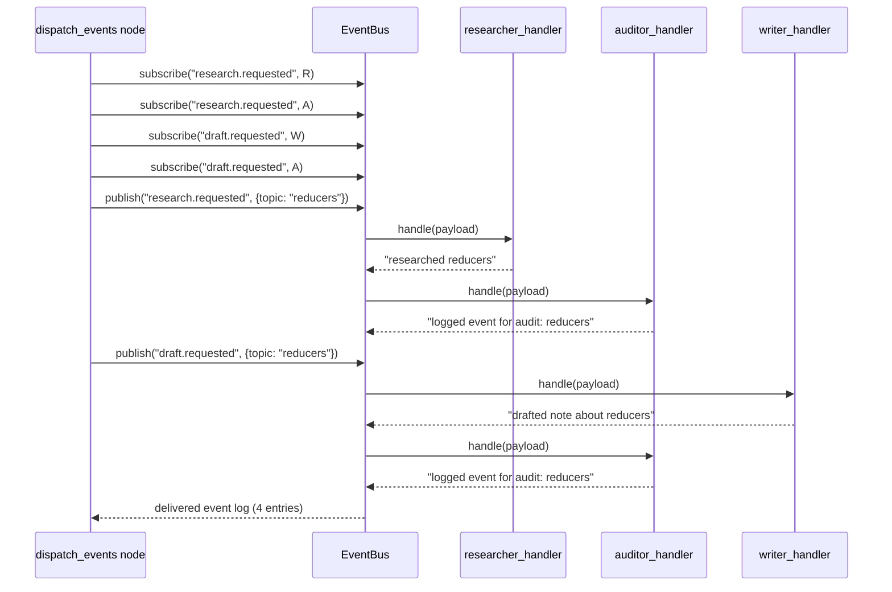

# 52 — Event Bus (Pub/Sub)

## Learning Objectives

After this module you can:

- Implement a minimal in-process publish/subscribe bus and explain how it
  differs from a hard-wired conditional edge.
- Register multiple subscribers on one topic and confirm every one is
  invoked, in subscription order.
- Explain the decoupling win: publishers never reference handlers directly,
  only topic names.
- Map a pub/sub bus onto a LangGraph node, and articulate what changes if
  each subscriber became its own process/agent instead.

## Theory

Every routing mechanism used so far in this track is **hard-wired**: module
11's `add_conditional_edges(source, router, mapping)` requires the `mapping`
to enumerate every destination node up front. Adding a new branch means
editing the mapping *and* the router. This works well when the set of
destinations is small and known.

A **pub/sub event bus** inverts the dependency:

- **Publishers** emit an event on a topic (`bus.publish("draft.requested", payload)`)
  without knowing — or caring — whether anyone is subscribed.
- **Subscribers** register a handler for a topic (`bus.subscribe("draft.requested", writer_handler)`)
  independently of the publisher's code.
- The **bus** looks up subscribers for a topic at publish time and dispatches
  to each of them, in registration order.

The decoupling: you can add a new subscriber to `"draft.requested"` (say, a
`translator_handler`) by adding one `subscribe` call — the publisher's code,
and every other subscriber's code, is untouched. Compare that to a hard-wired
router, where adding a new branch means editing the `mapping` dict that every
other branch also lives in.

In this module the whole bus — subscription table, publish loop, dispatch —
lives inside one graph node (`dispatch_events`) for simplicity and to stay
offline. In a distributed system, each subscriber would instead be its own
service/agent listening on a real queue (Kafka, SQS, Redis pub/sub, ...); the
routing *logic* (topic -> handler list, resolved dynamically) is identical —
only the transport changes.

## Mental Models

Think of a hard-wired conditional edge as a private phone line: the router
must personally dial each possible destination by name. A pub/sub bus is a
radio broadcast: the publisher transmits on a frequency (topic) without
knowing who's tuned in, and any number of receivers (subscribers) can tune in
or drop out without the transmitter ever being reconfigured.

## Architecture



Event delivery sequence:



## Runnable Example

```bash
python src/52_event_bus/event_bus.py
```

Expected output (truncated, deterministic):

```
delivered event log:
  research.requested -> researcher_handler: researched reducers
  research.requested -> auditor_handler: logged event for audit: reducers
  draft.requested -> writer_handler: drafted note about reducers
  draft.requested -> auditor_handler: logged event for audit: reducers
Delivered 4 event(s) via the bus.
=== TRACK7 MODULE 52: EVENT BUS COMPLETE ===
```

## Challenge

1. Add a third topic (`"review.requested"`) with two new subscribers and
   confirm both fire without touching any existing subscription line.
2. Publish an event on a topic with **no** subscribers and confirm
   `EventBus.publish` logs `"(no subscribers)"` instead of raising.
3. Change `EVENTS` to publish the same topic twice with different payloads
   and confirm every subscriber is invoked once per publish (not once total).

## Stretch Goals

- Add an `unsubscribe(topic, handler)` method and demonstrate a subscriber
  that stops receiving events mid-run.
- Add topic wildcards (e.g. a subscriber registered for `"*.requested"` that
  matches any topic ending in `.requested`) and discuss the added complexity
  vs. exact-match topics.
- Split `dispatch_events` into one graph node per subscriber (each reading
  from a shared "outbox" list in `context`) to make the mapping onto real
  graph nodes explicit, then compare the resulting graph's rigidity to the
  in-node bus version.

## Common Mistakes

- **Confusing pub/sub with a hard-wired conditional edge.** If the router
  must know every destination by name in a `mapping` dict, it's hard-wired
  routing (module 11), not pub/sub — even if you call it a "bus."
  Decoupling means the publisher's code doesn't change when subscribers do.
- **Assuming publish order guarantees delivery order across topics.** This
  bus dispatches synchronously and in registration order *within* a topic,
  but don't generalize that guarantee to a real distributed queue without
  checking its ordering semantics.
- **Silently dropping events with no subscribers.** Log it (as this module
  does) rather than let a mistyped topic name fail invisibly.

## Best Practices

- Keep the bus itself dependency-free of any specific agent — it should only
  know about topics and handler callables, never business logic.
- Log every dispatch (`get_logger`) so the delivered-event log doubles as an
  audit trail, exactly like the printed log in this module.
- Name topics as verbs/events (`"draft.requested"`), not destinations
  (`"writer"`) — that's what keeps publishers decoupled from *who* handles
  the event.

## Suggested Improvements

- Add a dead-letter list for events published with zero subscribers, so a
  later node can alert on likely-misconfigured topics.
- Add per-handler error isolation (one subscriber's exception shouldn't stop
  delivery to the others) — an application of module 14's error-handling
  pattern to a fan-out dispatch loop.

## References

- Publish/subscribe pattern (background):
  https://en.wikipedia.org/wiki/Publish%E2%80%93subscribe_pattern
- Module [`11_graph_branching`](../11_graph_branching/README.md) — the
  hard-wired conditional-edge routing this module contrasts with.
- Module [`51_shared_memory`](../51_shared_memory/README.md) — the blackboard
  pattern this module's decoupled alternative builds on conceptually.
- [`docs/multi-agent.md`](../../docs/multi-agent.md) — coordination patterns
  overview across modules 48-52.

## What Comes Next

Track 7 is complete. From here, `docs/multi-agent.md` ties modules 48-52
together as one coherent set of coordination patterns; the capstone in
[`10_full_brain_simulation`](../10_full_brain_simulation/README.md) is a good
next stop to see several of these patterns combined in one larger system.
