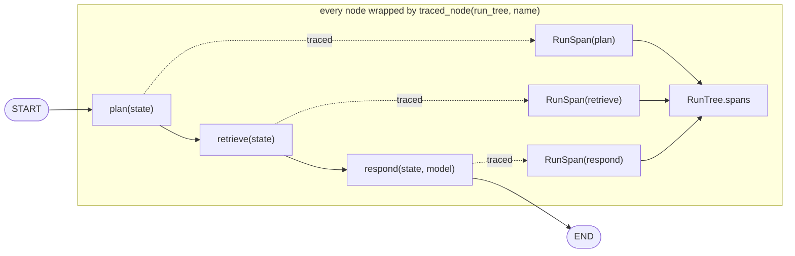
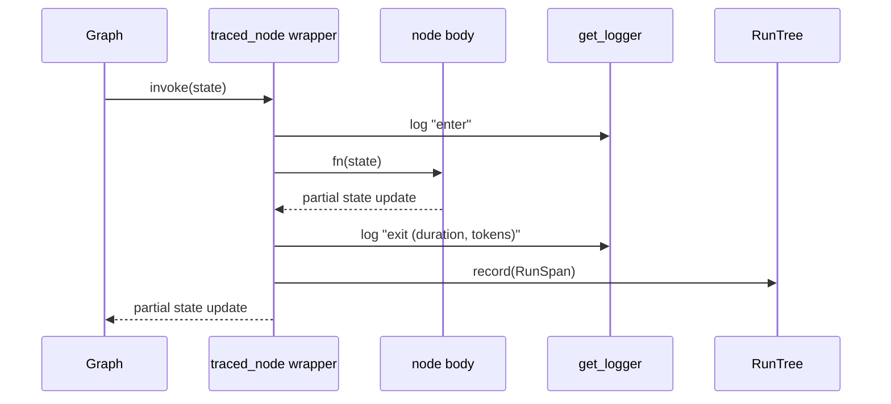

# 53 — Observability

## Learning Objectives

After this module you can:

- Instrument LangGraph nodes with structured logging via `get_logger` instead
  of ad-hoc `print` debugging.
- Capture per-run metrics: wall-clock latency, node count, and an estimated
  token count for each unit of work.
- Build a **run tree** that records the execution path of a graph invocation
  and render it as a readable trace.
- Explain why observability is a decorator/wrapper concern, not something you
  hand-roll inside every node body.

## Theory

Once an agent leaves a notebook and runs in production, "does it work" stops
being enough — you need to answer "what did it do, how long did it take, and
what did it cost" for every single run. Three primitives cover most of that:

- **Structured logs** — timestamped, leveled, machine-parseable lines (`%(asctime)s
  | %(levelname)s | %(name)s | %(message)s` here, via `get_logger`). Unlike
  `print`, they carry a logger name and level so they can be filtered and
  shipped to a log backend without code changes.
- **Metrics** — numeric facts about a run: latency per node, total latency,
  node count, token/cost estimates. Metrics answer "how much" questions at a
  glance without reading full traces.
- **Run tree (trace)** — the ordered record of *which* nodes ran, in what
  order, with what duration. This is a minimal, offline stand-in for what
  LangSmith or OpenTelemetry spans capture in a real deployment: a tree of
  timed operations, each with metadata.

The pattern that ties them together is **instrumentation via wrapping**: a
`traced_node` decorator wraps any node function, timing it, logging enter/exit,
and appending a `RunSpan` to a shared `RunTree` — without the node itself
knowing it is being observed. This keeps business logic (the node body) and
cross-cutting concerns (timing, logging) cleanly separated.

## Mental Models

Think of `traced_node` as a security camera at a warehouse door: goods
(state) pass through unchanged, but the camera (decorator) silently logs a
timestamped entry — who came in, what time, how long they stayed. Multiply
that across every door (node) in the building (graph) and you get a full
video log (run tree) of the day's operations without slowing anyone down.

## Architecture



*Legend: solid arrows are the actual graph edges; dotted arrows show each
node wrapped by `traced_node`, which records timing/tokens into the shared
`RunTree` without changing the node's own logic or the graph's edges.*

Sequence of one instrumented node call:



**Flow notes:**
- `traced_node(run_tree, name)` is a decorator **factory**: it closes over
  `run_tree` and `name`, then returns a decorator that wraps the actual node
  function — the node body (`plan`, `retrieve`, `respond`) never knows it is
  being observed.
- On `enter`, the wrapper logs via `get_logger` and starts
  `time.perf_counter()`; on exit (success or exception) it computes
  `duration_ms`, estimates tokens from the stringified result via
  `estimate_tokens`, and appends one `RunSpan` to the shared `RunTree`.
- If the wrapped node raises, the wrapper logs the exception (`logger.exception`)
  and **re-raises** — instrumentation never swallows an error, it only
  observes it.
- `RunTree.render()` prints spans in recorded order as a nested trace; the
  header metrics (`total_latency_ms`, `total_tokens_est`) are simple sums
  over every recorded span.

## Runnable Example

```bash
python src/53_observability/observability.py
```

Expected output (latency values vary by machine, structure is stable):

```
query='When is the daily standup?' answer='Standups are at 9:30am in #team.'
run-tree:
plan (0.00ms, ~17 tokens)
    └── retrieve (0.00ms, ~9 tokens)
        └── respond (0.40ms, ~47 tokens)
metrics: nodes=3 total_latency_ms=0.40 tokens_est=73
=== MODULE 53: OBSERVABILITY COMPLETE ===
```

## Challenge

1. Add a fourth node (`summarize`) and confirm it appears in the run tree with
   its own span, in the right position.
2. Change `estimate_tokens` to use a smarter heuristic (e.g. word count instead
   of character count) and compare the resulting estimates.
3. Add a `min`/`max`/`avg` latency summary across multiple `app.invoke()` calls
   with different queries.

## Stretch Goals

- Export the run tree as JSON and write it to a file for later inspection.
- Add a `slow_node_threshold_ms` and flag (log a warning) any span exceeding
  it — a poor man's alerting rule.
- Wire this pattern to a real tracer (LangSmith or OpenTelemetry) behind a
  feature flag, keeping the offline `RunTree` as the default.

## Common Mistakes

- Putting timing/logging code inline in every node — duplicated, easy to
  forget on new nodes. Use the wrapper instead.
- Logging the full message content at `INFO` in production — prefer
  summaries or truncated previews; full payloads belong at `DEBUG`.
- Estimating tokens from the final answer only — instrument every node so
  cost/latency spikes are traceable to their source.

## Best Practices

- One logger per module (`get_logger(__name__)`), not a global logger.
- Never swallow exceptions in an instrumented node — log then re-raise, as
  `traced_node` does here.
- Keep metrics cheap to compute (character-based estimates, `time.perf_counter`)
  so instrumentation itself never becomes the bottleneck.

## Suggested Improvements

- Add span nesting for parallel branches (module 12) so the run tree reflects
  fan-out/fan-in shapes, not just linear chains.
- Persist run trees to `docs/observability.md`-referenced storage for trend
  analysis across runs.

## References

- [`docs/observability.md`](../../docs/observability.md) — logging, metrics,
  run trees, and tracing conventions for the whole repo.
- [LangSmith tracing concepts](https://docs.smith.langchain.com/) — the
  production analogue of this module's `RunTree`.
- Module [11_graph_branching](../11_graph_branching/README.md) — the routing
  primitives this module instruments.

## What Comes Next

[54_evaluations](../54_evaluations/README.md) builds an eval harness on top of
these same instrumentation ideas: instead of tracing *how* a run happened, it
scores *whether* the output was correct.
