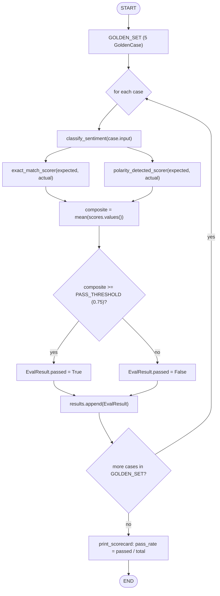
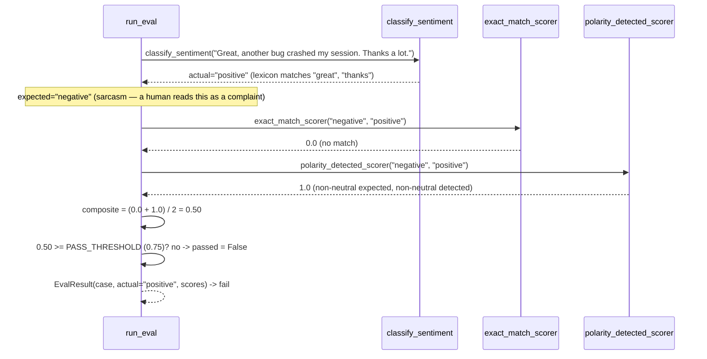

# 54 — Evaluations

## Learning Objectives

After this module you can:

- Build a **golden set**: a fixed collection of (input, expected output) pairs
  used to regression-test an agent.
- Write **scorers**: small, pure functions that grade one run against its
  expected output and return a number.
- Aggregate per-case scores into a **pass rate** — the single number a CI
  gate or dashboard cares about.
- Recognize why a single, overly lenient scorer can hide real regressions.

## Theory

An **eval** answers "is this agent still correct?" the same way a unit test
answers "is this function still correct?" — except the system under test is
often nondeterministic (an LLM), so exact-string assertions are usually too
brittle. The standard shape is:

1. **Golden set** — a small, hand-curated list of representative inputs with
   known-good expected outputs. Golden sets should include edge cases (here:
   sarcasm) that the system is known — or suspected — to handle poorly.
2. **Scorers** — functions `(expected, actual) -> float` in `[0, 1]`. Multiple
   scorers can grade different qualities of the same output (exact
   correctness, partial credit, format validity, safety). A **composite
   score** averages or weights them into one number per case.
3. **Aggregation** — a **pass threshold** turns the composite score into a
   pass/fail per case, and the **pass rate** (`passed / total`) becomes the
   headline metric tracked over time.

This module's system under test is `classify_sentiment`, a lexicon-based
classifier. It is *deliberately* naive: it gets sarcasm wrong
(`"Great, another bug crashed my session. Thanks a lot."` reads as positive
from the words alone). The golden set includes that case on purpose — a good
eval harness exists to surface exactly this kind of gap with a number, not to
hide it behind a single forgiving scorer.

## Mental Models

Think of the golden set as a **driving test route**: it is not exhaustive of
every road in the city, but it deliberately includes a tricky roundabout
(sarcasm) alongside easy straightaways (clear positive/negative/neutral
cases). Passing the route does not guarantee perfect driving everywhere, but
failing the roundabout tells you exactly what to fix next.

## Architecture

`run_eval` loops over every case in `GOLDEN_SET`, scores it with all
registered `SCORERS`, and averages them into one composite per case:



*Legend: `run_eval` is a plain Python loop, not a LangGraph graph — the
diagram uses the same flowchart conventions to make the per-case iteration
and its exit condition explicit.*

Trace of the one golden case the naive classifier gets wrong (sarcasm):



**Flow notes:**
- The `for each case` loop runs `classify_sentiment` (the system under test)
  once per `GoldenCase`, then every scorer in `SCORERS` against that one
  prediction.
- `composite` is the unweighted mean of all scorer outputs for that case;
  `passed` is `composite >= PASS_THRESHOLD` (`0.75`).
- The sarcasm case shows exactly why a single lenient scorer can hide a
  regression: `polarity_detected_scorer` alone would score `1.0` (some
  charge was detected) even though the exact label is backwards; averaging
  it with the strict `exact_match_scorer` (`0.0`) surfaces the failure as
  `0.50 < 0.75`.
- `print_scorecard` aggregates every `EvalResult.passed` into one
  `pass_rate` after the loop exits — the headline number a CI gate would
  check.

## Runnable Example

```bash
python src/54_evaluations/evaluations.py
```

Expected output (deterministic):

```
case='I love the new dashboard, great work!' expected=positive actual=positive composite=1.00 pass
case='This update is terrible and broken.' expected=negative actual=negative composite=1.00 pass
case='The meeting is scheduled for 3pm.' expected=neutral actual=neutral composite=1.00 pass
case="I hate how this turned out; it's really bad." expected=negative actual=negative composite=1.00 pass
case='Great, another bug crashed my session. Thanks a lot.' expected=negative actual=positive composite=0.50 fail
=== SCORECARD ===
total=5 passed=4 pass_rate=80.0%
=== MODULE 54: EVALUATIONS COMPLETE ===
```

## Challenge

1. Add a sixth golden case that the classifier gets wrong for a *different*
   reason (e.g. negation: `"not good"`) and confirm the pass rate drops.
2. Write a third scorer, `length_penalty_scorer`, that penalizes empty
   predictions, and add it to `SCORERS`.
3. Lower `PASS_THRESHOLD` to `0.5` and observe how the sarcasm case flips from
   `fail` to `pass` — then explain in a comment why that is a worse eval.

## Stretch Goals

- Swap `classify_sentiment` for a call through `get_chat_model` and see how
  the offline `FakeToolCallingModel` performs against the same golden set.
- Track pass rate over time by appending scorecards to a file and diffing
  runs — a minimal regression dashboard.
- Add a weighted composite (`0.7 * exact_match + 0.3 * polarity_detected`)
  instead of a simple average.

## Common Mistakes

- Using only a lenient scorer (like `polarity_detected_scorer` alone) — the
  sarcasm case would score `1.0` and the regression would go unnoticed. Always
  pair a strict scorer with any partial-credit scorer.
- Golden sets with only "easy" cases — they build false confidence. Include
  known-hard cases deliberately.
- Treating pass rate as a single point-in-time number instead of a trend —
  one run tells you today's state, not whether you are improving.

## Best Practices

- Keep golden sets small and curated (5–50 cases), not large and unreviewed —
  every case should be a deliberate decision.
- Version golden sets alongside code so eval results are reproducible.
- Log every case (`get_logger`), not just the aggregate — debugging a failing
  eval starts with the per-case trace.

## Suggested Improvements

- Persist scorecards as structured JSON for downstream dashboards.
- Add a CLI flag to run only failing cases from the previous run (fast
  iteration loop).

## References

- [`docs/testing.md`](../../docs/testing.md) — testing nondeterministic
  agents, golden sets, and snapshotting.
- Module [53_observability](../53_observability/README.md) — the tracing
  primitives that help debug *why* an eval case failed.
- Module [55_testing_agents](../55_testing_agents/README.md) — structural
  assertions and fakes, the complementary testing discipline to evals.

## What Comes Next

[55_testing_agents](../55_testing_agents/README.md) covers unit-testing
nondeterministic agents directly: fakes, snapshotting, and structural
assertions, rather than golden-set scoring.
