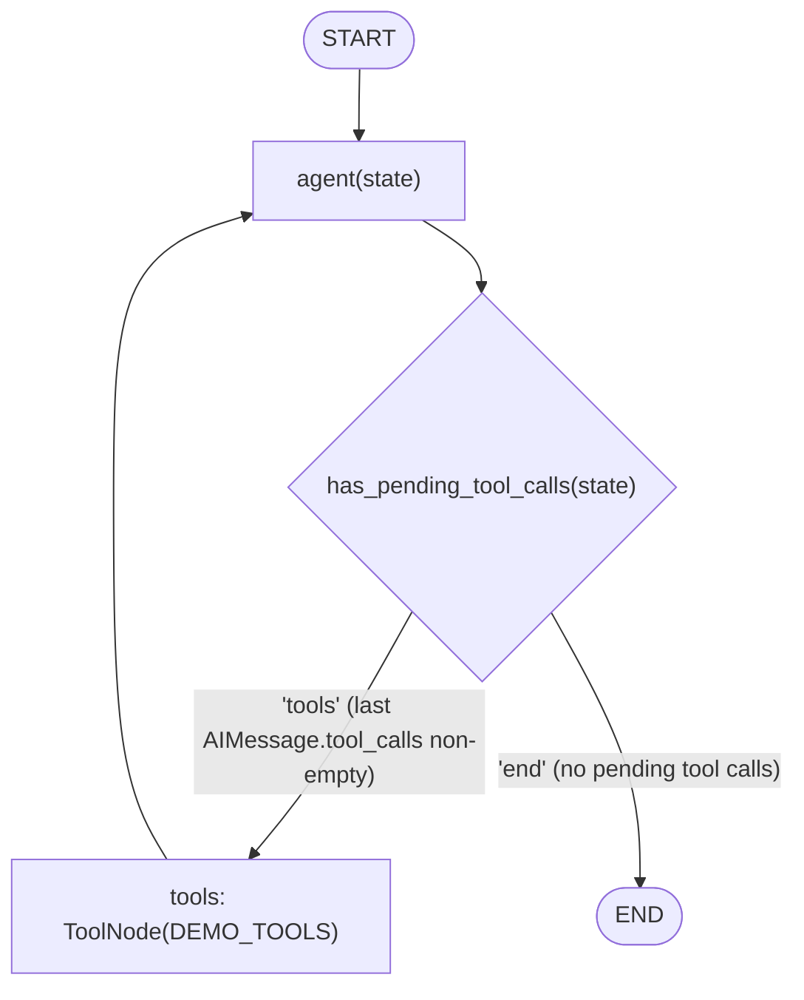
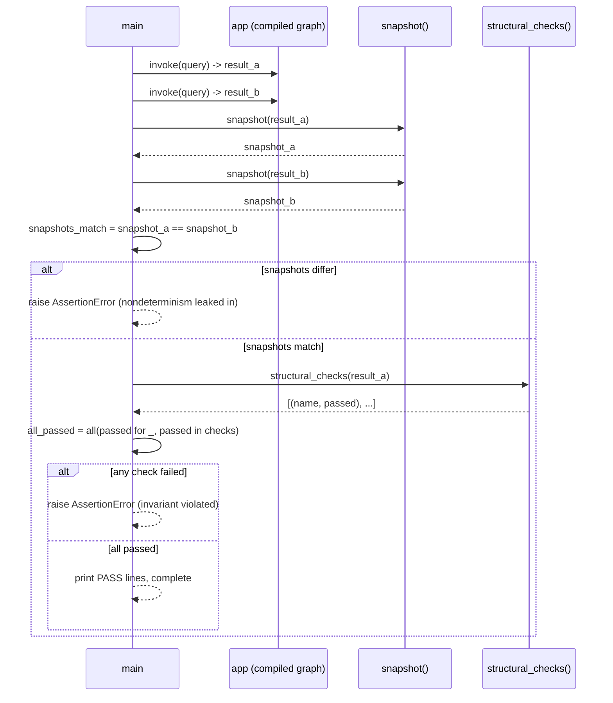

# 55 — Testing Agents

## Learning Objectives

After this module you can:

- Explain why exact-text assertions are brittle for LLM-backed agents and
  what to assert instead.
- Use `get_chat_model`'s deterministic `FakeToolCallingModel` as a **fake**
  to make a tool-calling agent's tests reproducible and offline.
- Write a **snapshot** function that reduces an agent's output to a stable,
  comparable shape.
- Write **structural assertions** that check invariants (message roles, tool
  call ids, budgets) instead of specific wording.

## Theory

Testing a deterministic function is easy: same input, same output, `assert
result == expected`. Testing an **agent** is harder because the model in the
loop can vary — different providers, versions, temperatures, or just
non-zero sampling — even when the surrounding graph logic is identical. Three
patterns keep agent tests reliable anyway:

- **Fakes/stubs** — replace the nondeterministic component (the LLM) with a
  deterministic stand-in for the test. `get_chat_model()` already does this
  automatically when no API key is configured, returning
  `FakeToolCallingModel`: it still emits real tool calls and text answers, but
  from fixed, inspectable logic instead of sampling.
- **Snapshotting** — instead of asserting on exact output text (which will
  drift as prompts/models change), capture a **normalized shape**: message
  roles in order, which tools were called, how many messages resulted. Two
  runs of the same deterministic input should produce identical snapshots;
  comparing snapshots (not raw text) is what actually stays stable.
- **Structural assertions** — assert *invariants* that must hold regardless
  of exact wording: "the final message is an AIMessage with no pending tool
  calls," "every tool call has an id," "the tool-call count stays within
  budget." These catch real bugs (an infinite tool loop, a malformed message)
  without caring what the model actually said.

## Mental Models

Think of testing a real (non-fake) LLM agent like testing a **vending
machine** where the exact snack brand can change weekly. You would not
assert "the machine dispenses a Snickers" (brittle — brands rotate); you
would assert "the machine dispenses exactly one item, it's wrapped, and
change is returned correctly" (structural). The fake model is the "test
mode" switch on the machine: press it, and it always dispenses the same
labeled test item, so you can verify the mechanism itself.

## Architecture

The system under test is the same manual tool-call loop as module 17:



*Legend: the edge labels are the literal strings `has_pending_tool_calls`
returns; the loop `tools -> agent` repeats until the model stops emitting
tool calls or `MAX_TOOL_CALLS` is reached inside the fake model.*

The tests exercise this graph twice, then check the two runs the same way:



**Flow notes:**
- `has_pending_tool_calls` returns `"tools"` only when the last message is an
  `AIMessage` **and** it has pending `tool_calls`; otherwise it returns
  `"end"` — the same shape as module 17's manual loop.
- `snapshot()` strips nondeterministic fields (message ids, exact tool-call
  ids) and keeps only `num_messages`, `roles`, `tool_calls`, and
  `final_role` — that reduced shape is what must be identical across the two
  invocations for `snapshots_stable_across_runs` to hold.
- `structural_checks()` asserts five invariants (at least one message, final
  message is an `AIMessage` with no pending tool calls, every tool call has
  an id, tool-call count within `MAX_TOOL_CALLS`) — none of them reference
  the exact text of any message.
- Both failure paths (`snapshots_match is False`, any check `not passed`)
  raise `AssertionError` rather than silently continuing — a test module
  intentionally fails loud.

## Runnable Example

```bash
python src/55_testing_agents/testing_agents.py
```

Expected output (deterministic — the fake model makes tool selection and
final text reproducible):

```
snapshot_a={'num_messages': 6, 'roles': ['HumanMessage', 'AIMessage', 'ToolMessage', 'AIMessage', 'ToolMessage', 'AIMessage'], 'tool_calls': ['get_weather', 'send_slack'], 'final_role': 'AIMessage'}
snapshot_b={'num_messages': 6, 'roles': ['HumanMessage', 'AIMessage', 'ToolMessage', 'AIMessage', 'ToolMessage', 'AIMessage'], 'tool_calls': ['get_weather', 'send_slack'], 'final_role': 'AIMessage'}
snapshots_stable_across_runs=True
[PASS] has_at_least_one_message
[PASS] final_message_is_ai_message
[PASS] final_message_has_no_pending_tool_calls
[PASS] every_tool_call_has_an_id
[PASS] tool_call_count_within_budget
=== MODULE 55: TESTING AGENTS COMPLETE ===
```

## Challenge

1. Add a structural check `no_duplicate_tool_call_ids` and verify it passes.
2. Change `MAX_TOOL_CALLS` to `0` and observe which structural check now
   fails (and why that is the *correct* thing to fail).
3. Write a `snapshot_diff(a, b)` helper that reports exactly which keys
   differ between two snapshots.

## Stretch Goals

- Wrap this module's checks as real `pytest` test functions (mirroring
  `tests/test_track8_production.py`) that import `build_graph` directly
  instead of running via subprocess.
- Add a property-based check: run the agent with several different queries
  and assert the structural invariants hold for all of them.
- Persist snapshots to disk and diff against a checked-in "golden snapshot"
  file — a lightweight regression baseline.

## Common Mistakes

- Asserting on the literal final answer string — it will break the first
  time the model, prompt, or temperature changes.
- Testing only the "happy path" tool sequence — also test what happens when
  the tool budget is exhausted or a tool raises.
- Comparing snapshots that still include nondeterministic fields (ids,
  timestamps) — strip them before comparing, as `snapshot()` does here.

## Best Practices

- Always test through the same `get_chat_model()` factory used in
  production code — the fake and the real backend share an interface, so the
  graph logic under test never changes between environments.
- Prefer structural assertions over string assertions by default; reserve
  exact-text checks for truly fixed strings (error messages, enum values).
- Keep fakes deterministic and documented (`FakeToolCallingModel`'s behaviour
  is specified in `src/shared/llm.py`) so failures are debuggable.

## Suggested Improvements

- Add a `hypothesis`-style fuzzer over query text to stress-test the router
  logic in `has_pending_tool_calls`.
- Extend `structural_checks` into a small reusable assertion library shared
  across modules.

## References

- [`docs/testing.md`](../../docs/testing.md) — testing nondeterministic
  agents, fakes, golden sets, and snapshotting for the whole repo.
- Module [17_function_calling](../17_function_calling/README.md) — the
  tool-loop pattern under test here.
- Module [54_evaluations](../54_evaluations/README.md) — golden-set scoring,
  the complementary discipline to structural unit testing.

## What Comes Next

[56_security](../56_security/README.md) applies the same "assert the
invariant, not the exact text" discipline to a safety problem: detecting and
neutralizing prompt injection before it reaches a tool call.
