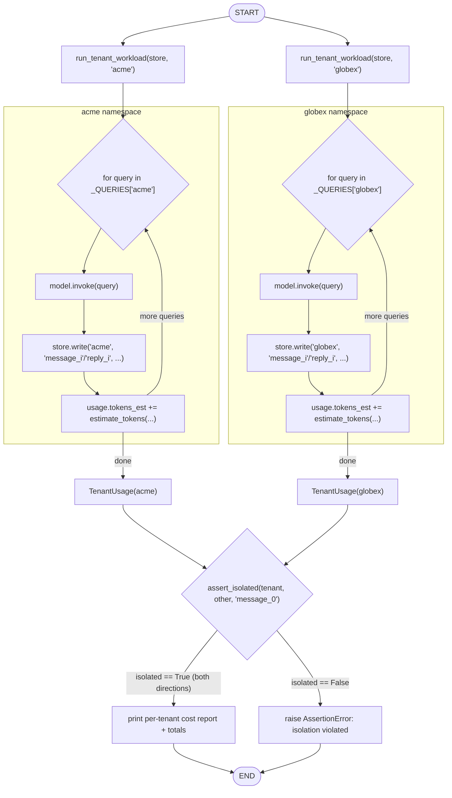
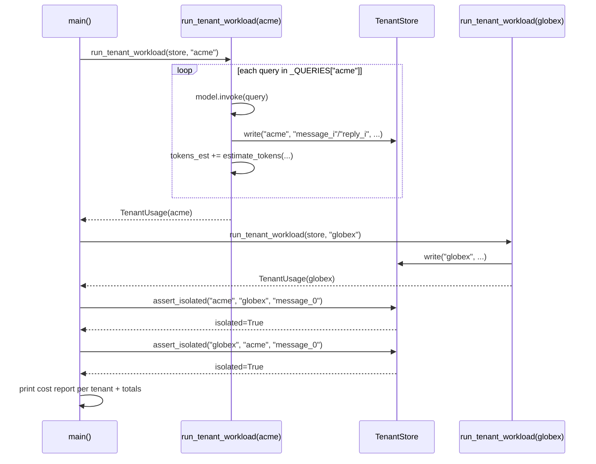

# 57 — Cost & Multitenancy

## Learning Objectives

After this module you can:

- Estimate token counts and dollar cost for a run without calling a real
  billing API.
- Build a namespaced, per-tenant store so tenants can never read each other's
  data.
- Combine usage tracking with isolation to produce a per-tenant cost report.
- Explain why "isolation" must be verified, not assumed, even in an in-memory
  store.

## Theory

Once an agent serves more than one customer (tenant), two concerns become
unavoidable:

- **Cost accounting** — every model call has a token cost. `estimate_tokens`
  uses the same cheap heuristic as module
  [53_observability](../53_observability/README.md) (~4 characters per
  token); `estimate_cost_usd` converts that into a dollar figure using a
  fixed, illustrative price. In production this heuristic is replaced by the
  provider's real tokenizer and pricing table, but the shape — tokens in,
  cost out, aggregated per tenant — does not change.
- **Multitenancy isolation** — shared infrastructure (a memory store, a
  vector index, a cache) must never let Tenant A read Tenant B's data. The
  simplest correct pattern is **namespacing**: every read/write is scoped by
  `tenant_id`, and the storage API has no operation that crosses namespaces.
  `TenantStore` here enforces this by keying its internal dict on
  `tenant_id` first — there is no "read any tenant's key" method, only
  "read this tenant's key," which raises if that tenant never wrote it.

The two concerns compose naturally: `run_tenant_workload` tracks token/cost
usage *while* writing every message into that tenant's own namespace, so the
final report can say, per tenant, "how much did you cost and is your data
isolated."

## Mental Models

Think of `TenantStore` like **hotel room safes**: every room (tenant) has its
own combination (namespace); the front desk (store) has no master key API
exposed to guests — only "open your own safe" is possible. The cost report is
the itemized bill slipped under each door: what this tenant specifically used,
not a shared total.

## Architecture



Legend: each tenant runs inside its own subgraph/namespace with no edge
crossing between `ACME` and `GLOBEX`; the `ISO` diamond is the isolation
check that gates whether the report ever prints.

Sequence of the same run over time:



Flow notes:

- Each tenant's workload loops over its own `_QUERIES` list, invoking the
  model and writing message/reply pairs only into that tenant's own
  `TenantStore` namespace (`store.write(tenant_id, ...)`), never another's.
- `assert_isolated` branches on whether a cross-tenant read of the same key
  name (`"message_0"`) succeeds and matches; if isolation is violated in
  either direction, `main()` raises `AssertionError` and the report never
  prints.
- The final report runs only after both isolation checks pass, aggregating
  `tokens_est` / `cost_usd` per tenant plus a grand total.

## Runnable Example

```bash
python src/57_cost_and_multitenancy/cost_and_multitenancy.py
```

Expected output (deterministic):

```
tenant=acme cannot read tenant=globex data: isolated=True
tenant=globex cannot read tenant=acme data: isolated=True
=== COST REPORT ===
tenant=acme messages=2 tokens_est=30 cost_usd=0.000060
tenant=globex messages=1 tokens_est=13 cost_usd=0.000026
total_tokens_est=43 total_cost_usd=0.000086
=== MODULE 57: COST AND MULTITENANCY COMPLETE ===
```

## Challenge

1. Add a third tenant (`initech`) with its own query list and confirm it
   appears in the cost report with correct isolation.
2. Add a `per_tenant_budget_usd` cap and make `run_tenant_workload` stop
   processing further queries once a tenant exceeds it.
3. Change `PRICE_PER_1K_TOKENS_USD` and confirm the report's totals update
   consistently.

## Stretch Goals

- Back `TenantStore` with `InMemoryVectorStore` or `InMemoryGraphStore` from
  `src.shared`, namespacing collections/graphs by tenant the same way.
- Add a `top_n_most_expensive_tenants` report sorted by `cost_usd`.
- Simulate a noisy-neighbor scenario: one tenant sends far more queries and
  confirm the report attributes cost correctly without affecting other
  tenants' figures.

## Common Mistakes

- Using a single global dict keyed only by message content — two tenants
  asking the same question would collide. Always key by `tenant_id` first.
- Assuming isolation "by convention" (e.g. hoping code never crosses
  namespaces) instead of enforcing it in the store's API, as
  `assert_isolated` verifies here.
- Reporting only a global total cost — per-tenant breakdowns are what make
  a cost report actionable (who to talk to about usage).

## Best Practices

- Namespace every shared resource by tenant: memory, vector collections,
  graph nodes, rate limits, and logs (include `tenant_id` in log lines).
- Treat token/cost estimates as approximate but always compute *some* number
  — an approximate cost signal beats no cost signal.
- Write an automated isolation check (like `assert_isolated`) into your test
  suite, not just a manual audit.

## Suggested Improvements

- Add per-tenant rate limiting alongside cost accounting.
- Export the cost report as CSV/JSON for a billing pipeline.

## References

- [`docs/observability.md`](../../docs/observability.md) — the token
  estimation heuristic reused here.
- [`docs/security.md`](../../docs/security.md) — isolation as a security
  boundary, not just a cost-accounting convenience.
- Module [56_security](../56_security/README.md) — allow-listing and
  validation, the complementary defense to namespacing.

## What Comes Next

[58_deployment](../58_deployment/README.md) closes Track 8 by mapping this
kind of multi-tenant, observable, secured agent onto the Docker Compose and
CI shapes it will actually run inside.
