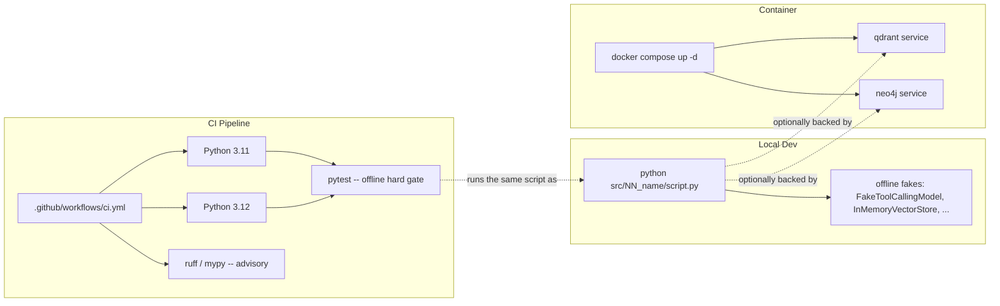

# 58 — Deployment

## Learning Objectives

After this module you can:

- Explain the service topology defined by the repo's `docker-compose.yml`
  (optional Qdrant + Neo4j backends for local dev).
- Explain the CI pipeline shape in `.github/workflows/ci.yml` (offline test
  matrix, advisory lint/type gates).
- Map the three deployment stages every module in this repo already
  supports: local dev script -> containerized backend -> CI pipeline.
- Write an offline **readiness check** that validates deployment
  configuration without needing Docker or GitHub Actions running.

## Theory

This module does not introduce new infrastructure — Task 1 already shipped
the compose file and CI workflow this repo uses. Module 58's job is to make
that shape *legible* and *checkable*:

- **`docker-compose.yml`** (repo root) defines two **optional** services,
  `qdrant` and `neo4j`, used only when a learner wants to exercise the real
  vector/graph backends instead of the offline `InMemoryVectorStore` /
  `InMemoryGraphStore` fakes from `src.shared`. Every exercise in this
  curriculum runs without them — compose is additive, never required.
- **`.github/workflows/ci.yml`** runs the **offline test suite**
  (`python -m pytest`) across a Python version matrix on every push and pull
  request — the same **hard gate** this task's own validation follows: no
  script may require a key or a running service. Lint (`ruff`) and type
  checks (`mypy`) run too, but as advisory (`continue-on-error: true`) gates
  in a teaching repo, so a style nit never blocks a contribution.
- **Health checks** in this context are the offline **readiness checks** this
  module performs: instead of pinging a live container, `build_readiness_report`
  parses the compose and CI files and asserts they still declare the expected
  shape (services present, Python matrix declared, pytest wired in). This is
  the same idea as a container health check, applied to configuration.

The mapping from **local dev** to **container** to **pipeline** is the
throughline: the exact same `python src/NN_name/script.py` command a learner
runs locally is what CI runs (just repeated across a matrix), and the compose
file is a purely optional upgrade path when a module needs a real backend.

## Mental Models

Think of this three-stage mapping like a recipe moving from **home kitchen**
(local dev — no special equipment, run the script) to **food truck**
(container — same recipe, now backed by real equipment like a commercial
fridge/oven when needed) to **certified commercial kitchen inspection**
(CI pipeline — the same recipe, verified reproducibly on a schedule, by
someone else's oven). The recipe (the script) never changes between stages.

## Architecture



## Runnable Example

```bash
python src/58_deployment/deployment.py
```

Expected output (deterministic; reflects the repo's actual compose/CI files):

```
deployment map:
  local dev   -> `python src/NN_name/script.py` (offline, no services required)
  container   -> `docker compose up -d` starts optional Qdrant + Neo4j backends
  pipeline    -> `.github/workflows/ci.yml` runs `pytest` offline on every push/PR
[PASS] compose_defines_qdrant: services found: ['qdrant', 'neo4j']
[PASS] compose_defines_neo4j: services found: ['qdrant', 'neo4j']
[PASS] ci_declares_python_matrix: python-version matrix: ['3.11', '3.12']
[PASS] ci_runs_offline_pytest: run commands: ['|', 'python -m pytest', 'ruff check src tests', 'mypy src/shared']
=== MODULE 58: DEPLOYMENT COMPLETE ===
```

## Challenge

1. Add a check confirming the CI workflow declares `continue-on-error: true`
   for the `ruff` and `mypy` steps (advisory, not blocking).
2. Add a check confirming `docker-compose.yml` mounts a named volume for each
   service (data persistence).
3. Break one of the checks intentionally (rename a service in a local copy of
   the compose text) and confirm `main()` raises with a clear message.

## Stretch Goals

- Extend `extract_compose_services` to also report each service's exposed
  ports, and assert `qdrant` exposes `6333`.
- Add a Dockerfile readiness check (does `docker/local/Dockerfile` exist,
  does it install `requirements.txt`) alongside the compose/CI checks.
- Write a `--strict` mode that also fails on advisory CI gates being marked
  `continue-on-error: true`, to model a stricter production pipeline.

## Common Mistakes

- Treating the compose file as required infrastructure — in this repo it is
  strictly optional; every exercise must still pass the offline hard gate
  without it running.
- Adding a new CI step that calls out to a real API/service — that would
  break the "offline hard gate" this whole curriculum depends on.
- Parsing YAML with regex for anything beyond a light structural read (as
  done here) — for real config validation, use a proper YAML parser; this
  module intentionally stays light to avoid a new dependency.

## Best Practices

- Keep local dev, container, and CI running the **exact same command** —
  divergence between "works on my machine" and "works in CI" usually comes
  from scripts that differ per environment.
- Make infrastructure additive: real backends (Qdrant, Neo4j, a real LLM)
  should always be an *upgrade* over a working offline default, never a
  requirement to get started.
- Fail loudly on missing/misconfigured deployment files (`_read_text` raises
  `FileNotFoundError`) rather than silently skipping checks.

## Suggested Improvements

- Add a `docs/deployment.md` (future work) mirroring `docs/observability.md`
  / `docs/security.md` / `docs/testing.md` if this track grows a fourth doc.
- Generate this readiness report as a CI step itself, so compose/CI drift is
  caught automatically.

## References

- [`docker-compose.yml`](../../docker-compose.yml) — the service topology
  this module validates.
- [`.github/workflows/ci.yml`](../../.github/workflows/ci.yml) — the CI
  pipeline this module validates.
- [`docs/DEVELOPMENT_COMMANDS.md`](../../docs/DEVELOPMENT_COMMANDS.md) — the
  full local command reference.
- Module [57_cost_and_multitenancy](../57_cost_and_multitenancy/README.md) —
  the multi-tenant agent this deployment shape ultimately hosts.

## What Comes Next

This closes Track 8 (Production). From here, revisit
[10_full_brain_simulation](../10_full_brain_simulation/README.md) or the
capstone modules with an eye toward applying observability, evaluation,
testing, security, cost, and deployment practices to a complete agent
system.
