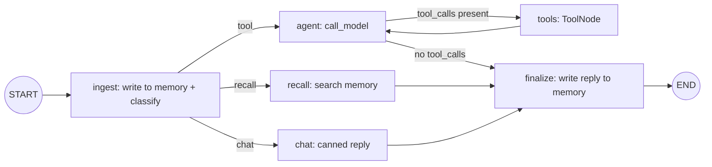
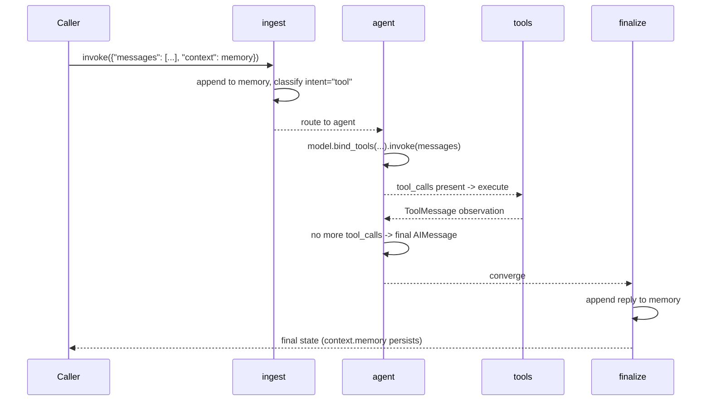

# 59 — Personal Assistant

## Learning Objectives

After this module you can:

- Combine intent routing, a manual tool-calling loop, and session memory in
  one coherent graph instead of three separate demos.
- Explain how a router decision (`recall` / `tool` / `chat`) determines which
  subsystem handles a turn, and how all paths converge to a single memory
  write.
- Persist conversational memory across multiple `invoke()` calls by threading
  `context` back into the next call's input state.
- Build a manual `ToolNode` loop (`add_conditional_edges`, not
  `create_react_agent`) that keeps calling tools until the model has no more
  tool calls to make.

**Integrates:** Track 1 routing (module [`11_graph_branching`](../11_graph_branching/README.md)),
Track 3 tools (module [`05_tools`](../05_tools/README.md)), Track 4 memory
(module [`06_memory_basics`](../06_memory_basics/README.md)).

## Theory

A personal assistant is not one skill — it is a **dispatcher** over several
skills that share one conversation. Every incoming turn must first be
written to memory (so later turns can reference it), then classified
(does it need an *action*, a *lookup in the past*, or just a *reply*?), and
finally routed. Tool-using turns loop through an agent/tool cycle until the
model stops requesting tools; recall turns search memory directly; chat
turns get a canned reply. All three paths **converge** on a `finalize` node
that writes the assistant's reply back to memory — the same convergence
pattern from module 11, applied to a stateful multi-turn agent.

## Mental Models

Think of a front-desk assistant with a notebook. Every request is jotted
down first. Then the assistant decides: "should I go do something (call a
tool), should I flip back through my notes (recall), or can I just answer
from what I know (chat)?" Whatever happens, the outcome gets written back
into the notebook before the next visitor arrives.

## Architecture



Sequence for a tool-routed turn:



## Runnable Example

```bash
python src/59_personal_assistant/assistant.py
```

Expected output (truncated, deterministic):

```
user='What is the weather in Paris?' intent=tool reply='[offline] Completed using tools. Observations: ...'
user='Do you remember what I asked earlier?' intent=recall reply='Recalled from memory: ...'
user='Thanks, that is all for now.' intent=chat reply='Got it — anything else I can help with?'
memory_entries=6
=== TRACK9 MODULE 59: PERSONAL ASSISTANT COMPLETE ===
```

## Challenge

1. Add a fourth intent, `task`, that always calls `create_task` regardless of
   keyword overlap, and route it explicitly instead of relying on the tool
   selector's fallback behavior.
2. Make `recall` return the *n* most relevant memory entries (by keyword
   overlap count) instead of all matches.
3. Cap `memory` at the last 10 entries so long sessions don't grow unbounded
   — a simple sliding-window memory policy.

## Stretch Goals

- Swap the keyword-based `_classify` for `get_chat_model(responses=[...])`
  driven classification, keeping it offline and deterministic.
- Back the memory list with `InMemoryVectorStore` so recall becomes semantic
  search instead of substring matching (see module
  [`60_research_agent`](../60_research_agent/README.md)).
- Add a `context["turn_count"]` counter and print a session summary at the
  end of `main()`.

## Common Mistakes

- **Classifying before writing to memory.** `ingest` must record the turn
  *before* routing, or a recall on the very next turn would miss it.
- **Losing memory between `invoke()` calls.** `context` has no reducer, so
  the caller must pass the previous result's `context` back in explicitly —
  forgetting this silently resets memory every turn.
- **Unbounded tool loops.** Always rely on `max_tool_calls` (via
  `get_chat_model`) to bound the agent/tool cycle; never loop without a
  budget.

## Best Practices

- Keep the router (`route_intent`) pure — classification lives in `ingest`,
  not in the router itself.
- Converge every branch on one `finalize` node so memory-writing logic isn't
  duplicated three times.
- Log every routing decision (`get_logger`) so intent misclassification is
  debuggable in production.

## Suggested Improvements

- Replace the flat memory list with structured events (`{"role", "text",
  "timestamp"}`) so downstream consumers can filter by role.
- Add a confidence score to `_classify` and route low-confidence turns to a
  `clarify` node that asks a follow-up question.

## References

- [`docs/langgraph.md`](../../docs/langgraph.md) — conditional edges and
  graph execution model.
- [`docs/memory.md`](../../docs/memory.md) — the four memory types and
  read/write pipelines this module's session log is a flat instance of.
- Module [`11_graph_branching`](../11_graph_branching/README.md) — the
  routing/convergence pattern this module reuses.
- Module [`05_tools`](../05_tools/README.md) and
  [`06_memory_basics`](../06_memory_basics/README.md) — the tool and memory
  primitives combined here.
- LangGraph `ToolNode`:
  https://docs.langchain.com/oss/python/langgraph/graph-api

## What Comes Next

[`60_research_agent`](../60_research_agent/README.md) swaps substring-based
recall for real retrieval-augmented generation, adding a reflection loop on
top of retrieval.
