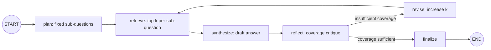
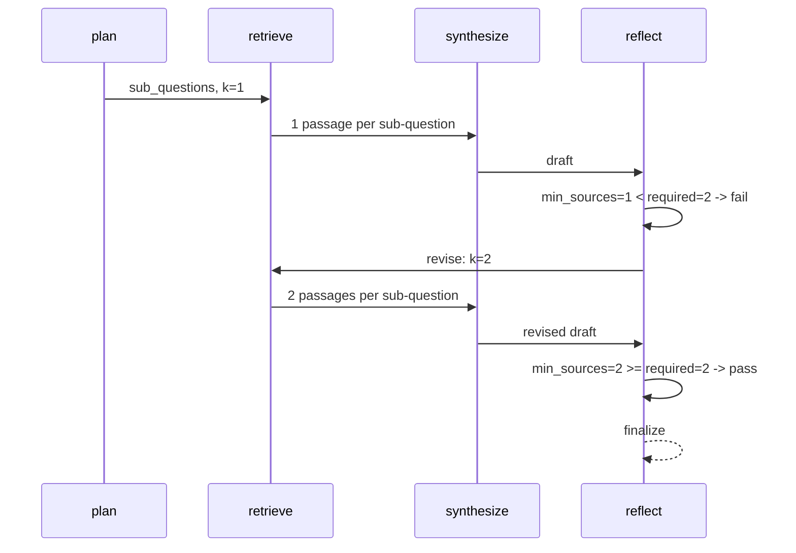

# 60 — Research Agent

## Learning Objectives

After this module you can:

- Decompose a research question into fixed sub-questions (a minimal planner)
  and retrieve supporting passages per sub-question from
  `InMemoryVectorStore`.
- Synthesize a draft answer from retrieved passages, then **reflect** on the
  draft with an explicit, deterministic critique.
- Build a revise loop: when the critique fails, deepen retrieval (`k`) and
  re-run the pipeline instead of giving up or hallucinating a fix.
- Explain why "more sources per sub-question" is a useful, cheap proxy for
  answer quality in a RAG pipeline.

**Integrates:** Track 2 LLM composition (module
[`03_llm_nodes`](../03_llm_nodes/README.md)), Track 5 RAG
(`InMemoryVectorStore`), reflection/critique loops (Tracks 7/8).

## Theory

Naive RAG retrieves once and answers once — it never checks its own work.
A **research agent** adds a reflection step: after drafting an answer, it
critiques the draft against an explicit rubric (here: "does every
sub-question have at least `_REQUIRED_SOURCES` supporting passages?"). If
the critique fails, the agent **revises** — not by editing text, but by
deepening retrieval (`k=1 -> k=2`) and re-running synthesis. This models the
plan → retrieve → draft → critique → revise loop used by real research
agents, without needing an LLM to grade itself (the rubric is a simple,
auditable function of retrieval results).

## Mental Models

Think of a student writing a report. First they list the questions they
need to answer (plan). Then they go to the library and pull one book per
question (retrieve, k=1). They write a draft. Before turning it in, they
check: "did I cite more than one source per claim?" If not, they go back to
the library for a second book per question (revise, k=2) and rewrite the
draft — a bounded, mechanical peer-review pass.

## Architecture



Sequence of the reflect/revise cycle:



## Runnable Example

```bash
python src/60_research_agent/research_agent.py
```

Expected output (truncated, deterministic):

```
question='How do vector databases use embeddings for retrieval?'
sub_questions=['What is a vector database?', 'What are embeddings?', 'How is similarity measured?']
revisions=1 critique='coverage sufficient'
Q: How do vector databases use embeddings for retrieval?
- What is a vector database? -> ...
=== TRACK9 MODULE 60: RESEARCH AGENT COMPLETE ===
```

## Challenge

1. Add a fourth sub-question and a matching corpus entry; confirm the
   revision loop still converges in exactly one revision.
2. Change `_REQUIRED_SOURCES` to 3 and observe the loop demand a third
   revision level — you'll need to extend the `k` ladder.
3. Make `reflect` also check answer *length* (e.g. draft must exceed N
   characters) as a second critique dimension, combined with an `and`.

## Stretch Goals

- Replace the fixed `_SUB_QUESTIONS` tuple with an LLM-driven planner via
  `get_chat_model(responses=[...])` that still produces a deterministic,
  canned decomposition offline.
- Add a `max_revisions` circuit breaker (see module
  [`14_error_handling`](../14_error_handling/README.md)) so the loop can't
  spin forever if coverage is unreachable.
- Track citation provenance (`document.id`) alongside each passage so the
  final answer can footnote its sources.

## Common Mistakes

- **Reflecting on style instead of substance.** A critique that checks
  "does this sound confident?" is not verifiable; checking source count is
  cheap, deterministic, and testable.
- **Revising by editing text instead of re-retrieving.** Patching the draft
  string directly hides the real problem (insufficient retrieval); always
  revise upstream (deepen `k`) and re-synthesize.
- **No bound on revisions.** Every revise loop needs a ceiling — here it's
  implicit (fixed to `_REQUIRED_SOURCES`), but production systems need an
  explicit `max_revisions`.

## Best Practices

- Keep the critique function pure and rubric-based — no hidden state.
- Log every reflection decision (`get_logger`) so a failed critique is
  auditable, not silent.
- Separate `retrieve` from `synthesize` so retrieval depth can change
  without touching synthesis logic.

## Suggested Improvements

- Score each retrieved passage's relevance (`SearchResult.score`) and let
  `reflect` weigh both coverage *and* relevance.
- Persist the final draft plus its critique history for later audit
  (observability, Track 8).

## References

- [`docs/langgraph.md`](../../docs/langgraph.md) — conditional edges used for
  the revise loop.
- [`docs/rag.md`](../../docs/rag.md) — the retrieval stack (embeddings,
  hybrid search, reranking) this module's `retrieve`/`synthesize` steps
  simplify from.
- Module [`03_llm_nodes`](../03_llm_nodes/README.md) — LLM node composition
  this planner/synthesizer builds on.
- `InMemoryVectorStore` — see [`src/shared/README.md`](../shared/README.md).
- LangGraph loops and cycles:
  https://docs.langchain.com/oss/python/langgraph/graph-api#cycles

## What Comes Next

[`61_coding_agent`](../61_coding_agent/README.md) applies the same
"iterate until done" idea to a tool-calling loop instead of a retrieval
loop.
