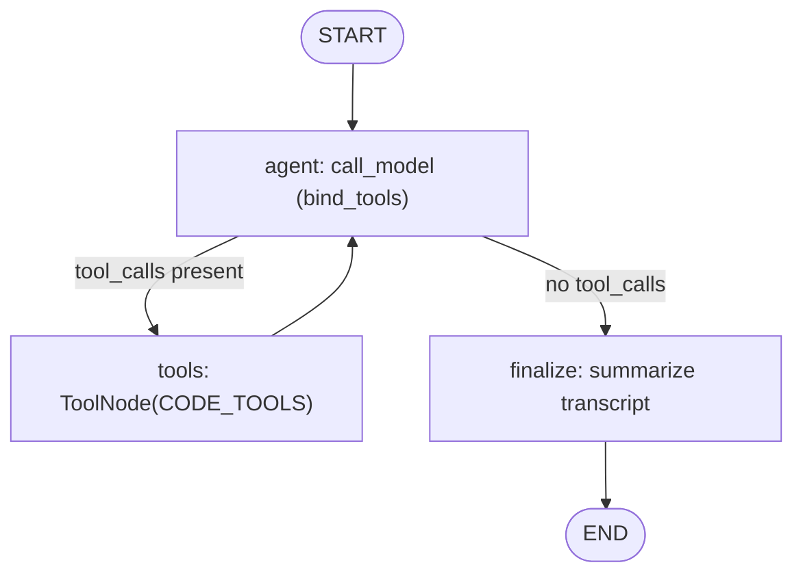
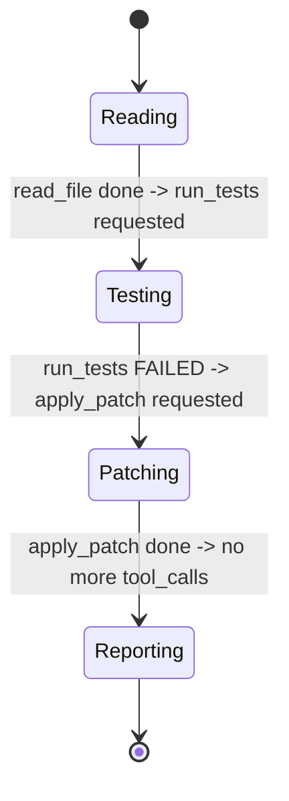
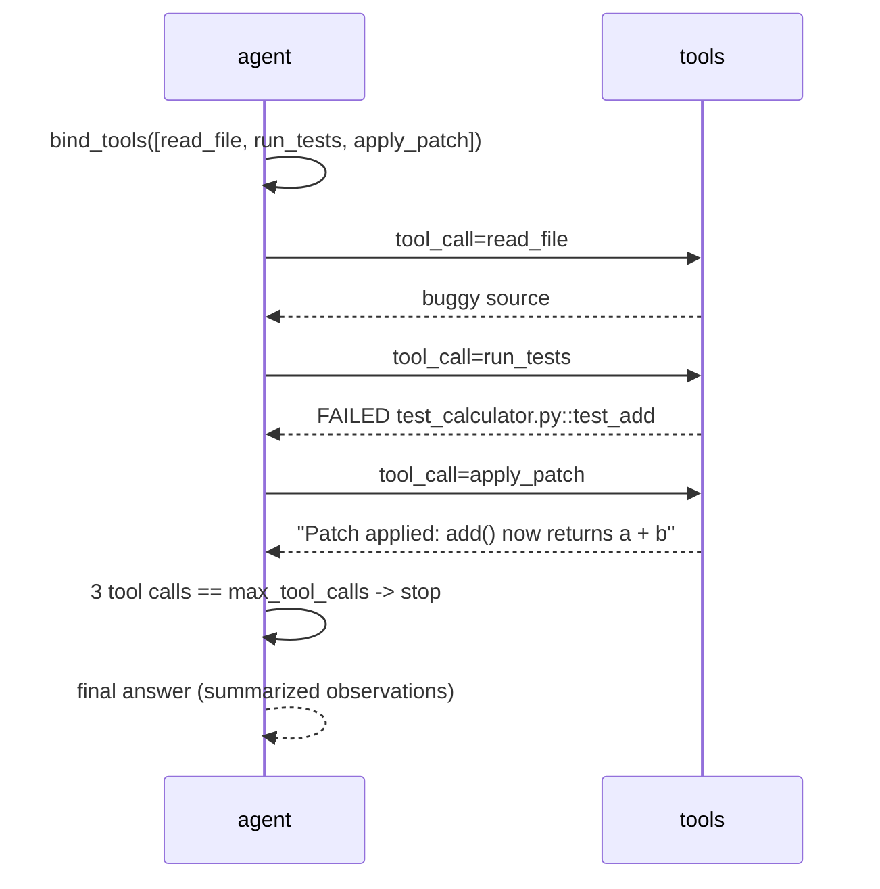

# 61 — Coding Agent

## Learning Objectives

After this module you can:

- Build a manual tool-calling loop (`add_conditional_edges` around an
  `agent` <-> `tools` cycle) for a code-assist task, without the deprecated
  `create_react_agent`.
- Define new, deterministic, offline tools (`read_file`, `run_tests`,
  `apply_patch`) local to a module, following the same shape as
  `src.shared.DEMO_TOOLS`.
- Explain how `FakeToolCallingModel` sequences multiple tool calls in one
  run based on tool order and keyword overlap with the query.
- Summarize a tool-call transcript into a final, human-readable answer.

**Integrates:** Track 3 tool use and manual loops (module
[`05_tools`](../05_tools/README.md)).

## Theory

A coding assistant is a **loop**, not a single call: read the relevant file,
run the tests to see what's failing, apply a fix, and (in a real system)
re-run tests to confirm. Each of those steps is a tool call whose output
informs the next decision. The loop here is the standard LangGraph
agent/tool cycle: an `agent` node asks the model (bound to tools) what to do
next; if it requests a tool, a `tools` node (`ToolNode`) executes it and
loops back to `agent`; once the model has no more tool calls, the loop
exits and a `finalize` node summarizes every step taken.

Unlike `05_tools` (a single tool call), this module chains **three** tools
in one run and proves the loop terminates deterministically once
`max_tool_calls` is reached.

## Mental Models

Think of a junior engineer working a ticket: open the file, run the tests
to see the failure, write the patch. Each step depends on the previous
step's output — you wouldn't write a patch without first seeing what broke.
The loop is the same shape as a human debugging session, just executed by
an agent one tool call at a time.

## Architecture



Legend: the edge out of `agent` is the tool-loop continuation condition
(`route_after_model`); `tools -> agent` is the retry loop that keeps
executing the next code tool until the model stops requesting one.

Flow notes:

- `route_after_model` loops back to `tools` whenever the last `AIMessage`
  carries `tool_calls`; it falls through to `finalize` once the model has
  none left (or `max_tool_calls` is reached).
- Each pass through the loop executes exactly one of `read_file`,
  `run_tests`, or `apply_patch`, in the order the (offline) model selects
  them — see the coding-loop state machine below for the read→test→patch
  progression this produces.
- `finalize` is the single convergence point that turns the `ToolMessage`
  transcript into the printed `scratchpad`.

The `agent`/`tools` cycle above walks through a fixed read→test→patch
progression for this task; as a state machine:



Legend: each state is one tool call executed by the `agent`/`tools` cycle;
the transition label is the observation that triggers the next tool call.

Flow notes:

- `Reading` (`read_file`) always runs first because the task text mentions
  the file before the tests.
- `Testing` (`run_tests`) reports the failing assertion, which is the
  observation that leads the model to request `apply_patch` next.
- `Patching` (`apply_patch`) is the last tool call in this run; once it
  returns, the model has no more tool calls and the loop exits to
  `Reporting` (`finalize`).
- In a real system, `Reporting` would loop back to `Testing` to confirm the
  fix — see Challenge #2, which wires in exactly that re-run.

Sequence of the three-step tool loop:



## Runnable Example

```bash
python src/61_coding_agent/main.py
```

Expected output (truncated, deterministic):

```
task='Please read calculator.py, run the tests, and apply a patch to fix the add function.'
step: read_file: def add(a, b):
    return a - b  # bug: should be a + b
step: run_tests: FAILED test_calculator.py::test_add - assert (1 - 2) == -1, expected 3
step: apply_patch: Patch applied: add() now returns a + b; re-run tests to confirm.
final_answer='[offline] Completed using tools. Observations: ...'
tool_calls_made=3
=== TRACK9 MODULE 61: CODING AGENT COMPLETE ===
```

## Challenge

1. Add a fourth tool, `list_files`, and a task phrase that triggers it first
   in the sequence — observe how tool *list order* (not just keyword match)
   determines which tool the fake model picks when several match.
2. Make `run_tests` fail again after `apply_patch` (simulate an incomplete
   fix) and add a second `run_tests` call to the loop by raising
   `max_tool_calls`.
3. Persist the tool transcript (`scratchpad`) across multiple tasks in one
   session, like module [`59_personal_assistant`](../59_personal_assistant/README.md)
   persists memory.

## Stretch Goals

- Replace the toy in-memory file with a real temp-file fixture (still
  offline) so `read_file`/`apply_patch` operate on an actual file on disk.
- Add a `route_after_model` branch that stops early if `run_tests` reports a
  pass, skipping `apply_patch` entirely.
- Wire in `InMemoryVectorStore` to retrieve the relevant file by semantic
  query instead of a hardcoded filename (see module
  [`60_research_agent`](../60_research_agent/README.md)).

## Common Mistakes

- **Using `create_react_agent`.** It is deprecated; build the loop
  explicitly with `add_conditional_edges` so the control flow is visible and
  testable.
- **No bound on tool calls.** Always pass `max_tool_calls` to
  `get_chat_model` — an unbounded loop with a buggy router never terminates.
- **Tools with side effects that aren't idempotent.** `apply_patch` here is
  a pure function returning a string; a real patch tool must be safe to
  call once and log clearly if called twice.

## Best Practices

- Keep tool functions single-purpose and typed (`@tool` + type hints) so
  the model's argument-filling stays predictable.
- Summarize the tool transcript in a dedicated `finalize` node rather than
  inline in `agent`, keeping responsibilities separated.
- Log every tool call's name via `get_logger` (or inspect `ToolMessage.name`)
  for observability.

## Suggested Improvements

- Add a real diff/patch library call (still offline) so `apply_patch`
  performs a genuine text transformation instead of returning a canned
  string.
- Emit a structured (JSON) transcript instead of print statements, for
  downstream tooling.

## References

- [`docs/langgraph.md`](../../docs/langgraph.md) — `ToolNode` and
  conditional-edge agent loops.
- Module [`05_tools`](../05_tools/README.md) — the single-tool-call baseline
  this module extends into a multi-step loop.
- LangChain tool decorator:
  https://docs.langchain.com/oss/python/langchain/tools

## What Comes Next

[`62_incident_response_agent`](../62_incident_response_agent/README.md)
combines a similar tool loop with graph-based root-cause analysis instead of
a fixed file-based task.
