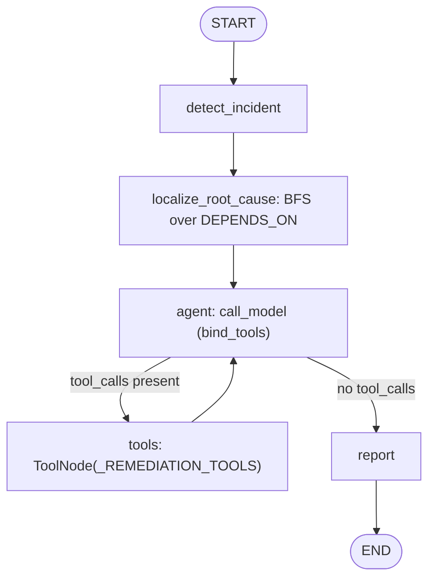
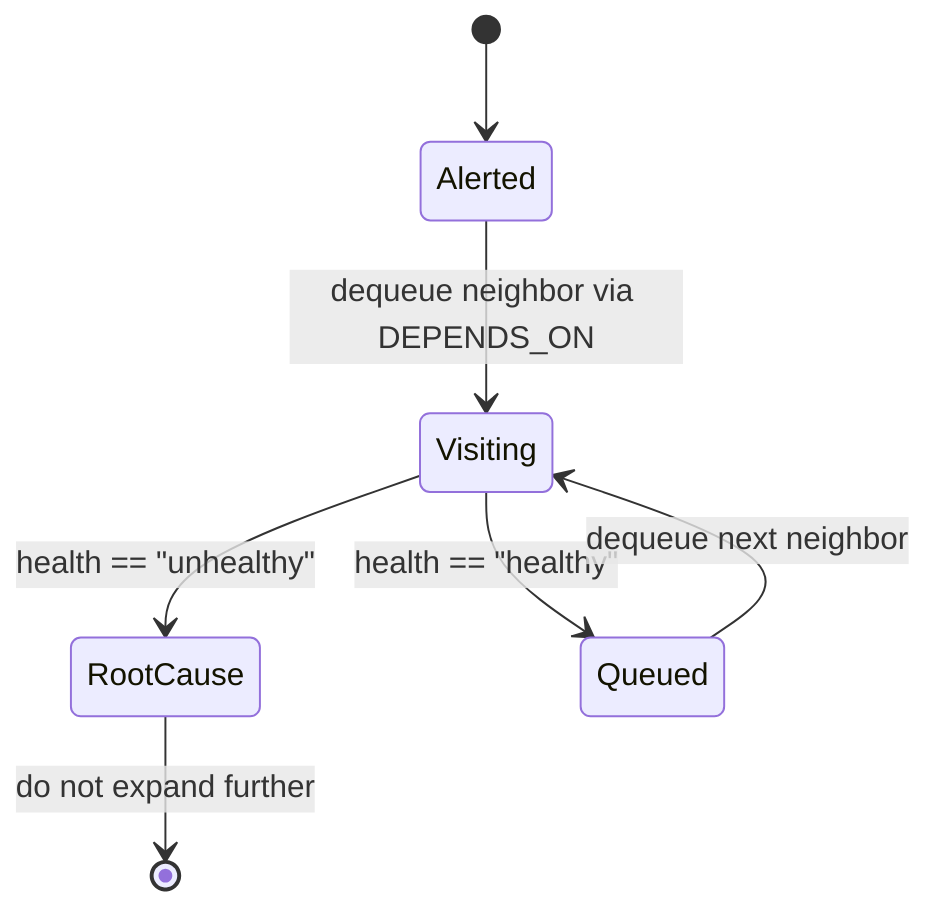
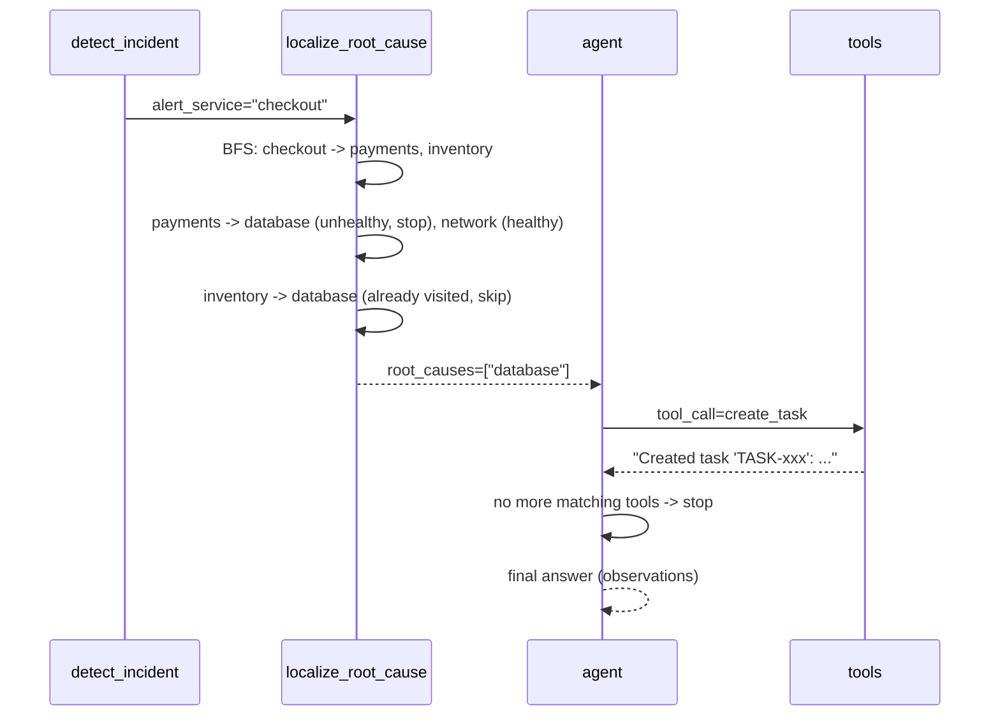

# 62 — Incident Response Agent

## Learning Objectives

After this module you can:

- Model a service dependency topology with `InMemoryGraphStore` and walk it
  breadth-first to localize root causes.
- Distinguish an **alert** (the symptom, e.g. "checkout is failing") from its
  **root cause** (the unhealthy leaf dependency it depends on).
- Stop expanding a BFS branch once an unhealthy node is found, while
  continuing to explore healthy branches — a simple but real RCA heuristic.
- Chain graph-based localization into a tool-calling remediation step
  (open a ticket, notify the team) using a subset of `DEMO_TOOLS`.

**Integrates:** Track 6 graph memory (module
[`08_graph_memory_neo4j`](../08_graph_memory_neo4j/README.md)) and Track 3
tool use (`DEMO_TOOLS`).

## Theory

Root-cause analysis over a service graph is a graph traversal problem: given
an alerting service, walk its `DEPENDS_ON` edges outward; any dependency
whose health is `unhealthy` is a **candidate root cause**. Because two
different paths (`checkout -> payments -> database` and
`checkout -> inventory -> database`) can converge on the same unhealthy
node, a visited-set is required so the shared root cause is reported once,
not twice. Once localized, the agent hands off to a **tool loop** (same
pattern as modules 59/61) to actually do something about it — open a task
and notify the team — closing the loop from *detection* to *action*.

## Mental Models

Think of an on-call engineer looking at a dependency diagram on a
whiteboard. The alert says "checkout is down." They trace every arrow
leaving `checkout`, checking each box's status light. Green boxes get
traced further; the first red box they hit *on each path* is a suspect. If
two paths point at the same red box, it's very likely the actual root
cause. Once found, they open a ticket and post in the incident channel.

## Architecture



Legend: the edge out of `agent` is the remediation tool-loop condition
(`route_after_model`); `tools -> agent` is the retry loop that keeps
dispatching remediation tools until the model stops requesting them.

Flow notes:

- `localize_root_cause` runs a single breadth-first pass before any tool is
  called — diagnosis and remediation are separate nodes, never interleaved.
- `route_after_model` loops back to `tools` while the model keeps
  requesting `create_task`/`send_slack`, and falls through to `report` once
  it stops (or `max_tool_calls` is reached).
- `report` is the single convergence node that summarizes the alert, the
  BFS trace, the root causes, and the remediation transcript.

The BFS inside `localize_root_cause` walks each node through the same three
states; as a state machine per visited node:



Legend: `Visiting` is evaluated once per unvisited neighbor; the transition
out of it is the node's health, read from the fixed `_HEALTH` snapshot.

Flow notes:

- `Alerted` is the starting service (`checkout`); its own health is never
  evaluated as a root cause — only its dependencies are.
- `Visiting -> RootCause` fires when a neighbor's health is `"unhealthy"`;
  that node is recorded in `root_causes` and **not** expanded further (its
  own dependencies are irrelevant to this incident).
- `Visiting -> Queued -> Visiting` is the healthy path: a healthy neighbor
  is appended to the BFS queue so its own dependencies get checked next.
- The `visited` set (not shown as a state) prevents a node reached by two
  paths — e.g. `database` via both `payments` and `inventory` — from being
  visited or reported twice.

Sequence of the RCA + remediation flow:



## Runnable Example

```bash
python src/62_incident_response_agent/incident_agent.py
```

Expected output (truncated, deterministic):

```
alert_service=checkout
dependency_trace=['checkout', 'payments', 'inventory', 'database', 'network']
root_causes=['database']
final_answer="[offline] Completed using tools. Observations: Created task '...'"
=== TRACK9 MODULE 62: INCIDENT RESPONSE AGENT COMPLETE ===
```

## Challenge

1. Add a second unhealthy leaf (e.g. `cache`) reachable only from
   `inventory`, and confirm `root_causes` reports both `database` and
   `cache`.
2. Change the health snapshot so `payments` itself is unhealthy — confirm
   the BFS still reports `payments` as a root cause and does **not** expand
   past it to `database`/`network`.
3. Extend the remediation tool call to also page a specific on-call rotation
   (add a new `@tool` locally, following the pattern in module
   [`61_coding_agent`](../61_coding_agent/README.md)).

## Stretch Goals

- Replace the fixed BFS with a depth-limited search and compare which root
  causes are found at each depth.
- Add a `docs/neo4j.md`-style Cypher equivalent in the README to show how
  the same query would look against a real Neo4j instance.
- Weight edges by "criticality" and report root causes ranked by impact.

## Common Mistakes

- **Not tracking visited nodes.** Without a `visited` set, a diamond-shaped
  dependency graph (two paths converging on one node) would report the same
  root cause twice or loop forever on a cyclic graph.
- **Expanding past an unhealthy node.** Once a node is marked as a root
  cause, its own dependencies are irrelevant to *this* incident — stop
  there, don't keep walking.
- **Conflating the alert with the root cause.** `checkout` is the symptom;
  never report the alerting service itself as its own root cause.

## Best Practices

- Keep the graph walk (`localize_root_cause`) and the remediation
  (`call_model`/`tools`) as separate nodes — diagnosis and action are
  different concerns.
- Log root-cause localization results (`get_logger`) so incident timelines
  are reconstructable after the fact.
- Reuse `DEMO_TOOLS` by filtering (`t.name in (...)`) instead of redefining
  tools that already exist.

## Suggested Improvements

- Persist historical incidents and their root causes in
  `InMemoryVectorStore` so future incidents can retrieve "similar past
  incidents" (bridges to module [`60_research_agent`](../60_research_agent/README.md)).
- Add a severity score derived from how many services depend (transitively)
  on the root cause.

## References

- [`docs/langgraph.md`](../../docs/langgraph.md) — conditional edges used
  for the remediation tool loop.
- [`docs/neo4j.md`](../../docs/neo4j.md) — the property-graph model and
  traversal/root-cause-ranking algorithms this module's BFS walk is a
  minimal instance of.
- Module [`08_graph_memory_neo4j`](../08_graph_memory_neo4j/README.md) —
  the graph-store primitive this module walks.
- `InMemoryGraphStore` — see [`src/shared/README.md`](../shared/README.md).

## What Comes Next

[`63_company_brain`](../63_company_brain/README.md) generalizes "route to
the right knowledge source" beyond a single graph into a coordinator over
memory, graph, and RAG specialists at once.
