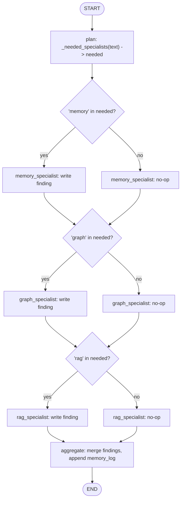
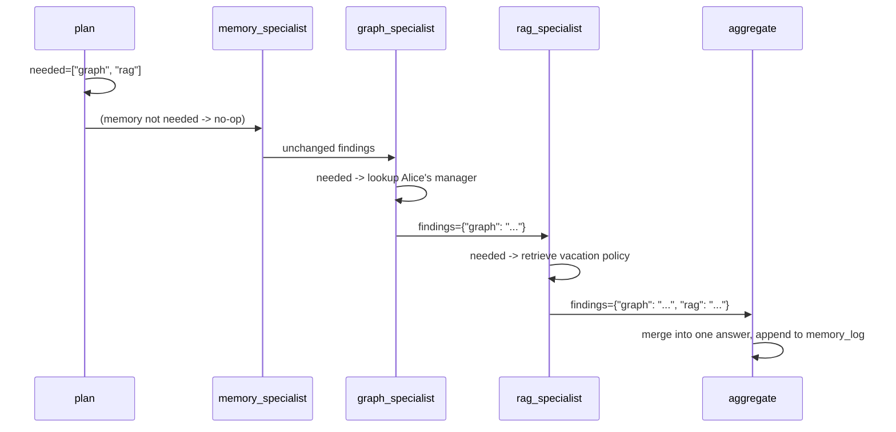

# 63 — Company Brain

## Learning Objectives

After this module you can:

- Coordinate several **specialist** nodes (memory, graph, RAG) over one
  shared plan, where each specialist independently decides whether it has
  anything to contribute.
- Explain the difference between **routing** (pick exactly one branch) and
  **cooperation** (run every specialist, let each opt in) as two multi-agent
  patterns, and when to use each.
- Merge heterogeneous findings (a memory recap, a graph fact, a retrieved
  policy passage) into one aggregated answer.
- Persist a session memory log across multiple `invoke()` calls so a later
  question can recall an earlier answer.

**Integrates:** Track 4 memory (module
[`06_memory_basics`](../06_memory_basics/README.md)), Track 5 RAG
(`InMemoryVectorStore`), Track 6 graph memory
(module [`08_graph_memory_neo4j`](../08_graph_memory_neo4j/README.md)), and
Track 7 multi-agent cooperation (module
[`09_multi_agent_systems`](../09_multi_agent_systems/README.md)).

## Theory

Modules 59–62 each pick **one** subsystem per turn (routing). A company's
knowledge, though, rarely lives in one place: "who is Alice's manager, and
what's the vacation policy?" needs both the org graph *and* the policy
corpus in a single answer. This module models that as a **blackboard**
multi-agent pattern: a `plan` node decides which specialists are relevant
(possibly several), then every specialist node runs in a fixed sequence,
each reading the shared plan and contributing to a shared `findings` dict
**only if its domain was requested** — otherwise it's a no-op pass-through.
An `aggregate` node then merges whatever findings exist into one answer and
writes it to a persistent memory log.

## Mental Models

Picture three consultants sitting in the same room, each with their own
expertise (HR policy, org chart, meeting notes). A question is read aloud
to all three at once. Each consultant speaks up only if the question is in
their domain; the others stay silent. A moderator then combines whatever
was said into a final answer for the person who asked.

## Architecture



Legend: the diamonds are the internal `if name not in needed: return {}`
guard each specialist evaluates — every specialist node always executes in
this fixed sequence, but only writes a finding when its domain was planned;
this is a **cooperation** pattern (run everyone, let each opt in), not a
LangGraph conditional edge that skips a node entirely.

Flow notes:

- `plan` computes `needed` once, via keyword matching in
  `_needed_specialists` (`memory`: remember/earlier/before/previously,
  `graph`: manager/reports/alice/team/engineering, `rag`:
  policy/vacation/deploy); every downstream node reads this same list.
- Each specialist is a no-op pass-through (`return {}`) when its name is
  absent from `needed` — it neither touches `findings` nor errors.
- `aggregate` merges whatever `findings` exist (possibly zero, one, two, or
  three) into one `" | "`-joined answer and appends it to the persistent
  `memory_log`, which the caller must thread into the next `invoke()` call.

Sequence of a two-specialist cooperative answer:



## Runnable Example

```bash
python src/63_company_brain/main.py
```

Expected output (truncated, deterministic):

```
request="Who is Alice's manager, and what is the vacation policy?" needed=['graph', 'rag'] answer='[graph] Alice reports to Bob | [rag] Vacation requests must go through the HR portal two weeks ahead.'
request='Remind me what I asked before about Alice.' needed=['memory', 'graph'] answer="[memory] Q: Who is Alice's manager..."
memory_log_entries=2
=== TRACK9 MODULE 63: COMPANY BRAIN COMPLETE ===
```

## Challenge

1. Add a fourth specialist (`tools_specialist`, reusing `DEMO_TOOLS`) that
   contributes when the request mentions an action verb like "notify" or
   "create".
2. Change `_needed_specialists` so a request with **no** matching keywords
   still triggers `memory` as a fallback (always show conversation
   context).
3. Make `graph_specialist` handle a request naming a person other than
   Alice by looking them up dynamically instead of hardcoding `"alice"`.

## Stretch Goals

- Replace the fixed keyword-based planner with an LLM-driven planner
  (`get_chat_model(responses=[...])`) that still returns a deterministic,
  canned list of needed specialists offline.
- Let specialists run **in parallel** using `Send` (see module
  [`12_parallel_execution`](../12_parallel_execution/README.md)) instead of
  a fixed sequential chain, since they don't depend on each other's output.
- Add a confidence/priority weight per specialist so `aggregate` can order
  findings by relevance instead of insertion order.

## Common Mistakes

- **Specialists that always contribute.** If a specialist ignores the
  `needed` plan and always writes a finding, `aggregate` produces noisy,
  irrelevant answers — always gate on the plan.
- **Losing memory between turns.** Just like module
  [`59_personal_assistant`](../59_personal_assistant/README.md), you must
  thread `context["memory_log"]` from one `invoke()` result into the next
  call's input.
- **Hardcoding a single entity.** The graph specialist here hardcodes
  `"alice"` for simplicity — a real system should extract the entity name
  from the query.

## Best Practices

- Keep specialist nodes side-effect-free and idempotent — safe to run even
  when their contribution is a no-op.
- Log the plan (`get_logger`) so it's auditable which specialists fired for
  a given request.
- Prefer a shared `findings` dict over separate per-specialist state keys —
  it keeps `aggregate` simple and generic.

## Suggested Improvements

- Add a `confidence` field per finding so `aggregate` can flag low-confidence
  answers for human review.
- Cache specialist results per query hash to avoid redundant graph/vector
  lookups across a session.

## References

- [`docs/langgraph.md`](../../docs/langgraph.md) — sequential node chaining
  and conditional routing.
- [`docs/memory.md`](../../docs/memory.md) — the memory-type taxonomy the
  `memory_specialist` draws on.
- [`docs/rag.md`](../../docs/rag.md) — the retrieval stack behind
  `rag_specialist`.
- [`docs/neo4j.md`](../../docs/neo4j.md) — the property-graph model behind
  `graph_specialist`.
- [`docs/multi-agent.md`](../../docs/multi-agent.md) — the cooperation
  pattern (blackboard-style specialists) this module implements.
- Module [`09_multi_agent_systems`](../09_multi_agent_systems/README.md) —
  the planner/executor baseline this module elaborates into cooperating
  specialists.
- `InMemoryVectorStore` / `InMemoryGraphStore` — see
  [`src/shared/README.md`](../shared/README.md).

## What Comes Next

[`64_mini_dailybot_brain`](../64_mini_dailybot_brain/README.md) folds this
same cooperative pattern together with routing, tool use, and observability
into one end-to-end brain — deepening module
[`10_full_brain_simulation`](../10_full_brain_simulation/README.md).
