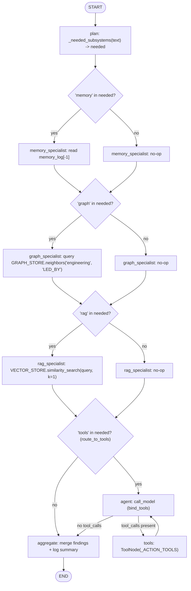
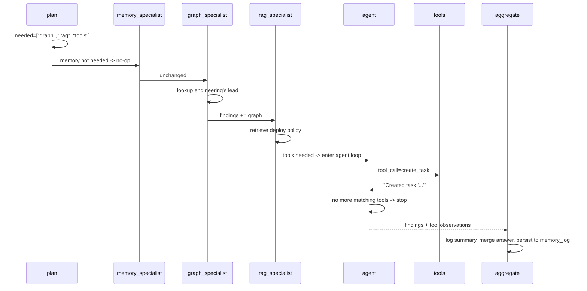

# 64 — Mini DailyBot Brain

## Learning Objectives

After this module you can:

- Explain how routing, memory, RAG, graph knowledge, tool use, multi-agent
  cooperation, and observability compose into one "mini AI operating
  system" instead of seven separate demos.
- Trace a single multi-step request through a coordinator, three cooperating
  specialists, and a conditional tool-calling loop, all in one graph.
- Read a structured, deterministic observability summary
  (`subsystems=[...] tool_calls=N`) logged at the end of every run.
- Describe how this module deepens the on-ramp `10_full_brain_simulation` with
  observability, multi-turn memory, and production-grade composition.

**Integrates:** Track 1 routing (module
[`11_graph_branching`](../11_graph_branching/README.md)), Track 3 tools
(`DEMO_TOOLS`), Track 4 memory (module
[`06_memory_basics`](../06_memory_basics/README.md)), Track 5 RAG
(`InMemoryVectorStore`), Track 6 graph memory (module
[`08_graph_memory_neo4j`](../08_graph_memory_neo4j/README.md)), Track 7
multi-agent cooperation (module
[`09_multi_agent_systems`](../09_multi_agent_systems/README.md)), and Track 8
observability (structured `get_logger` summaries). It deepens
[`10_full_brain_simulation`](../10_full_brain_simulation/README.md) — on-ramp
integrated brain this module extends with observability and session memory.

## Theory

This is the **capstone of capstones**: it takes the cooperative
memory/graph/RAG pattern from
[`63_company_brain`](../63_company_brain/README.md) and adds the two pieces
that were still missing — a conditional **tool-calling loop** for taking
action, and **observability** logging that reports, for every turn, which
subsystems fired and how many tool calls were made. A `plan` node reads the
request and decides which of `memory`, `graph`, `rag`, and `tools` apply;
three specialist nodes cooperate exactly as in module 63; a conditional edge
then either enters the `agent`/`tools` loop (module 61's pattern) or skips
straight to `aggregate`; and `aggregate` merges every contribution plus any
tool observations into one answer, logging a structured summary before
persisting it to the session memory log.

## Mental Models

Picture the front desk of a small company where one coordinator triages
every incoming request: "do I need to check the org chart, look up a
policy, remember what we discussed, and/or actually go do something (open a
ticket)?" Multiple boxes can be checked at once. Whoever is needed does
their part; if action is required, someone walks over and does it; then the
coordinator writes a summary in the log book before answering. That's the
whole "mini AI operating system" — the same shape as
[`10_full_brain_simulation`](../10_full_brain_simulation/README.md)
described, now actually built.

## Architecture



Legend: the first three diamonds are each specialist's internal
`if name not in needed: return {}` guard (cooperation — every specialist
always runs, opts in to writing a finding); `routeT` is the one real
LangGraph conditional edge (`route_to_tools`) that skips the agent/tool
loop entirely when no action is needed; `agent`'s outgoing edge
(`route_after_model`) is the tool-calling retry loop.

Flow notes:

- `plan` is the single router: `_needed_subsystems` matches request text
  against `memory`/`graph`/`rag`/`tools` keyword tables once, and every
  downstream node reads this same `needed` list — this is the "route"
  step that decides which of memory, RAG, graph, and tools fire.
- `memory_specialist`, `graph_specialist`, and `rag_specialist` always
  execute in sequence but only **read** from their backing store
  (`memory_log`, `InMemoryGraphStore`, `InMemoryVectorStore`) and write a
  `findings` entry when their name is in `needed`; otherwise they no-op.
- `route_to_tools` is the only branch that changes which node runs next:
  it enters the `agent`/`tools` loop only when `"tools" in needed`,
  otherwise it skips straight to `aggregate` — this is what keeps 90% of
  requests from paying for an unnecessary model call.
- Inside the loop, `route_after_model` sends control back to `tools`
  while the model keeps requesting `create_task`/`send_slack`, and falls
  through to `aggregate` once it stops.
- `aggregate` is the observability seam: it merges every specialist
  finding plus any tool observations into one answer, logs a structured
  `subsystems=[...] tool_calls=N` summary, and appends the answer to the
  persistent `memory_log` before the run ends.

Sequence of the full end-to-end run (request 1, all subsystems fire):



## Runnable Example

```bash
python src/64_mini_dailybot_brain/main.py
```

Expected output (truncated, deterministic):

```
=== Mini DailyBot Brain: full offline run ===
request='Tell me who leads engineering, look up the deploy policy, and create a task to follow up on the outage.' needed_subsystems=['graph', 'rag', 'tools'] tool_calls=1 answer='[graph] Engineering is led by Carol || [rag] Production deploys require two approvals and a passing CI run. || [tools] Created task ...'
request='What did I just ask you to do?' needed_subsystems=['memory'] tool_calls=0 answer='[memory] Q: Tell me who leads engineering...'
memory_log_entries=2
=== TRACK9 MODULE 64: MINI DAILYBOT BRAIN COMPLETE ===
```

## Challenge

1. Add a `send_slack` trigger phrase to the first request so both
   remediation tools fire (`tool_calls=2`) instead of just `create_task`.
2. Extend `_SPECIALIST_KEYWORDS` with a fifth subsystem
   (e.g. `"escalate"` -> paging) and wire a new specialist node into the
   chain.
3. Print a running per-subsystem usage counter across the two requests
   (e.g. `graph_used=1 rag_used=1 memory_used=1 tools_used=1`) as a tiny
   observability dashboard.

## Stretch Goals

- Run the four cooperating pieces (`memory_specialist`, `graph_specialist`,
  `rag_specialist`, and the decision to enter the tool loop) as parallel
  `Send` branches (module
  [`12_parallel_execution`](../12_parallel_execution/README.md)) that join
  before `aggregate`.
- Replace the flat `memory_log` with `InMemoryVectorStore`-backed semantic
  recall, as suggested in module
  [`59_personal_assistant`](../59_personal_assistant/README.md)'s stretch
  goals.
- Add a `MemorySaver` checkpointer so a crashed brain can resume mid-session
  without losing `memory_log`.

## Common Mistakes

- **Skipping the conditional routing to `agent`.** If the tool loop always
  runs, requests that don't need actions waste a model call; gate it with
  `route_to_tools`, exactly like module
  [`62_incident_response_agent`](../62_incident_response_agent/README.md).
- **Losing `context` between turns.** As in modules 59 and 63, thread the
  previous result's `context` into the next `invoke()` call or memory resets
  silently.
- **Treating observability as an afterthought.** Log the subsystems-used
  summary from inside the graph (`aggregate`), not as a separate script
  wrapped around it — otherwise partial runs go unobserved.

## Best Practices

- Keep the plan step as the single source of truth for "what does this
  request need" — every downstream node reads it, none re-derives it.
- Route into the tool loop conditionally; never run an agent/tool cycle
  unconditionally when 90% of requests don't need it.
- Emit one structured, deterministic summary line per turn
  (`get_logger`) — this is the minimum viable observability for any agent.

## Suggested Improvements

- Factor shared `build_graph()` helpers into `src/shared/` if module `10` should
  import this capstone graph directly without duplication.
- Add latency and token-count fields to the observability summary once a
  real `ChatOpenAI` backend is configured.

## References

- [`docs/langgraph.md`](../../docs/langgraph.md) — the full graph-execution
  model this capstone exercises end to end.
- [`docs/memory.md`](../../docs/memory.md), [`docs/rag.md`](../../docs/rag.md),
  [`docs/neo4j.md`](../../docs/neo4j.md),
  [`docs/multi-agent.md`](../../docs/multi-agent.md),
  [`docs/observability.md`](../../docs/observability.md) — the five deep-dive
  handbook pages this brain integrates in one run.
- Module [`10_full_brain_simulation`](../10_full_brain_simulation/README.md)
  — on-ramp integrated brain this module extends.
- Modules [`59_personal_assistant`](../59_personal_assistant/README.md),
  [`60_research_agent`](../60_research_agent/README.md),
  [`61_coding_agent`](../61_coding_agent/README.md),
  [`62_incident_response_agent`](../62_incident_response_agent/README.md),
  [`63_company_brain`](../63_company_brain/README.md) — the five capstones
  this module combines.
- `src/shared/README.md` — the full shared-library surface reused here.

## What Comes Next

This is the final module of Track 9. From here, the curriculum's next step
(outside this task's scope) is wiring a real `ChatOpenAI` backend and a real
Qdrant/Neo4j deployment behind the same graph — the offline fakes were
built precisely so that swap requires no code changes, only environment
variables (see [`docs/SECURITY.md`](../../docs/SECURITY.md)).
